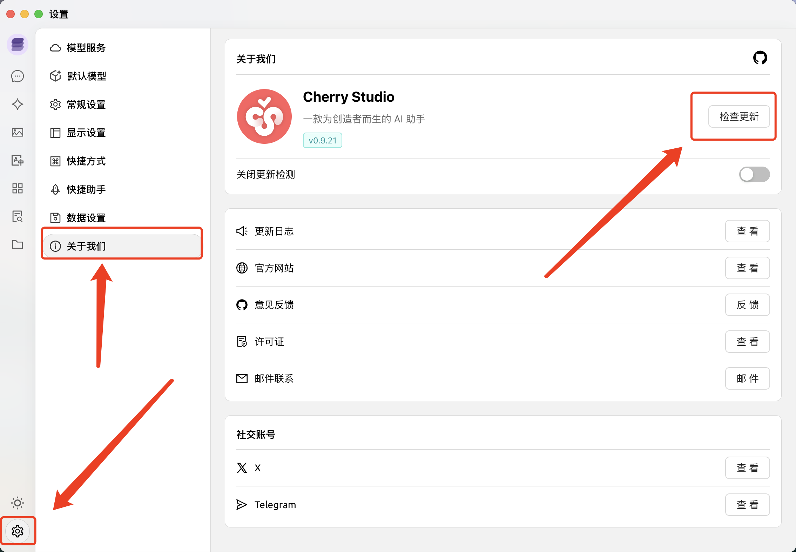
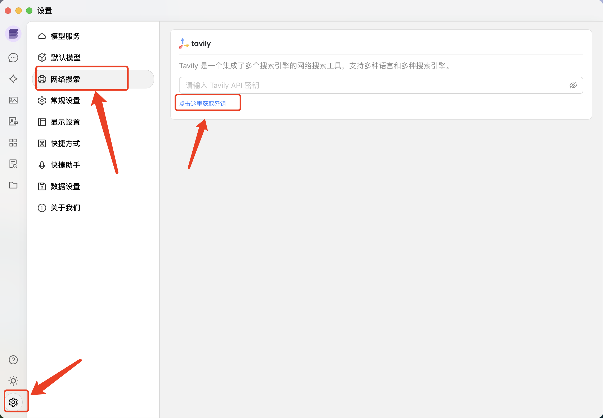
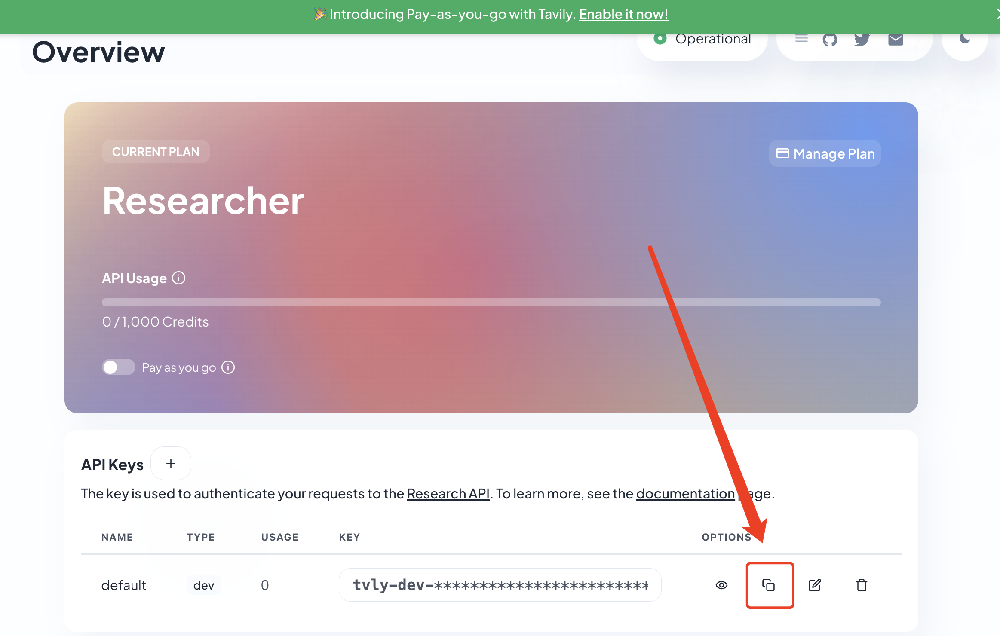
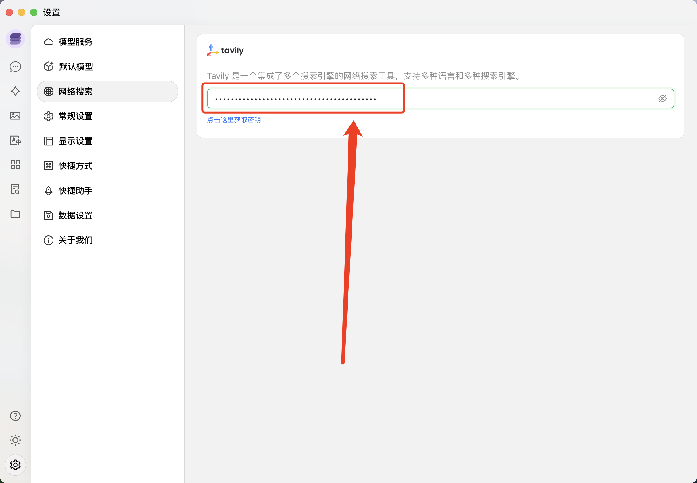
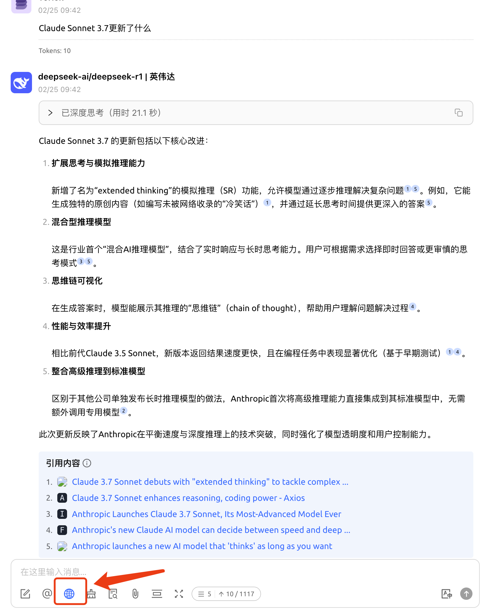

# Cherry Studio实现联网搜索

1. 打开CherryStudio，在设置的关于我们找到检查更新

   

2. 点击立即安装

   

3. 点击设置-网络搜索-点击这里获取密钥

   

4. 点注册

   

5. 输入邮件，我这里直接选择Github登录了

   

6. 复制密钥，每月有1000次调用

   

7. 回到Cherry Studio，粘贴密钥

   

8. 回到对话，点击地球图标开启联网搜索，可以看到信息很新！

   
