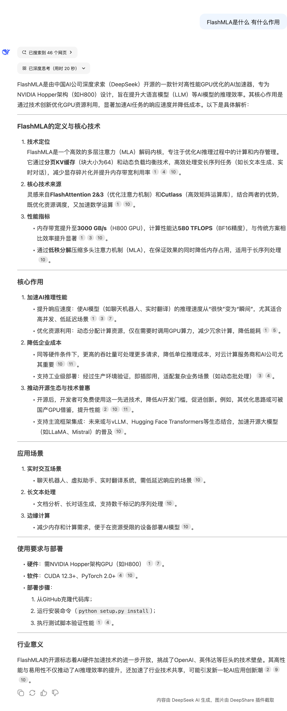
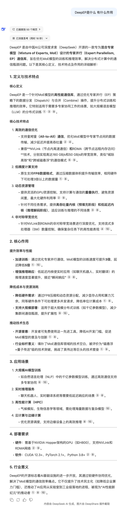
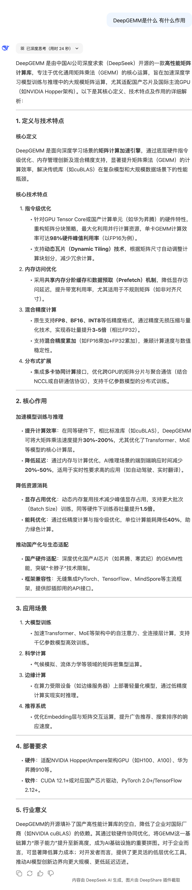

# DeepSeek开源周

## Day1 FlashMLA

[FlashMLA](https://github.com/deepseek-ai/FlashMLA)是用于Hopper GPU的高效MLA解码内核，针对可变长度序列服务进行了优化。

- BF16支持
- 分页KV缓存（块大小64）
- H800上3000 GB/s内存绑定和580 TFLOPS计算绑定

## Day2 DeepEP

[DeepEP](https://github.com/deepseek-ai/DeepEP)是为混合专家（MoE）和专家并行（EP）量身定制的通信库，提供高通量和低延迟的全对全GPU内核，也就是所谓的MoE调度和合并，该库还支持低查准率/精确度操作，包括FP8。

## Day3 DeepGEMM

DeepGEMM是一个专为干净高效的FP8通用矩阵乘法（GEMM）而设计的库，具有细粒度扩展，如DeepSeek-V3中提出的。它支持普通和混合专家（MoE）分组的GEMM。该库用CUDA编写，在安装过程中不需要编译，通过在运行时使用轻量级即时（JIT）模块编译所有内核。

## Day 4 