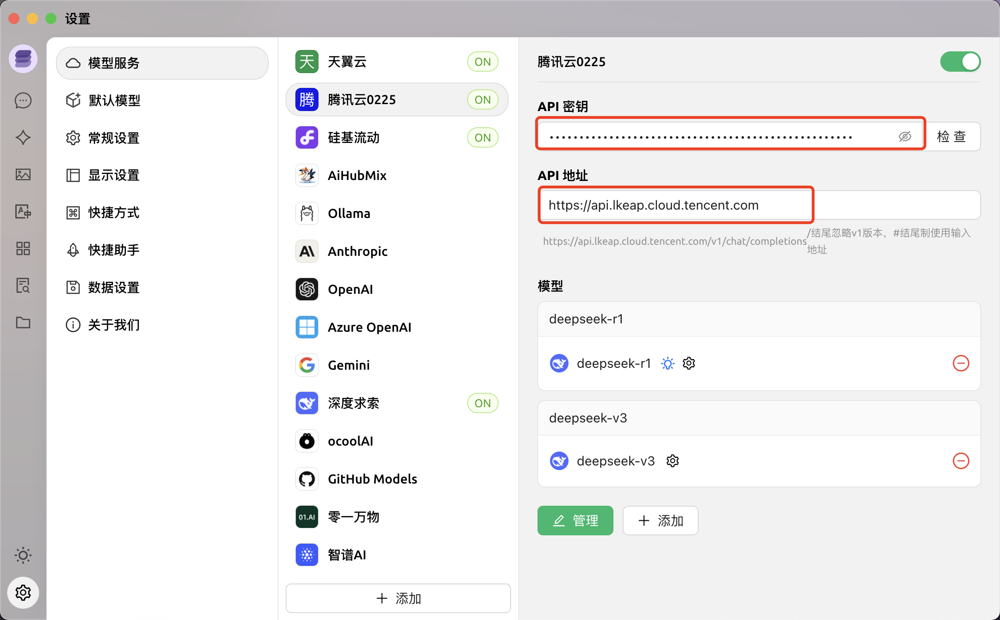

# DeepSeek白嫖指南

| 平台   | 免费额度（Tokens）             | 获取链接                                    | 接口地址（base_url）               | 模型名称（model）               | 文档 |
| :----- | :----------------------------- | :------------------------------------------ | --------------------------- | -------------------------------- | -------- |
| DeepSeek官方 | 10元免费额度，折算500万        | [点击跳转](https://platform.deepseek.com/api_keys)      | https://api.deepseek.com | deepseek-chat或deepseek-reasoner | [点击跳转](https://api-docs.deepseek.com/zh-cn/) |
| 硅基流动 | 14元免费额度，折算2000万       | [点击跳转](https://cloud.siliconflow.cn/i/23c6QiTj) | https://api.siliconflow.cn | deepseek-ai/DeepSeek-R1或deepseek-ai/DeepSeek-V3 | [点击跳转](https://docs.siliconflow.cn/capabilities/reasoning) |
| 华为云  | R1和V3各200万                  | [点击跳转](https://console.huaweicloud.com/modelarts/?region=cn-southwest-2#/model-studio/deployment) | 官网查看 | DeepSeek-R1或DeepSeek-V3 | [点击跳转](https://support.huaweicloud.com/usermanual-maas-modelarts/maas-modelarts-0010.html) |
| 阿里云  | R1和V3各1000万，限开通后半年内 | [点击跳转](https://bailian.console.aliyun.com) | https://dashscope.aliyuncs.com/compatible-mode/v1/ | deepseek-r1、deepseek-v3、deepseek-r1-distill-qwen-1.5b、deepseek-r1-distill-llama-8b、deepseek-r1-distill-llama-70b（免费） | [点击跳转](https://help.aliyun.com/zh/model-studio/developer-reference/get-api-key) |
| 腾讯云 | 无限制，截止2月25日23:59:59    | [点击跳转](https://console.cloud.tencent.com/lkeap/api) | https://api.lkeap.cloud.tencent.com | deepseek-r1或deepseek-v3 | [点击跳转](https://cloud.tencent.com/document/product/1772/115963) |
| 百度云  | 无限制，截止2月18日23:59:59    | [点击跳转](https://console.bce.baidu.com/qianfan/ais/console/onlineTest/LLM/DeepSeek-R1) | https://qianfan.baidubce.com/v2/ | deepseek-r1或deepseek-v3 | [点击跳转](https://cloud.baidu.com/doc/WENXINWORKSHOP/s/Fm2vrveyu) |
| 火山   | R1和V3各50万                   | [点击跳转](https://www.volcengine.com/product/ark) | https://ark.cn-beijing.volces.com/api/v3/chat/completions | 官网查看你的接入点ID，YOUR_ENDPOINT_ID | [点击跳转](https://www.volcengine.com/docs/82379/1449737) |
| 天翼云 | 2500万                 | [点击跳转](https://huiju.ctyun.cn/modelSquare) | https://wishub-x1.ctyun.cn | DeepSeek-R1-昇腾版：4bd107bff85941239e27b1509eccfe98 DeepSeek-R1-英伟达版：7ba7726dad4c4ea4ab7f39c7741ae | [点击跳转](https://huiju.ctyun.cn/modelSquare/4bd107bff85941239e27b1509eccfe98?regionId=200000001852&tab=API_DOCUMENT) |
| 英伟达 | 1000次调用                     | [点击跳转](https://build.nvidia.com/deepseek-ai/deepseek-r1) | https://integrate.api.nvidia.com | deepseek-ai/deepseek-r1 | [点击跳转](https://docs.api.nvidia.com/nim/reference/deepseek-ai-deepseek-r1-infer) |
| Github | https://docs.github.com/zh/github-models/prototyping-with-ai-models#rate-limits | [点击跳转](https://github.com/marketplace/models/azureml-deepseek/DeepSeek-R1/playground) | https://models.inference.ai.azure.com/ | DeepSeek-R1 | [点击跳转](https://learn.microsoft.com/zh-cn/python/api/overview/azure/ai-inference-readme?view=azure-python-preview) |
| 浮点奇迹 | R1和R1联网版每日各20次 | [点击跳转](https://dazi.co/login?i=3dcee729) | 不支持API调用 | \ | \ |

## 使用方法

1. 点击获取链接完成注册登录创建应用等操作并获取API KEY（可以通过查看文档找到获取方法）

2. 复制API KEY到Cherry Studio（没有就去下载：https://cherry-ai.com/）

3. 点击设置

   

4. 找到对应的模型供应商

   

   没有则添加，输入供应商名称，如百度，点击确定

   

5. 填入API KEY和API地址

   

6. 点击添加

   

7. 输入模型ID，点击添加模型

   

8. 点击检查，选择刚刚添加的模型ID，点击确定，出现“连接成功”即成功

   

   

   

