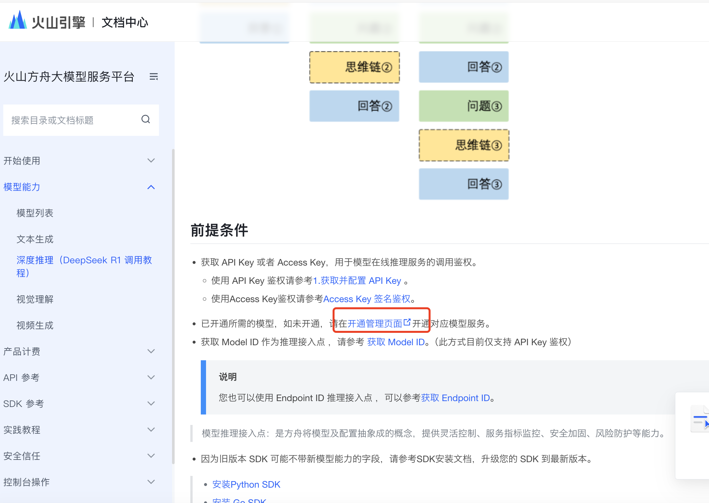
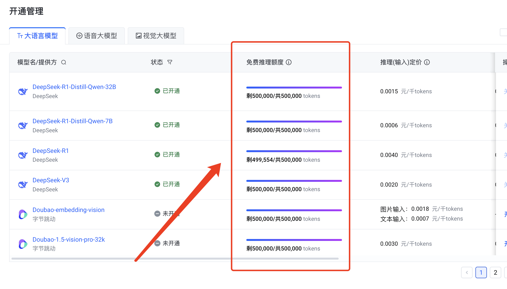

# 火山引擎如何查看费用消耗

接[火山引擎如何获取DeepSeek API并接入Cherry Studio](https://blog.rick216.cn/AI/volcengine-get-ds-api/)

大家接入之后，使用一段时间，可能想查看模型额度/费用消耗，下面是方法：

1. 访问https://www.volcengine.com/docs/82379/1449737

2. 下拉找到开通管理界面

   

3. 登录您的账号后，就可以查看模型额度了

   
