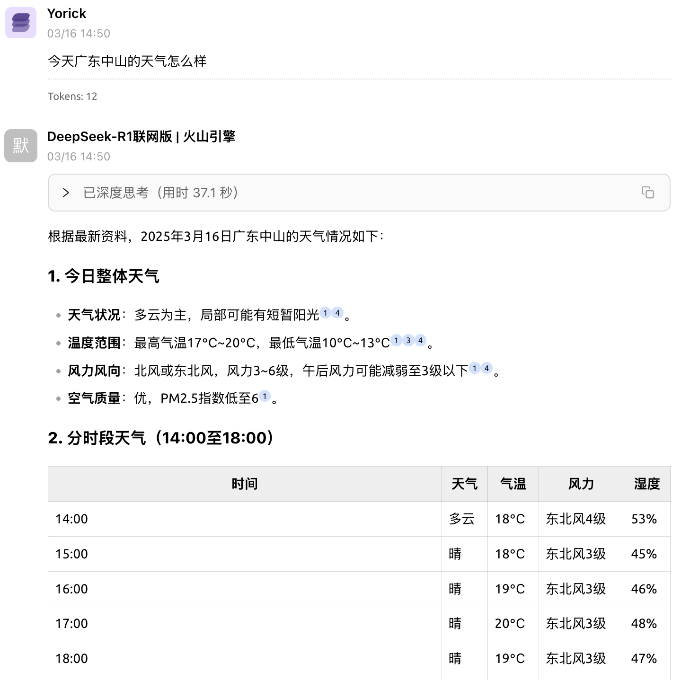
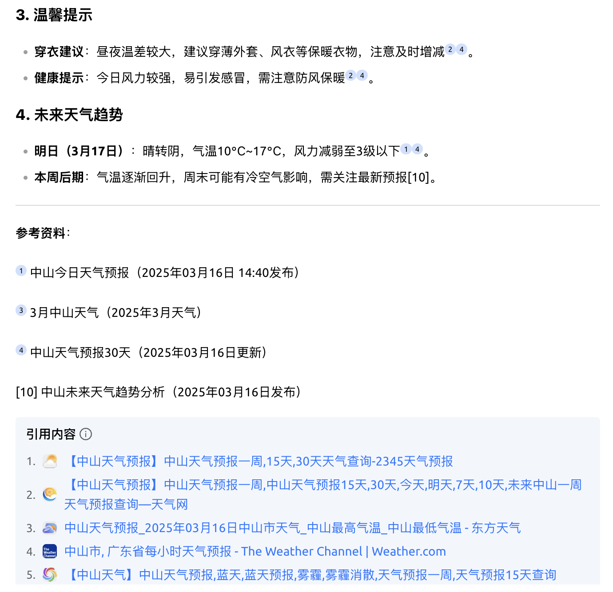
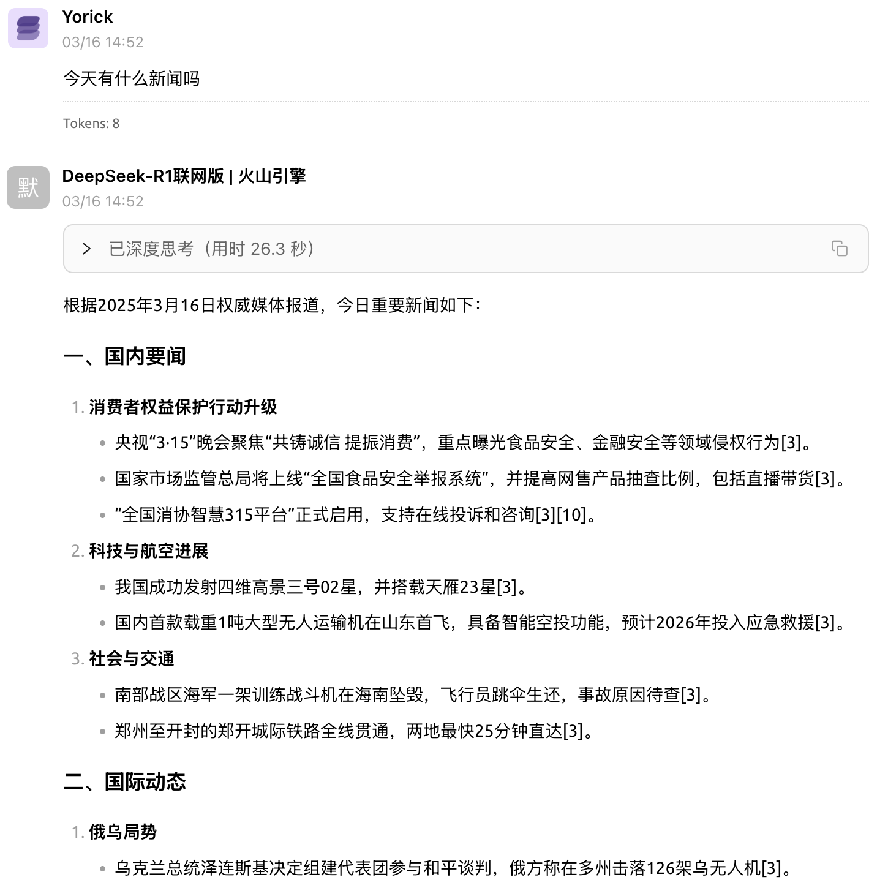
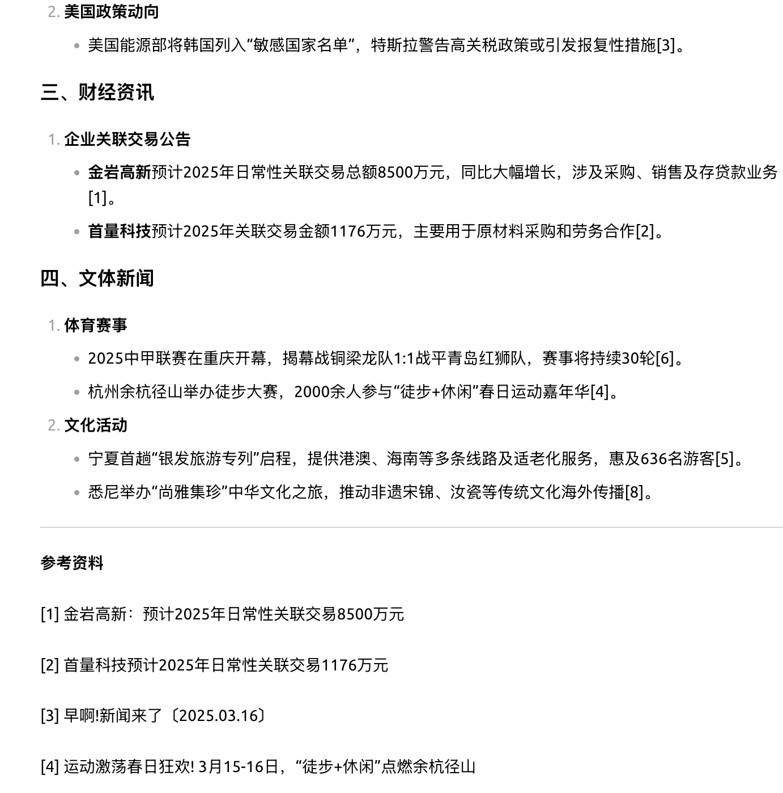

# 火山引擎模型开启联网搜索并使用CherryStudio调用

## 效果展示

先看效果：

1. 第一个问题：今天广东中山的天气怎么样

   

   

2. 第二个问题：今天有什么新闻吗

   

   

   目前看来效果还是不错的，毕竟部分数据来源是付费的。

## 数据来源

- 互联网公开域网页
- 头条图文
- 墨迹天气
- 抖音百科

## 调用费用：

- 全链路tokens +按照资源使用次数收费（一次请求返回结果包含某类型资源，该类型资源计费一次）

 - 联网资源：每月免费额度是2万次，超出部分按照4元/千次收费
 - 头条资源（头条图文）：6元/千次
 - 抖音资源（抖音百科、抖音视频、西瓜视频）：6元/千次
 - 墨迹天气：6元/千次

 价格还算合理，并且是可以使用无门槛**代金券**的。如何获得代金券呢？很简单：

 - 访问[火山引擎官网](https://www.volcengine.com/experience/ark?utm_term=202502dsinvite&ac=DSASUQY5&rc=D3VA3VGQ)
 - 输入邀请码D3VA3VGQ、手机号、验证码注册领取15元大模型/无门槛代金券，约可抵扣375万R1模型tokens
   
## 使用教程

[点击跳转到Cherry Studio官方教程](https://docs.cherry-ai.com/advanced-basic/lian-wang-mo-xing/deepseekr1-lian-wang-gong-neng-huo-shan-yin-qing-jie-ru)

