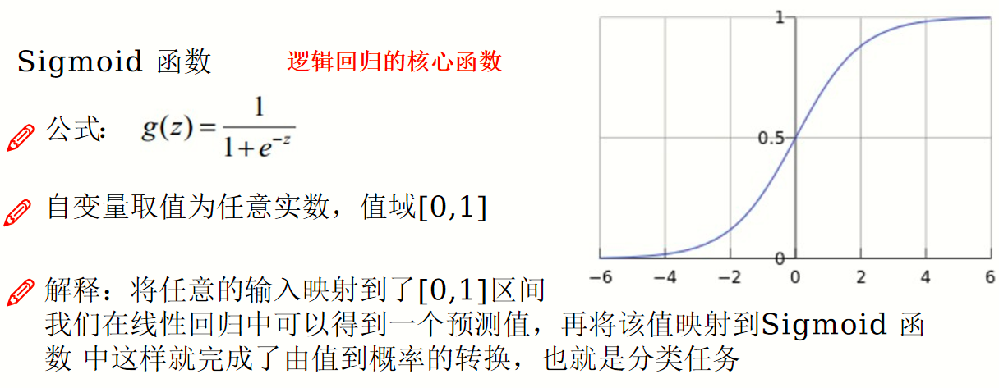
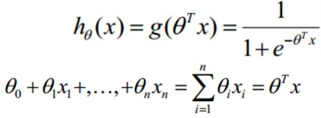
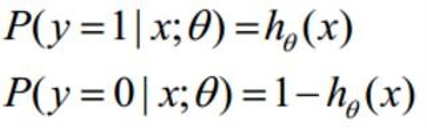
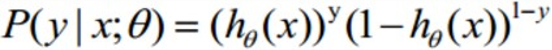
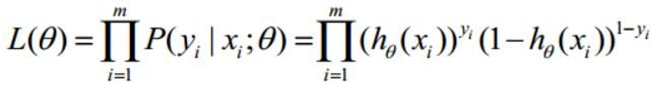
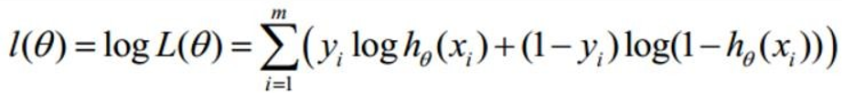
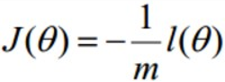

# 逻辑回归

解决回归问题，经典的二分类算法

## Sigmoid函数

## 预测函数

分类

整合

解释：对于二分类任务（0，1），整合后y取0只保留后者 y取1只保留前者

## 似然函数

似然函数：什么样的参数跟我们的数据组合后恰好是真实值

对数似然

似然函数求最大值（难求），引入

转换为梯度下降任务。m为样本个数，似然函数要考虑每一个样本的概率。

求导

