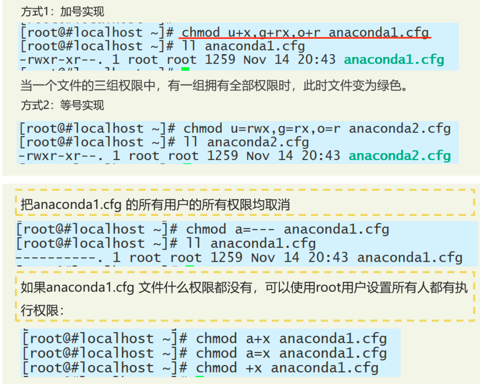
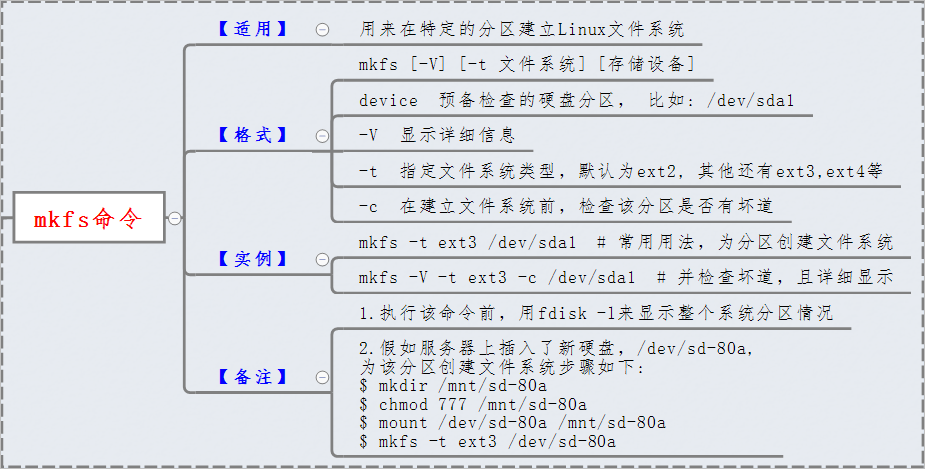

# Linux复习

## 认识 Linux 操作系统

Linux操作系统作为一款**免费、自由、开放**的操作系统, **支持多任务、多用户**。

Linux有**内核**版本和**发布**版本之分。

Linux 的版本号分为两部分，即内核版本与发行版本。内核版本号由3个数字组成：A.B.C。各数字含义如下：

> A：内核主版本号。这是很少发生变化，
> 只有当发生重大变化的代码和内核发生才会发生。
> B：内核次版本号。是指一些重大修改的内核。偶数表示稳定版本；奇数表示开发中版本。
> C：内核修订版本号。是指轻微修订的内核。这个数字当有安全补丁，bug修复，新的功能或驱动程序，内核便会有变化。

### 常见的Linux系统版本

CentOS，Ubuntu，FreeBSD，Debian

### Linux内核的组成部分及每个部分的作用

- 进程调度：控制进程对CPU的访问。
- 内存管理：允许多个进程安全的共享主内存区域；
- 虚拟文件系统：隐藏了各种硬件的具体细节，为所有的设备提供了统一的接口
- 网络接口：提供了对各种网络标准的存取和各种网络硬件的支持；
- 进程间通信： 支持进程间各种通信机制。

### 虚拟机

**虚拟机**指通过软件模拟的具有完整硬件系统功能的、运行在一个完全隔离环境中的完整计算机系统。

特点：

- 可同时在同一台PC上运行多个操作系统。
- 虚拟机之间共享文件、应用、网络资源等。 
- 同一服务器上的虚叔机若有一台故障或者中病毒, 不会影响到其他虚批机的使用。
- 虚拟机的本质是以文件的形式存在于虚拟化系统中，可以通过移动文件或者复制粘贴的形式对虚拟机进行迁移。

**快照**是虚拟机磁盘文件（VMDK）在某个时间点的复本。

**快照作用**： 快照可以保存虚拟机的状态， 当虚拟机出现问题的时候， 可以通过预先制作的快照恢复到制作时候的状态， 用作备份用。

虚拟机上网的三种主要方式是**桥接**、**NAT**和**Host-Only**。

## 文件管理

参考[狂神说Linux02：常用的基本命令](https://mp.weixin.qq.com/s?__biz=Mzg2NTAzMTExNg==&mid=2247483885&idx=1&sn=cf98ffb9698999abf950c55da75c60ec&scene=19%23wechat_redirect)

### 处理目录的常用命令

- ls: 列出目录 
  - -a 全部文件包括隐藏
  - -l 长数据串列出，包含文件的属性与权限
- cd：切换目录
- pwd：显示目前的目录
- mkdir：创建一个新的目录
- rmdir：删除一个空的目录
- cp: 复制文件或目录
- rm: 移除文件或目录
- mv: 移动文件与目录，或修改文件与目录的名称

```shell
cp [-adfilprsu] 来源档(source) 目标档(destination)
```

```shell
rm [-fir] 文件或目录
```

选项与参数：

- -f ：就是 force 的意思，忽略不存在的文件，不会出现警告信息；
- -i ：互动模式，在删除前会询问使用者是否动作
- -r ：递归删除

```shell
mv [-fiu] source destination
```

选项与参数：

- -f ：force 强制的意思，如果目标文件已经存在，不会询问而直接覆盖；
- -i ：若目标文件 (destination) 已经存在时，就会询问是否覆盖！
- -u ：若目标文件已经存在，且 source 比较新，才会升级 (update)

### 文件属性


- chgrp：更改文件属组，R表示递归修改

  ```shell
  chgrp [-R] 属组名 文件名
  ```

- chown：更改文件属主，也可以同时更改文件属组

  ```shell
  chown [–R] 属主名 文件名
  chown [-R] 属主名：属组名 文件名
  ```

- chmod：更改文件9个属性(权限)

  ```shell
  chmod [-R] xyz 文件或目录
  ```

  Linux文件属性有两种设置方法，一种是数字，一种是符号。

  > 1. 更改文件所有者的权限 chmod u= filename
  >
  > 2. 更改文件所属组的权限  chmod g= filename
  >
  > 3. 更改文件Other的权限 chmod o= filename
  >
  > 4. 同时更改三个组的权限 chmod a= filename

  Linux文件的基本权限就有九个，分别是owner/group/others三种身份各有自己的read/write/execute权限。

  先复习一下刚刚上面提到的数据：文件的权限字符为：『-rwxrwxrwx』， 这九个权限是三个三个一组的！其中，我们可以使用数字来代表各个权限，各权限的分数对照表如下：
  
  ```
  r:4     w:2         x:1
  ```
  
  每种身份(owner/group/others)各自的三个权限(r/w/x)分数是需要累加的，例如当权限为：[-rwxrwx---] 分数则是：
  
  - owner = rwx = 4+2+1 = 7
  - group = rwx = 4+2+1 = 7
  - others= --- = 0+0+0 = 0
  
  ```shell
  chmod 770 filename
  ```



## 文件内容查看

- cat 由第一行开始显示文件内容
- tac 从最后一行开始显示，可以看出 tac 是 cat 的倒着写！
- nl  显示的时候，顺道输出行号！
- more 一页一页的显示文件内容
- less 与 more 类似，但是比 more 更好的是，他可以往前翻页！
- head 只看头几行
- tail 只看尾巴几行

查找文件或目录：find 和 loacta

查看当前主机IP地址的命令是  `ipaddr`

`who`  命令的作用是  查看当前在线用户

`umask`查看系统默认文件和目录权限

请用命令完成新建目录 newdir，在该目录下新建文件 newfile 并将该文件复制到/tmp 目录下。

```shell
mkdir newdir
cd newdir
touch newfile
cp newfile /tm
```

### 文件解压缩

1. tar

   ```shell
   # 压缩文件 file1 和目录 dir2 到 test.tar.gz
   tar -zcvf test.tar.gz file1 dir2
   # 解压 test.tar.gz（将 c 换成 x 即可）
   tar -zxvf test.tar.gz
   # 列出压缩文件的内容
   tar -ztvf test.tar.gz 
   ```

   -z : 使用 gzip 来压缩和解压文件

   -v : --verbose 详细的列出处理的文件

   -f : --file=ARCHIVE 使用档案文件或设备，这个选项通常是必选的

   -c : --create 创建一个新的归档（压缩包）

   -x : 从压缩包中解出文件\

2. rar

   ```shell
   # 压缩文件
   rar a -r test.rar file
   # 解压文件
   unrar x test.rar
   ```

   a : 添加到压缩文件

   -r : 递归处理

   x : 以绝对路径解压文件

3. zip

   ```shell
   # 压缩文件
   zip -r test.zip file
   # 解压文件
   unzip test.zip
   ```

   -r : 递归处理

### 软链接和硬链接的区别(必考)

```shell
ln -s [源文件] [软链接文件]
ln -s /path/to/target link_name
```


区别：

- 删除源文件，软链接会失效，硬链接不会；
- 软链接可以为文件和目录（允许不存在）创建链接，硬链接只可以为文件创建链接；
- 软链接可以跨文件系统，硬链接必须是同一个文件系统；
- 软链接的文件权限可以和源文件不一样，硬链接的文件权限一定和源文件一样；

## 软件包管理

**Linux中软件的三种安装方式**

- 源码编译安装（根据当前系统编译）
- rpm安装（需要自己安装相应的依赖）
- yum安装（自动安装依赖）

### rpm安装

RPM 软件包的文件名中一般包括**软件名 、版本号 、硬件平台和包后缀**。

功能：

- 安装，解压软件并安装
- 查询，查询已经安装的软件包
- 卸载
- 升级
- 验证，验证系统中软件与包的区别

查询 RPM 软件包的命令`rpm -q`

为卸载一个软件包`rpm -e`

- -i：安装（install）;
- -v：显示更详细的信息（verbose）;
- -h：打印 #，显示安装进度（hash）;

### 源码安装

获取软件的源代码包之后，必须要先进行编译形成**二进制文件** ，然后才能在 Linux 上运行

Linux 系统维护中软件安装最大的问题就是就是软件包之间的 **依赖性** 

**优点：**

- （1）开源，可以根据需求进行个性化定制
- （2）可以自由安装
- （3）稳定
- （4）卸载方便

**缺点：**

- 安装步骤多
- 编译时间长
- 易报错
- 对技术要求高

### yum安装

**特点：**

- （1）自动解决依赖问题
- （2）安装简单
- （3）有详细日志
- （4）可以方便地管理 rpm 

## 系统管理

广义上来讲，Linux的账户包括  **主账户**  和  **用户账户** 两种。

Linux系统中的每个用户都在`/etc/passwd`文件记录了这个用户的一些基本属性。这个文件对所有用户都是可读的。

```text
root:x:0:0:Superuser:/:
daemon:x:1:1:System daemons:/etc:
用户名:口令:用户标识号:组标识号:注释性描述:主目录:登录Shell
```

`/etc/shadow`文件记录真正的加密后的用户口令。 有超级用户才拥有该文件读权限

```shell
root:Dnakfw28zf38w:8764:0:168:7:::
daemon:*::0:0::::
登录名:加密口令:最后一次修改时间:最小时间间隔:最大时间间隔:警告时间:不活动时间:失效时间:标志
```

当使用`useradd`命令新建了一个用户之后，将在`/etc/passwd`文件中写入一行新建用户信息，在`/etc/shadow`文件中写入一行用户密码信息。

通常用户标识号的取值范围是`0～65535`。0是超级用户root的标识号，1-99由系统保留作为管理账号，普通用户的标识号从**100**开始。在Linux系统中，这个界限是500。

记录用户组信息的文件有两个，分别是 `/etc/gshadow` 和 `/etc/group`

`/etc/group`:

```shell
bin::2:root,bin
组名:口令:组标识号:组内用户列表
```

使用`passwd`命令可以设置用户密码，使用 passwd 命令修改用户自己的密码时必须符合复杂性要求。

> 普通用户会要求输入原密码，密码长度不少于8个字符，root 用户可以无视则不需要输入原密码，密码长度及时不合规范也可以正常更新密码

如何创建一个普通用户的时候，同时指定其主组group和附加组bin, root，并且自定义uid

```shell
useradd -g group -G bin,root -u 100 zhangsan
```

如果你是管理员，现在增加一个用户叫张三，密码是123456，把一个叫李四的用户给锁定，删除王五

```shell
useradd zhangsan
passwd zhangsan
123456
123456
passwd -l lisi
userdel wangwu
```

## vim

 vi命令既可以编辑文件，也可以**创建文件**

**vim有哪几种模式，之间该怎么切换：**

- 任何情况下，不论用户处于什么模式，只要按一下`esc`   键，就可以进入vi的**命令模式**。
- **底行模式**也叫**末行模式**，在**命令模式**下输入`:`或者`/`就会进入**底行模式**。
- 在**底行模式**模式下按`i`或者`a`键进入**编辑模式**。

进入**底行模式**，在`:`后面输入`wq`并回车，即可保存文件，强行退出`:q!`，

进入**底行模式**，输入内容`:set nu`，即可显示文本的行号

在**命令模式**下输入`nG`则可以  定位到第`n`行	  

命令模式下：

- 光标移动到行首`home`	

- 光标移动到行尾`end`

- 光标移动到首行`gg`		

- 光标移动到末行`G`

- 以当前光标为准，向上移动n行`nk`

- 以当前光标为准，向下移动n行`nj`和`n<Enter>`

- 以当前光标为准，向左/右移动n个字符`nh/nl`

- 复制光标所在行`yy`	

- 剪切/ 删除光标所在行`dd`

- 撤销`u`

- 恢复`Ctrl+R`


末行模式下：

- 移动到指定的行`:n`

- 搜索：`/关键词`

- 替换

  - `:s/旧文本/新文本` 替换光标所在行的**第一处**符合条件的内容
  - `:s/旧文本/新文本/g` 替换光标所在行的**全部**符合条件的内容
  - `:%s/旧文本/新文本` 替换整个文档中每行**第一个**符合条件的内容
  - `:%s/旧文本/新文本/g` 替换**整个文档**的符合条件的内容

  `%`表示整个文件

  `g`表示全局(global)

在末行模式下无法直接进入编辑模式，必须要通过命令模式进入编辑模式：

- `i`在光标所在字符前开始插入
- `a`在光标所在字符后开始插入
- `o`在光标所在行的下面另起一新行插入
- `I`在光标所在行的行首开始插入， 如果行首有空格则在空格之后插入
- `A`在光标所在行的行尾开始插入
- `O`在光标所在行的上面另起一行开始插入
- `S`删除光标所在行并开始插入
- 退出方式：`[Esc]`

## Shell编程

### shell类型

shell常用类型有**bash、ash、ksh、csh、zsh**等。默认的shell是每个用户帐号的一个参数。Linux中典型的默认shell是/bin/bash。

### Shell 变量

局部变量：只能在函数内部使用

全局变量：可以在当前 Shell 进程中使用

环境变量：可以在子进程中使用

**特殊变量：**

| 名称   | 说明                                                         |
| :----- | :----------------------------------------------------------- |
| `$0`   | 执行脚本的名称                                               |
| `$1-9` | 脚本执行时的参数1到参数9                                     |
| `$?`   | 脚本的返回值，代表上一个命令是否执行成功，如果成功，则为0，否则不成功 |
| `$!`   | 代表最后执行的后台命令的PID                                  |
| `$#`   | 脚本执行时，输入的参数的个数                                 |
| `$@`   | 输入的参数的具体内容（将输入的参数作为一个多个对象，即是所有参数的一个列表） |
| `$*`   | 输入的参数的具体内容（将输入的参数作为一个单词）             |

## 管理磁盘存储与分区

1. Linux支持**虚拟文件系统**，其实质是Linux内核中的一个软件层，用于给用户空间的程序提供文件系统接口。

2. ` /root`目录存放内核和加载内核所需的文件。一般情况下，GRUB 或 LILO 系统引导管理器也位于这个目录。

3. `fdisk -l`查看系统磁盘及分区情况

   `fdisk -n` 添加一个新分区

4. `df`命令作用是列出文件系统的整体磁盘空间使用情况。

5. `/etc`系统存放所有的系统配置文件。

6. 一个硬盘最多可以分**4**个主分区。

7. 使用`dd`命令可以实现磁盘对拷

8. 执行`mkfs`命令格式化分区

### 设备文件的命名

Linux 系统和 Windows 操作系统不同，没有盘符的概念，磁盘对应分区存放在/dev 目录中，命名格式为`/dev/xxyN`，请简述 xxyN 表示的含义。

   > xx 表示分区所在**设备的类型**，其中IDE接口的的硬盘对应的是 hd 
   >
   > y 表示对应**分区所在的设备**，从 a 递增 ，例如第一个 SCSI 硬盘标记为`/dev/sda`，第二个 IDE 硬盘标记为`/dev/hdb` 
   >
   > N 表示分区前四个分区为**主分区或者拓展分区**，对应的是 1-4，**逻辑分区**从 5 开始，例如/dev/sda2 表示第一个 SCSI 硬盘上的第二个主分区或者扩展分区；/dev/hdb5 表示第二个 IDE 硬盘上的第一个逻辑分区。

### fdisk命令
使用fdisk 命令新增磁盘分区：

   ```shell
   # 给/dev/sdb分区
   fdisk /dev/sdb 
   # 进入交互界面
   # 新增一个分区
   n
   # 查看一下磁盘分区
   p
   # 选择分区号（这里注意一下，加上扩展分区，主分区只能有四个，所以只能选择1-4，一般按顺序输入分区号）
   1 
   # 保存
   w
   # 将新的分区表变更同步至操作系统。
   partprobe
   # 设置新建分区文件系统格式
   mkfs -t ext4 /dev/sdb1
   # 将新建分区挂载到需要增加空间的目录下，以“/opt”为例
   mount /dev/sdb1 /opt
   ```

其他参数：

> n  add a new partition      <==新增一个分区
>
> p  print the partition table   <==查看磁盘
>
> t  change a partition's system id	指定分区类型
>
> d  delete a partition       <==删除
>
> q  quit without saving changes  <==不保存
>
> w  write table to disk and exit  <==保存

### 文件系统

- ext2
- ext3
- ext4
- reiserFS
- VFAT

mkfs：make filesystem



## 例题

1. 查看是否有/etc/password?		

   `find /etc/password`

2. 把/etc文件夹拷贝到/home/learn/linux目录下？	

      `cp -R /etc /home/learn/linux`

3. 打开此/etc/password，定位到153行，增加一句话：abc?		

  ```shell
  vim /etc/password
  153G
  按键字母i
  输入abc
  ```
4. **shell输出九九乘法表**

```shell
#!/bin/bash
for i in 1 2 3 4 5 6 7 8 9
do
        for j in 1 2 3 4 5 6 7 8 9
        do
                if(test $j -le $i)then
                        echo -n "${i}*${j}=$((i*j))  "
                fi
        done
echo ""
done
```

5. 如果用rmdir命令删除某个已经存在的目录，但是无法成功，请给出原因和解决方法。

   (1)此目录可能不存在;

   (2)目录不为空;

   (3)目录中有隐含文件存在;

   (4)目录没有权限操作，解决方法：先修改权限，在使用`rm -r`命令删除。


