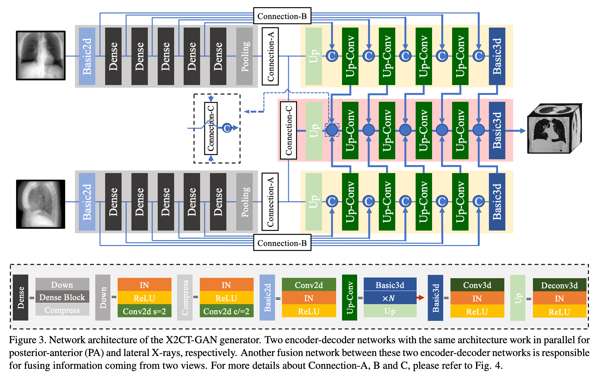

# X2CT-GAN论文笔记

PDF；https://openaccess.thecvf.com/content_CVPR_2019/papers/Ying_X2CT-GAN_Reconstructing_CT_From_Biplanar_X-Rays_With_Generative_Adversarial_Networks_CVPR_2019_paper.pdf

## X2CT-GAN

这篇论文“X2CT-GAN: Reconstructing CT from Biplanar X-Rays with Generative Adversarial Networks”提出了一种利用生成对抗网络（GAN）从双平面X光片（正交视图）重建三维CT影像的方法，旨在解决传统CT扫描的高辐射剂量和高成本问题。以下是论文的核心内容总结：

---

### **研究背景与动机**
- **CT的局限性**：虽然CT能提供三维解剖信息，但其需要大量X射线投影（通常上百次扫描），导致辐射剂量高且设备昂贵。
- **X光的优势与不足**：X光成本低且普及，但仅提供二维叠加图像，无法清晰区分重叠结构（如软组织）。
- **目标**：通过双平面X光（正位和侧位）重建三维CT，在保留X光低成本优势的同时，提供近似CT的3D信息，适用于特定临床场景（如器官尺寸测量、放射治疗规划等）。

---

### **方法创新**
1. **X2CT-GAN框架**：
   - **生成器**：由两个并行编码器-解码器网络处理双平面X光，通过特征融合模块整合信息，生成3D CT体积。
     - **密集连接编码器**：提取多层次2D特征。
     - **跳跃连接设计**（Connection-A/B/C）：桥接2D编码器与3D解码器，保留空间信息并提升特征融合效果。
   - **判别器**：基于3D PatchGAN结构，区分生成CT与真实CT。

2. **损失函数**：
   - **对抗损失（LSGAN）**：提升生成CT的视觉真实性。
   - **重建损失（MSE）**：约束生成CT与真实CT的体素级一致性。
   - **投影损失（L1）**：强制生成CT在三个正交平面的投影与真实CT一致，增强形状约束。

3. **数据合成与风格迁移**：
   - 使用**DRR技术**从公开胸部CT数据集（LIDC-IDRI）合成X光片，解决配对数据缺失问题。
   - 采用**CycleGAN**将真实X光转换为合成风格，缩小域间差异，使模型适应真实数据。

---

### **实验结果**
- **定量评估**：在合成数据上，双平面输入相比单视图显著提升性能（PSNR提高约4 dB）。X2CT-GAN在PSNR和SSIM上优于基线模型（如2DCNN）。
- **定性结果**：生成CT在主要解剖结构（如肺、心脏）的细节和边界清晰度上表现优异，3D渲染显示合理的器官形态。
- **真实数据验证**：通过CycleGAN风格迁移后，模型从真实X光重建的CT在肺部等结构上具有临床合理性。

---

### **贡献总结**
1. **首个基于GAN的双平面X光到CT重建方法**，突破传统方法依赖大量投影的限制。
2. **网络架构创新**：设计跳跃连接和特征融合模块，实现2D到3D的有效映射。
3. **多损失联合优化**：结合对抗、重建和投影损失，平衡视觉质量与解剖准确性。
4. **合成数据与域适应策略**：利用DRR和CycleGAN解决数据稀缺问题，提升模型泛化性。

---

### **局限与展望**
- **局限性**：小解剖结构（如血管）可能存在伪影；依赖合成数据，真实场景性能需进一步验证。
- **未来方向**：优化网络以提升细节重建能力；探索更多临床场景（如手术规划）；与医生合作评估临床价值。

这篇论文为低成本X光机的功能扩展提供了新思路，通过深度学习实现了从二维到三维的跨模态重建，具有重要的应用潜力。

## CycleGAN

CycleGAN（Cycle-Consistent Generative Adversarial Network）是一种用于**无配对图像到图像转换**的生成对抗网络（GAN）模型，由朱俊彦（Jun-Yan Zhu）等人在2017年提出。它的核心目标是实现两个不同视觉域（如真实照片与艺术画作、X光片与CT图像）之间的双向映射，**无需依赖成对的训练数据**。这一特性使其在医学图像处理、风格迁移、跨模态合成等领域具有广泛应用。

---

### **核心思想**
CycleGAN的核心创新在于引入了**循环一致性约束**（Cycle-Consistency Loss），通过强制两个生成器之间的双向映射满足一致性，解决无配对数据条件下的图像转换问题。其核心流程如下：
1. **两个生成器（G和F）**：
   - **G**: 将域A的图像（如真实X光）转换到域B（如合成X光风格）。
   - **F**: 将域B的图像转换回域A。
2. **两个判别器（D_A和D_B）**：
   - **D_A**: 判断图像是否属于域A。
   - **D_B**: 判断图像是否属于域B。

3. **循环一致性约束**：
   - 对域A中的图像x，经过G生成域B的图像G(x)，再通过F转换回域A应接近原图x，即`F(G(x)) ≈ x`。
   - 同理，对域B中的图像y，有`G(F(y)) ≈ y`。
   - 这一约束确保生成器不会产生随意的映射，而是保留图像的关键内容。

---

### **损失函数**
1. **对抗损失（Adversarial Loss）**：
   - 确保生成的图像在目标域中逼真（与判别器对抗）。
   - 例如，生成器G的目标是欺骗判别器D_B，使其认为G(x)属于域B。

2. **循环一致性损失（Cycle-Consistency Loss）**：
   - 使用L1距离约束重建图像与原图的一致性：
     $$
     L_cycle = E_x~A [||F(G(x)) - x||₁] + E_y~B [||G(F(y)) - y||₁]
     $$

3. **身份损失（可选，Identity Loss）**：
   - 强制生成器在输入图像已属于目标域时保持原图不变，增强颜色和纹理的保留能力。

---

### **关键优势**
1. **无需配对数据**：
   传统图像转换模型（如pix2pix）需要严格的成对数据（如同一场景的白天与夜晚照片），而CycleGAN仅需两个域的独立图像集合，极大降低了数据收集难度。

2. **双向映射**：
   可同时学习两个域之间的正反向转换（如X光→CT和CT→X光）。

3. **保留内容结构**：
   循环一致性约束确保生成图像在风格转换时保留原始内容（如器官形状、病变位置）。

---

### **在医学图像中的应用**
在论文**X2CT-GAN**中，CycleGAN被用于解决**合成X光与真实X光之间的域适应问题**：
1. **问题背景**：
   - X2CT-GAN的训练数据为CT合成的X光（通过DRR技术生成），但真实X光的噪声、对比度等与合成数据存在差异。
2. **CycleGAN的作用**：
   - 学习真实X光（域A）与合成X光（域B）之间的风格映射。
   - 将真实X光转换为合成风格后，输入X2CT-GAN生成CT，提升模型在真实场景中的泛化性。

---

### **局限性**
1. **结构失真风险**：
   循环一致性损失无法完全保证复杂解剖结构的精确对齐，可能导致生成图像的部分细节错误。
2. **模式崩溃（Mode Collapse）**：
   生成器可能倾向于生成有限的几种模式，缺乏多样性。
3. **依赖数据分布**：
   若两个域的图像差异过大（如X光与MRI），转换效果可能不佳。

---

### **对比GAN**

| **任务**     | **GAN**               | **CycleGAN**                   |
| ------------ | --------------------- | ------------------------------ |
| 输入 → 输出  | 噪声 → 图像（如人脸） | 域A图像 → 域B图像（如马→斑马） |
| 数据配对要求 | 无需配对数据          | 无需配对数据，但需两个域数据   |
| 关键约束     | 对抗损失              | 对抗损失 + 循环一致性损失      |
| 医学应用     | 生成合成数据          | 跨模态转换                     |

---

### **总结**

CycleGAN通过无监督学习和循环一致性约束，为跨域图像转换提供了高效解决方案。在医学影像中，它被广泛用于解决数据稀缺、域差异等问题。尽管存在局限性，但其无需配对数据的特性使其在实际应用中具有重要价值，尤其适用于医学场景中成对数据难以获取的挑战。

## 经验

从这篇论文中，我们可以获得以下关键经验和启示，适用于医学图像生成、跨模态重建及生成对抗网络（GAN）的应用：

---

### **1. 跨模态与跨维度生成的设计经验**
- **问题定位**：
  论文解决了从低维（2D X光）到高维（3D CT）的跨模态重建问题。这种“升维生成”在医学影像中具有重要意义，例如从稀疏数据重建完整解剖结构。
- **网络架构创新**：
  设计生成器时，需针对数据特性定制模块。例如：
  - **双编码器-解码器结构**：分别处理正交视图（正位和侧位X光），通过特征融合整合多视角信息。
  - **跳跃连接（Skip Connection）**：通过Connection-A/B/C桥接2D和3D特征，保留空间信息并提升细节重建能力。
- **启示**：
  在类似任务中，需结合任务特点（如多视图输入、维度差异）设计网络，而非直接套用通用架构。

---

### **2. 多目标损失函数的平衡**
- **损失函数组合**：
  结合对抗损失（提升视觉真实性）、重建损失（保证体素级精度）和投影损失（强制解剖形状一致性）：
  - **投影损失**：通过正交投影约束生成CT的全局形状，是医学领域先验知识的有效利用。
  - **权重调整**：通过调整损失权重（如λ₁=0.1, λ₂=λ₃=10），优先保证解剖合理性，再优化细节。
- **启示**：
  在医学任务中，需结合领域知识设计损失函数，并通过实验确定权重，平衡生成质量与解剖准确性。

---

### **3. 数据合成与域适应的应用**
- **合成数据生成**：
  使用DRR（数字重建放射影像）技术从CT合成X光，解决配对数据稀缺问题。这对医疗领域（如罕见病数据）具有普适性。
- **域适应技术**：
  通过CycleGAN将真实X光风格迁移到合成数据，缩小域间差距。此方法可推广至其他需跨设备或跨协议数据对齐的任务。
- **启示**：
  当真实数据不足时，合成数据+域适应是可行方案，但需验证合成数据的解剖合理性和临床有效性。

---

### **4. 多视图信息的价值**
- **双平面输入的优越性**：
  实验证明，双视图（正位+侧位）相比单视图显著提升性能（PSNR提高4 dB）。多视图提供了互补的解剖约束，减少生成歧义。
- **启示**：
  在医学影像分析中，多模态或多视角数据融合可增强模型鲁棒性，例如结合X光、超声和MRI的信息。

---

### **5. 生成模型的评估标准**
- **临床需求导向**：
  论文强调生成结果需同时满足视觉质量（医生可读性）和定量指标（如PSNR/SSIM）。例如，小血管的清晰度可能比全局PSNR更重要。
- **局限性认知**：
  生成CT存在小结构伪影，提示在临床应用中需谨慎使用，建议结合后处理或医生审核。
- **启示**：
  医学生成模型的评估应结合临床实际，不仅依赖传统指标，还需通过医生反馈和下游任务验证（如病灶检测）。

---

### **6. 实际应用的可行性**
- **低成本设备的增强潜力**：
  该技术可将普通X光机升级为“伪CT”功能，适用于资源有限地区或特定场景（如术前规划）。
- **伦理与安全性考量**：
  论文强调需避免误导性结果（如伪影误诊），需明确技术适用边界，并与其他检查手段结合使用。
- **启示**：
  医学AI技术的落地需综合考虑成本、临床价值和潜在风险，优先选择可解释性强、需求明确的场景。

---

### **总结**
这篇论文为医学图像生成提供了以下经验：
1. **任务驱动设计**：根据数据特性（如模态、维度）定制网络架构和损失函数。
2. **多源数据融合**：利用多视图、合成数据和域适应技术弥补数据不足。
3. **临床导向评估**：生成结果需满足医生可读性和解剖合理性，而非单纯追求数值指标。
4. **技术落地考量**：平衡生成质量、成本效益和临床安全性，明确适用场景。

这些经验不仅适用于CT重建，还可推广至其他医学图像生成任务（如MRI超分辨率、超声到CT映射等），具有广泛的借鉴意义。

## 配图

论文中的第三张图片展示了 **X2CT-GAN生成器的网络架构**，其核心目标是实现从双平面（正位和侧位）2D X光到3D CT体积的跨维度重建。以下是图中关键模块和流程的详细解释：

---

### **整体架构概述**
生成器由 **两个并行的编码器-解码器分支** 和一个 **融合网络** 组成，分别处理正位（PA）和侧位（Lateral）X光输入，并通过特征融合生成最终的3D CT体积。设计亮点包括：
1. **双视图编码**：两个独立分支提取不同视角的X光特征。
2. **跨维度跳跃连接**：通过特殊连接模块（Connection-A/B/C）桥接2D和3D特征。
3. **融合网络**：整合双视图信息，输出高分辨率3D CT。

---

### **核心模块详解**
#### **1. 编码器（Encoder）**
- **输入**：单张2D X光（128×128像素）。
- **结构**：
  - **密集连接块（Dense Block）**：由多个卷积层组成，通过密集连接（Dense Connectivity）增强特征复用。
  - **下采样（Pooling）**：逐步压缩空间维度（如从128×128到64×64），提取高层语义特征。
  - **压缩块（Compress）**：减少通道数，降低计算复杂度。
- **作用**：从X光中提取多尺度特征，保留解剖结构的关键信息。

#### **2. 解码器（Decoder）**
- **输入**：编码器输出的高层特征 + 跳跃连接传递的低层特征。
- **结构**：
  - **上采样（Up-Conv）**：通过反卷积（Deconv3D）逐步恢复空间分辨率（如从32×32×32到64×64×64）。
  - **基础3D块（Basic3D）**：包含3D卷积、实例归一化（IN）和ReLU激活，学习3D体积的局部细节。
- **作用**：将2D特征逐步扩展为3D体积，重建CT的解剖结构。

#### **3. 跳跃连接（Skip Connections）**
- **目的**：解决2D到3D转换中的信息丢失问题，保留低层细节。
- **类型**：
  - **Connection-A**：将编码器最后一层的2D特征通过全连接层（FC）展开为3D向量，直接输入解码器起始层。
  - **Connection-B**：将编码器中低层2D特征扩展为伪3D（沿深度轴复制），再通过3D卷积融合。
  - **Connection-C**：在融合网络中，对双视图解码器的特征进行平均或拼接，增强互补信息。
- **作用**：确保生成CT的局部细节（如血管、器官边界）与输入X光一致。

#### **4. 融合网络（Fusion Network）**
- **输入**：来自两个解码器的3D特征图。
- **操作**：通过特征平均或拼接整合双视图信息，再经3D卷积细化。
- **作用**：消除单视角歧义（如器官重叠），提升全局解剖合理性。

---

### **数据流动示例**
1. **正位X光分支**：
   - 输入PA视图X光 → 经密集块提取特征 → 通过Connection-B传递低层特征至解码器 → 解码器生成初步3D体积。
2. **侧位X光分支**：
   - 同理处理Lateral视图，生成另一3D体积。
3. **融合阶段**：
   - 双分支的3D特征经Connection-C融合 → 输出最终CT（128×128×128体素）。

---

### **设计创新点**
1. **跨维度特征传递**：通过Connection-A/B实现2D到3D的自然过渡，避免简单堆叠卷积导致的细节模糊。
2. **双视图互补性**：融合正位和侧位信息，减少单视角投影的歧义（如器官位置重叠）。
3. **轻量化结构**：密集连接减少参数量，压缩块降低计算成本，适合处理高分辨率3D数据。

---

### **总结**
图3的创新性在于：
- **多视角编码-解码架构**：有效利用双平面X光的互补信息。
- **跨维度跳跃连接**：解决2D→3D转换中的信息瓶颈。
- **端到端融合策略**：生成解剖合理且细节丰富的3D CT。
这一设计为医学图像重建任务提供了可扩展的模板，适用于其他跨模态或跨维度生成场景（如MRI到PET、单视图X光到器官分割）。

