# 酷客工具箱使用文档

- [酷客工具箱使用文档](#酷客工具箱使用文档)
  - [满血充电使用指南](#满血充电使用指南)
    - [前提条件](#前提条件)
    - [激活Shizuku并授权](#激活shizuku并授权)
    - [降级安装组件](#降级安装组件)
    - [使用满血充电](#使用满血充电)
      - [文字教程](#文字教程)
      - [视频教程](#视频教程)
  - [电量统计](#电量统计)
  - [锁频段](#锁频段)
    - [安装组件](#安装组件)
    - [具体教程](#具体教程)
  - [状态栏显秒](#状态栏显秒)
  - [冻结应用](#冻结应用)
  - [资源下载](#资源下载)
    - [加群下载](#加群下载)
    - [本站下载](#本站下载)
  - [免责声明](#免责声明)
  - [隐私协议](#隐私协议)
  - [可用名单](#可用名单)

## 满血充电使用指南

**仅部分vivo/iqoo手机可用**，[可用名单](#可用名单)正在更新中...

这个功能就是借助系统的**开发测试工具**解除系统充电功率限制，实现**满血充电**，但是可能会带来**发热**等不可预知的问题。视频教程注意，最后要**点充放**防止因为异常降低功率！

### 前提条件

- 使用**原装**充电器和数据线良好的**散热环境**，建议使用**散热背夹**。
- 系统应用**电源信息**版本符合条件(1.2或1.6，不同机型不同版本)。

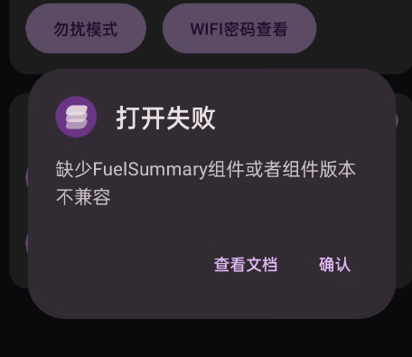

出现这个问题**很正常**，请**严格**按照以下步骤启用：

### 激活Shizuku并授权

1. 下载Shizuku

   ([下载 | Shizuku (rikka.app)](https://shizuku.rikka.app/zh-hans/download/))

2. 激活SHizuku

   激活方法：[用户手册 | Shizuku (rikka.app)](https://shizuku.rikka.app/zh-hans/guide/setup/)

下图为**激活正常界面**：**只有出现这个界面才能正常使用工具箱的功能**

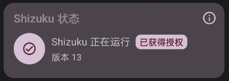

### 降级安装组件

1. 下载组件，两个版本**二选一**，详见[可用名单](#可用名单)

   | 名称     | 版本 | 链接                                                                                                   |
   | -------- | ---- | ------------------------------------------------------------------------------------------------------ |
   | 电源信息 | 1.2  | [点此下载](https://yorick.love/file/%E7%94%B5%E6%BA%90%E4%BF%A1%E6%81%AF-com.vivo.fuelsummary-1.2.apk) |
   | 电源信息 | 1.6  | [点此下载](https://yorick.love/file/%E7%94%B5%E6%BA%90%E4%BF%A1%E6%81%AF-com.vivo.fuelsummary-1.6.apk) |

2. 下载后找到**安装包**，点击后选择**降级安装**：

   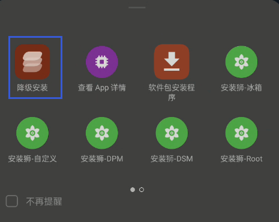

   如果找不到上面这个界面，进入**酷客工具箱—Shell界面—点击安装应用**，找到安装包并安装。

   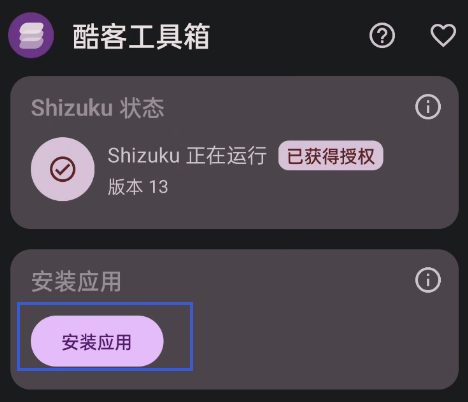

### 使用满血充电

完成[激活Shizuku并授权](#激活Shizuku并授权)、[降级安装组件](#降级安装组件)后，你就可用正式使用**满血充电**。

#### 文字教程

感谢群友[@张三]()提供的文字教程

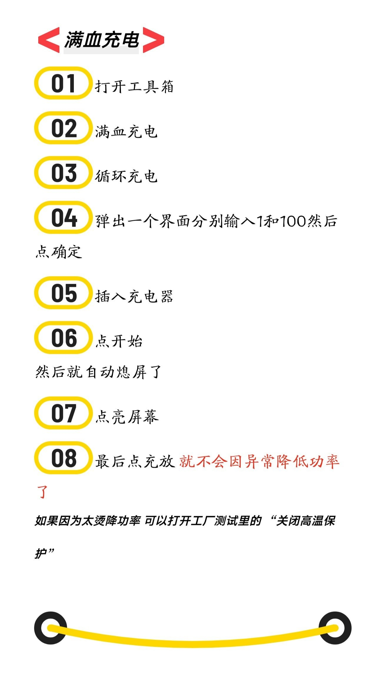

#### 视频教程

注意，最后要**点充放**，防止因为异常降低充电功率！（视频没提到）

> [教程视频点此](https://www.bilibili.com/video/BV1Fj411K7G4/)

<iframe src="//player.bilibili.com/player.html?aid=436962585&bvid=BV1Fj411K7G4&cid=1010286469&page=1" scrolling="no" border="0" frameborder="no" framespacing="0" allowfullscreen="true" height="400px" width="100%"> </iframe>

***

## 电量统计

对于电量统计看不了的**vivo/iqoo**手机

在shell界面

- iqoo 冻结`com.iqoo.powersaving`
- vivo 冻结`com.iqoo.powersaving`

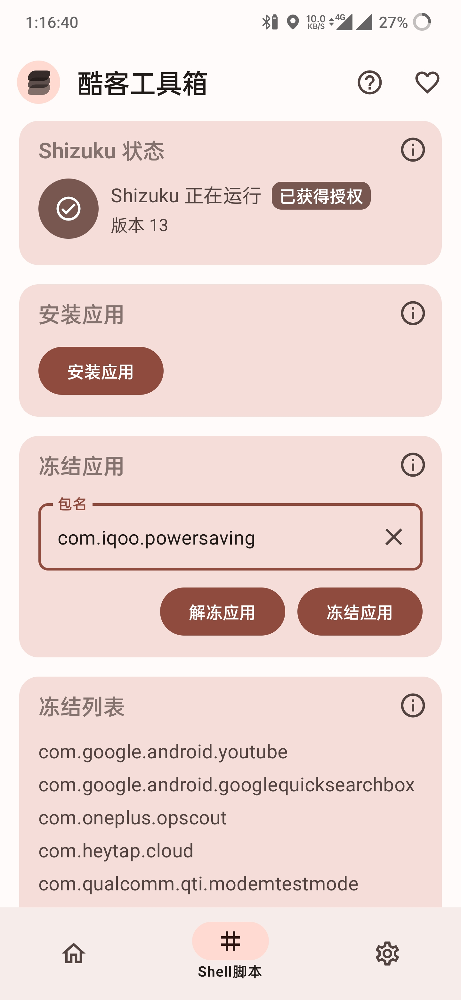

***

## 锁频段

通过手动锁定 Band 来提高某些场景下的网络速度。

### 安装组件

如果出现以下界面或者**打开失败**弹窗，说明您的**组件版本不匹配**，

请下载组件，[NetworkState.apk](https://yorick.love/file/NetworkState.apk)

参考[降级安装组件](#降级安装组件)安装即可。

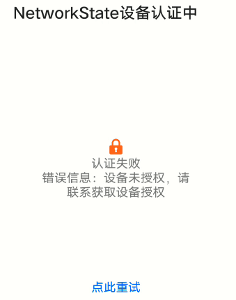

### 具体教程

选择**锁 Band**，进入后勾选要锁定频段，然后点击**确定**。

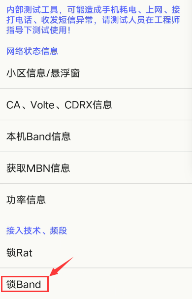

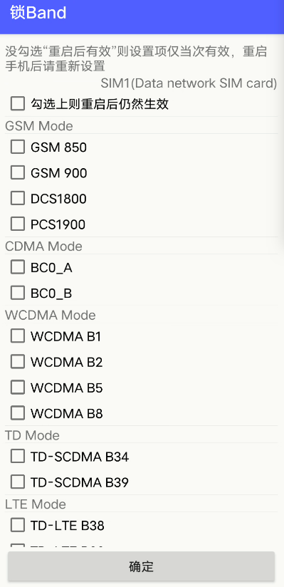

下面是一些参考，**具体还要看你的环境**，正常来讲手机自动选择最佳频段。但在是某些情况下，比如学校宿舍这种无线网络设备很多的地方，大量设备抢占最优频段，导致网络卡顿，这是选择**次优**的频段反而更快。

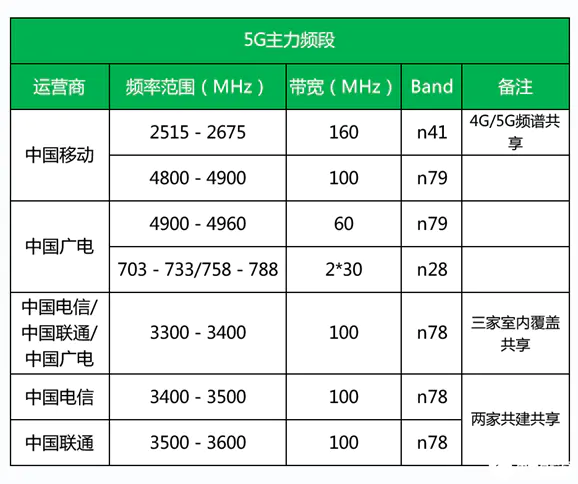

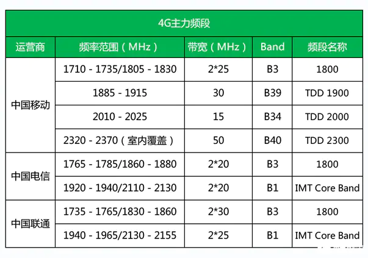

以上数据仅供参考
 

***

## 状态栏显秒

这个功能就是让你的状态栏显示**实时秒数**，这是安卓自带的功能，但是在很多定制系统被隐藏了，这里提供入口。

小米手机由于系统魔改无法使用这个功能！

点击**状态栏**

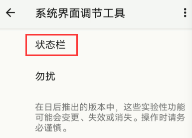

​	下滑找到**时间**

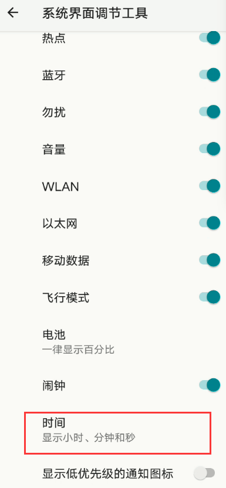

选中**显示小时、分钟和秒**

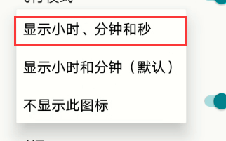

***

## 冻结应用

就是禁用这个应用，让他不会消耗系统资源，也无法使用，可以冻结一些不需要的应用，达到省电的目的。

## 资源下载

### 加群下载

本站流量资源有限，无法支撑大的下载量。

建议**加入 QQ 群-群文件-组件下载获取，群号：641096366**

群里还有老哥帮你解决问题，但是在问问题之前，一定要**先在文档中找一下**。99\%的答案都在本篇文档中了。

### 本站下载

| 组件名称     | 下载地址                                                                                               | 作用/功能 |
| ------------ | ------------------------------------------------------------------------------------------------------ | --------- |
| 电源信息1.2  | [点击此处](https://yorick.love/file/%E7%94%B5%E6%BA%90%E4%BF%A1%E6%81%AF-com.vivo.fuelsummary-1.2.apk) | 满血充电  |
| 电源信息1.6  | [点击此处](https://yorick.love/file/%E7%94%B5%E6%BA%90%E4%BF%A1%E6%81%AF-com.vivo.fuelsummary-1.6.apk) | 满血充电  |
| 工厂测试1.5  | [点击此处](https://yorick.love/file/%E5%B7%A5%E5%8E%82%E6%B5%8B%E8%AF%95_1.5.apk)                      |           |
| NetworkState | [点击此处](https://yorick.love/file/NetworkState.apk)                                                  | 锁频段    |

***

## 免责声明

本软件（酷客工具箱）和本文档仅供学习交流使用，使用本软件所造成的一切后果请用户自行承担，使用本软件即代表用户同意此声明。

***

## 隐私协议

本软件所需的互联网访问权限仅用于：
- 获取服务器的工具数据
- 采用Bugly采集应用崩溃信息，完善应用功能。[Bugly隐私协议](https://bugly.qq.com/v2/contract)

使用本软件代表您同意本软件的隐私协议。

***

## 可用名单

满血充电

正在统计中，欢迎评论区留言

**名单上没有不代表不可用**
**名单上没有不代表不可用**
**名单上没有不代表不可用**

| 机型                    | 系统版本     |
| ----------------------- | ------------ |
| iQOO                    | OriginOS 2.0 |
| IQOO 3                  | OriginOS 3.0 |
| IQOO 7                  | 8.9.5        |
| IQOO 8 / 8 Pro          | 最新         |
| IQOO 9 Pro              | 最新         |
| IQOO 10 / 10 Pro        | 最新         |
| IQOO 11                 | 7.19         |
| IQOO Z3                 | OriginOS 2.0 |
| IQOO Z5 / Z5x           | OriginOS 2.0 |
| IQOO Neo5 / 5s / 活力版 | OriginOS 3.0 |
| IQOO Neo6               | OriginOS 3.0 |
| IQOO Neo7               | 13.1.9.1     |
| vivo X90 Por+           | 19.1         |

***

**如何您觉得软件或者文档有用，可以请我喝杯冰镇快乐水。**

***

**支付宝每日红包，每天都有，建议保存下来每日扫码领红包。**

