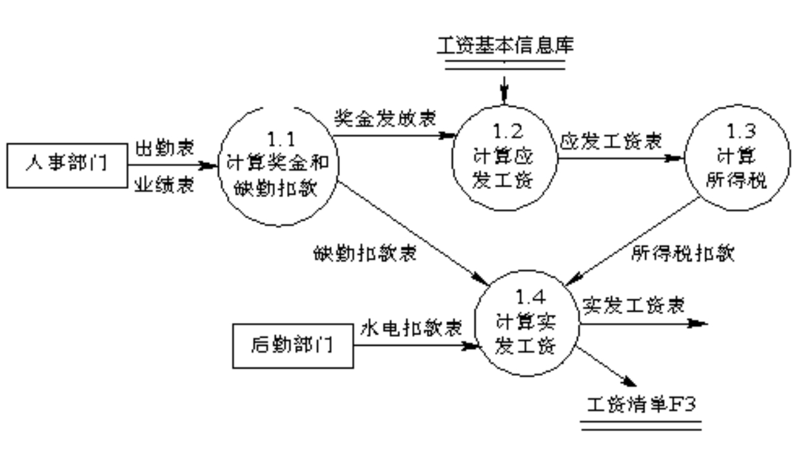

- [软件工程复习](#软件工程复习)
  - [软件工程概述](#软件工程概述)
    - [发展阶段](#发展阶段)
    - [软件危机](#软件危机)
    - [软件开发（过程）模型](#软件开发过程模型)
      - [瀑布模型](#瀑布模型)
      - [增量模型](#增量模型)
      - [原型模型](#原型模型)
      - [螺旋模型](#螺旋模型)
      - [喷泉模型](#喷泉模型)
    - [软件开发方法](#软件开发方法)
      - [结构化开发方法（Structured Developing Method）](#结构化开发方法structured-developing-method)
      - [原型化开发方法](#原型化开发方法)
      - [面向对象方法(OOSD)](#面向对象方法oosd)
  - [软件需求工程](#软件需求工程)
    - [需求工程过程](#需求工程过程)
    - [需求分析方法](#需求分析方法)
    - [数据流图（DFD）](#数据流图dfd)
    - [Use-Case 图](#use-case-图)
      - [用例图中的各种关系](#用例图中的各种关系)
  - [软件设计](#软件设计)
    - [软件设计阶段的任务](#软件设计阶段的任务)
    - [软件设计阶段的目标](#软件设计阶段的目标)
    - [软件体系结构设计](#软件体系结构设计)
      - [仓库模型](#仓库模型)
      - [层次模型](#层次模型)
      - [分布式模型](#分布式模型)
        - [C/S（客户/服务器模型）](#cs客户服务器模型)
        - [B/S（浏览器/服务器模型）](#bs浏览器服务器模型)
      - [云计算模型](#云计算模型)
    - [系统的数据设计](#系统的数据设计)
      - [E-R图](#e-r图)
    - [模块](#模块)
      - [模块分解](#模块分解)
      - [模块的独立性](#模块的独立性)
        - [耦合性（Coupling）](#耦合性coupling)
        - [内聚性（Cohesion）](#内聚性cohesion)
    - [面向对象设计](#面向对象设计)
      - [OOD的准则](#ood的准则)
      - [OOD基本任务](#ood基本任务)
    - [MVC设计模式](#mvc设计模式)
  - [面向对象方法与统一建模语言UML](#面向对象方法与统一建模语言uml)
  - [软件构造](#软件构造)
    - [程序设计方法（Structured Program）](#程序设计方法structured-program)
      - [结构化程序设计](#结构化程序设计)
      - [面向对象程序设计](#面向对象程序设计)
    - [算法与程序效率](#算法与程序效率)
      - [编码策略](#编码策略)
    - [软件代码审查](#软件代码审查)
    - [软件复用](#软件复用)
  - [软件测试](#软件测试)
    - [静态分析](#静态分析)
    - [动态测试](#动态测试)
      - [白盒测试](#白盒测试)
      - [黑盒测试](#黑盒测试)
      - [基本路径法](#基本路径法)
    - [测试用例](#测试用例)
  - [软件维护](#软件维护)
    - [基本概念](#基本概念)
      - [软件维护的类型](#软件维护的类型)
      - [软件维护的特性](#软件维护的特性)
      - [结构化维护与非结构化维护](#结构化维护与非结构化维护)
      - [软件维护的代价](#软件维护的代价)
    - [软件维护的过程](#软件维护的过程)
    - [软件可维护性](#软件可维护性)
  - [软件项目管理](#软件项目管理)
    - [软件项目计划](#软件项目计划)
      - [软件项目计划内容](#软件项目计划内容)
      - [软件开发进度计划](#软件开发进度计划)
    - [软件成本估算技术](#软件成本估算技术)
      - [成本估算模型](#成本估算模型)
  - [软件能力成熟度模型CMM](#软件能力成熟度模型cmm)
    - [什么是软件过程成熟度](#什么是软件过程成熟度)
    - [软件过程的成熟度等级](#软件过程的成熟度等级)
    - [软件能力成熟度模型集成(CMMI)](#软件能力成熟度模型集成cmmi)
  - [例题（小题）](#例题小题)
  - [例题（大题）](#例题大题)
    - [例1：医院病房监护系统](#例1医院病房监护系统)
    - [例2：BBS论坛的基本功能](#例2bbs论坛的基本功能)
    - [例3：银行取款过程](#例3银行取款过程)
    - [例4：一个报表系统的扼要功能模型](#例4一个报表系统的扼要功能模型)
    - [例5：学生选课](#例5学生选课)
    - [例6：保险金程序](#例6保险金程序)
    - [例7：白盒测试](#例7白盒测试)
    - [例8：教务管理系统](#例8教务管理系统)
    - [例9：工资计算系统](#例9工资计算系统)
    - [例10：看代码程序](#例10看代码程序)

# 软件工程复习

## 软件工程概述

概念：**用工程化的思想指导软件开发**

### 发展阶段

1. 第一代软件工程 — 传统的软件工程
2. 第二代软件工程 — 对象工程
3. 第三代软件工程 — 过程工程
4. 第四代软件工程 — 构件工程

### 软件危机

软件危机的出现是由于**软件的规模越来越大，复杂度不断增加，软件需求量增大。**

主要表现：

- 质量差
- 效率低，不满足需求

### 软件开发（过程）模型

软件过程模型是描述软件开发过程中各种活动如何执行的模型，也叫软件过程模型或软件生命周期。

目前典型的软件开发模型有：

**瀑布模型**、增量模型、**螺旋模型、喷泉模型**、变换模型和基于知识的模型等。

参考[软件过程模型-过程改进 (uml.org.cn)](http://www.uml.org.cn/SoftWareProcess/201802062.asp)

#### 瀑布模型

瀑布模型是一种线性的过程，瀑布模型要求有明确的需求分析，而要达到这一点在现实开发中几乎不可能。这种模型是最早也是应用最广泛的软件过程模型。

瀑布模型的优缺点：

优点

- 简单易行
- 可以进行阶段检查，能够及时发现问题
- 较好的分工协作，不同阶段不同职位，架构师，项目经理，开发工程师，测试工程师，运维工程师
- 对质量有一定的保障，因为每个阶段有详细的文档

缺点

将充满回溯的软件开发过程硬性分割为几个阶段

- 难以响应需求的变更
- 工作量分配不均匀
- 前期阶段受阻压缩后期进展

[瀑布模型总结](https://www.cnblogs.com/lanjianhappy/p/11934284.html)

#### 增量模型

融合了瀑布模型的基本成分和原型实现的迭代特征。增量模型强调每一个增量均发布一个可操作的产品。增量模型在各个阶段并不交付一个可运行的完整产品，而是交付满足客户需求的一个子集的可运行产品。

优点：

1. 人员分配灵活

2. 第一个可交付版本所需要的成本和时间很少

缺点：

1. 软件具备开放式体系结构

2. 容易退化为边做边改，使软件过程的控制失去整体性。

3. 至始至终开发者和客户纠缠在一起，直到完全版本出来。

#### 原型模型

最大特点就是它采用了一种动态定义需求的方法。即不需要有明确的需求。被开发的原型应交付客户使用，并收集客户的反馈意见，可在下一轮中对原型进行改进。

过程：

1. 快速分析
2. 构造原型
3. 运行和评价原型
4. 修改与改进

是一种循环模型

优点：能够快速、低成本地构建原型

缺点：没有考虑软件的整体质量和长期的可维护性

适用对象：开发初期用户需求是不完整、不准确的

#### 螺旋模型

将瀑布模型和原型化模型结合起来，并加入**风险分析**（主要特征）

螺旋模型将开发过程分为几个螺旋周期，每个螺旋周期可分为**4个工作步骤**：

1. 确定目标、方案和限制条件；
2. 评估方案、标识风险和解决风险；
3. 开发确认产品；
4. 计划下一周期工作。


优点：支持用户需求的动态变化。

缺点：

1. 需要开发人员具有相当丰富的风险评估经验和专门知识。
2. 增加开发成本和延迟提交时间。
3. 支持用户需求的动态变化

使用对象：庞大、复杂且具有高风险的系统。

#### 喷泉模型

以用户需求为动力，已对象作为驱动的模型。适用**面向对象**的开发过程，最核心的特点是**迭代性和无间隙性**。所有的开发活动没有明显的边界，允许各种开发活动同步进行。

开发过程分为4个阶段：

- 分析
- 系统设计
- 软件设计
- 实现

特点：各阶段相互重叠，反映了软件过程**并行**的特点

优点：提高软件项目的开发效率，节省开发时间。

缺点：

1. 需要大量的开发人员，不利于项目的管理。
2. 要求严格管理文档，使得审核的难度加大。

### 软件开发方法

软件开发的目标是要在规定的投资和时间内，开发出符合用户的需求，高质量的软件，为此需要有成功的开发方法。

#### 结构化开发方法（Structured Developing Method）

大问题分解为小问题，逐一解决。

指导思想：**自顶向下，逐步求精**

主要特点：**快速，自然，方便，容易理解。**

具体组成：

- 结构化程序设计方法（SP， Structured Program）
- 结构化设计方法（SD，Structured Design）
- 结构化分析方法（SA，Structured Analysis）

#### 原型化开发方法

又称速成原型法（ RapidPrototyping），花费少量代价建立一个可运行的系统，使用户及早获得学习的机会。

1. 废弃（throw away）型

   RSP法（Rapid Specific Prototyping）快速建立需求规格原型。

2. 追加（add on）型

   RCP法（Rapid Cyclic Prototyping）快速建立渐进原型法。采用循环渐进的开发方式，对系统模型作连续精化。

#### 面向对象方法(OOSD)

特点：封装，继承，多态

具体组成

- OOA 面向对象的分析
- OOD 面向对象的设计
- OOP 面向对象的程序设计

## 软件需求工程

软件需求包括**用户需求**和**系统需求**，系统需求包括**功能需求**，**非功能需求**和**领域需求**。


### 需求工程过程

1. 获取需求
2. 获取分析与建模
3. 确认需求
4. 进化需求

需求抽取的方法一般有：

1. 面谈法
2. 问卷调查法
3. 需求专题讨论会
4. 原型法获取
5. 面向用例的方法

### 需求分析方法

1. 功能分析方法

   系统功能模块划分图

2. 结构化分析方法（SA法）

   分层数据流图

3. 信息建模法

   ER图

4. 面向对象分析法

   UML

### 数据流图（DFD）

数据流图（Data Flow Diagram，DFD）是描述系统中数据流程的图形工具，它描述了将系统的逻辑输入转换为逻辑输出所需的加工处理过程。

数据字典：数据流，加工，数据存储和数据源点或终点。


### Use-Case 图

采用“基于用例的方法”来识别和获取需求，是从外部的角度来看系统功能，建立系统的Use case模型。描述外部执行者(Actor)所理解的系统功能。即待开发系统的功能需求。

- 用例：表示一个子系统，或者系统一个独立的功能。
- 角色：表示外部的“执行者”。


#### 用例图中的各种关系

参与者与用例的关系：实线箭头，表示关联关系

用例与用例之间：虚线箭头连接

- 包含`<<include>>`：一个用例需要某种功能，而该功能被另外一个用例定义，那么在用例的执行过程中，就可以调用已经定义好的用例

  

- 拓展`<<extend>>`：可选的或只在特定条件下才执行的动作

  

## 软件设计

软件设计是软件开发的关键步骤，直接影响软件质量。软件设计阶段要解决**“如何做”**的问题。

### 软件设计阶段的任务

将分析阶段获得的需求说明转换为计算机中实现的系统。包括：

- 确定软件结构
- 确定系统的数据结构
- 设计用户界面

### 软件设计阶段的目标

软件设计的目标就是构建一个**高内聚低耦合**的软件模型。

### 软件体系结构设计

软件体系结构不仅指定了系统的**组织结构和拓扑结构**，显示了系统需求和构成系统的元素之间的对应关系，而且提供了一些设计决策的基本原理。

#### 仓库模型

仓库模型是一种**集中式**的模型。在这种结构模型中，应用系统**用一个中央数据仓库来存储各个子系统共享的数据**。

优点：

1. 数据由一个子系统产生，并且被其他一些子系统共享。
2. 共享数据能得到有效的管理，各子系统之间不需要通过复杂的机制来传递共享数据。
3. 一个子系统不必关心其他的子系统是如何使用它产生的数据的。
4. **所有的子系统都拥有一致的甚于中央数据仓库的数据视图**。如果新子系统也采用相同的规范，则将它集成于系统中是容易的。

缺陷：

1. 虽然共享数据得到了有效的管理，但随之而来的问题是**各子系统必须有一致的数据视图，以便能共享数据**，换句话说，就是各子系统之间为了能共享数据必须走一条折中的路线，这不可避免地会影响整个系统的性能。
2. 一个子系统发生了改变，它产生的数据结构也可能发生改变。为了其他共享的目的，数据翻译系统会被用到。但这种翻译的代价是很高的，并且有时是不可能完成的。
3. 中央数据仓库和各子系统拥有的数据库必须有相同的关于备份、安全、访问控制和恢复的策略，这可能会影响子系统的效率。
4. 集中式的控制使数据和子系统的分布变得非常困难甚至成为不可能。这里分布一词指的是将数据或子系统分散到不同的机器上。

#### 层次模型

层次结构模型**将系统划分为若干层次**。适合增量的软件开发。

经典例子：OSI参考模型（七层）

#### 分布式模型

分布式结构中的节点可以是同构的（即具有相应的软/硬系统），也可以是异构的。

##### C/S（客户/服务器模型）

C/S结构的应用都由三个相对独立的逻辑部分组成：

- 用户界面层（客户端）
- 业务逻辑层（客户端/服务器）
- 数据访问层（服务器）

胖瘦客户端的区别主要在于**数据逻辑层**的占比。

C/S在更新客户端时需要用户下载新版本或者更新程序，

##### B/S（浏览器/服务器模型）

典型的瘦客户结构。重新部署很方便。

优点：

1. 资源共享
2. 开放性好
3. 可伸缩性好
4. 容错能力强
5. 透明性好

不足：

1. 复杂性较大
2. 安全性较低
3. 可管理性较困难（异构）
4. 不可预知性（系统响应时间，受网络环境影响大）

#### 云计算模型

基本特征：

1. 随需应变自助服务
2. 随时随地用任何网络设备访问
3. 多人共享资源池
4. 快速重新部署灵活度
5. 可被监控与量测的服务

服务模式：

1. 软件即服务（SaaS）
2. 平台即服务（PaaS）
3. 基础架构即服务（IaaS）

### 系统的数据设计

数据模型是系统内部的静态数据结构，它包括3种相互关联的信息：

- 数据对象
- 数据属性
- 关系

#### E-R图

E-R图也称实体——联系图(Entity Relationship Diagram)，提供了表示实体类型、属性和联系的方法，用来描述现实世界的概念模型。

- 用“矩形框”表示实体型，矩形框内写明实体名称；
- 用“椭圆图框”或圆角矩形表示实体的属性，并用“实心线段”将其与相应关系的“实体型”连接起来；
- 用“菱形框”表示实体型之间的联系成因，在菱形框内写明联系名，并用“实心线段”分别与有关实体型连接起来，同时在“实心线段”旁标上联系的类型（`1:1`,`1:n`或`m:n`）。

### 模块

模块（Module）是命名的程序对象的集合，如过程、函数、类等。

#### 模块分解

目的：

1. 降低复杂性
2. 使软件结构清晰，便于阅读和理解
3. 易于测试和调试
4. 提高软件的可靠性

#### 模块的独立性

所谓模块的独立性，是指软件系统中每个模块只涉及软件要求的具体的子功能，而和软件系统中其他的模块的接口是简单的。**即独立性的模块应具有专一功能。**

**模块独立性越强，并行开发越容易。**

模块独立性的度量标准：**耦合性**和**内聚性**

##### 耦合性（Coupling）

指软件结构系统中模块之间相互连接的紧密程度，是模块间相互连接性的度量。

##### 内聚性（Cohesion）

表示一个模块内部各种数据和各种处理之间联系的紧密程度，它是从功能的角度来度量模块内的联系

### 面向对象设计

面向对象的系统开发分为三个阶段：

1. 面向对象分析（Object-OrientedAnalysis，OOA）

2. **面向对象设计**（Object-Oriented Design，OOD）**（核心）**

3. 面向对象程序设计（Object-Oriented Programming，OOP）

#### OOD的准则

1. 抽象
2. 信息隐藏
3. 弱耦合
4. 强内聚
5. 可重用

#### OOD基本任务

OOD的目标是产生一个**满足用户需求的可实现的**OOD模型。

OOD的主要任务是**对象设计**。

### MVC设计模式


## 面向对象方法与统一建模语言UML

用例之间的关系：

- 包含`<<include>>`：

  包含关系描述的是一个用例需要某种功能，而该功能被另外一个用例定义，那么在用例的执行过程中，就可以调用已经定义好的用例。

- 拓展`<<extend>>`：

  用一个用例（可选）扩展另一个用例（基本例）的功能。**将一些常规的动作放在一个基本用例中，将可选的或只在特定条件下才执行的动作**

  **放在它的扩展用例中。**

## 软件构造

软件构造（Software Construstion）指通过编码、验证、单元测试、集成测试和排错的组合，创建一个可以工作的、有意义的软件。

### 程序设计方法（Structured Program）

#### 结构化程序设计

结构程序设计的概念最早是由E.W.Dijkstra提出来的。其基本思想是**自顶向下、逐步求精**。它的基本原则是功能的**分解**与**抽象**。

特点：

1. 自顶向下，逐步求精

2. 单入口和单出口的控制结构

   结构化的程序是由且仅由**顺序、选择、循环**三种基本控制结构组成

#### 面向对象程序设计

背景：对软件的**可重用和可扩展性**的需求越来越强烈

核心概念：

- 数据封装
- 继承
- 多态
- 泛型

### 算法与程序效率

#### 编码策略

1. 在高级别的警告模式下编译程序
2. 尽量采用自动化的编程工具
3. 交叉审阅代码
4. 只让一个功能模块完成一个任务
5. 正确性、简单性和清晰性是第一位的
6. 尽量避免全局和共享数据的使用
7. 总是初始化变量
8. 避免编写行数很多的函数，避免过深的嵌套

### 软件代码审查

为保证代码开发的质量，在编码完成后，进行代码审查或称Review。审查内容：

1. 程序的版式
2. 文件结构
3. 命名规则
4. 表达式与基本语句

### 软件复用

软件复用就是将已有的软件成分用于构造新的软件系统，以达到提高软件系统的开发质量与效率，降低开发成本的目的。

软件复用不仅是对程序的复用，它包括对软件生产过程中任何活动所产生的制成品的复用。

软件复用的级别：（抽象程度**由低到高**）

1. 代码的复用
2. 设计结果的复用
3. 分析结果的复用
4. 测试信息的复用

可复用构建的标准：

一个软件只有在多个系统中被使用才可称为“可复用构件”，必须具备的条件：

1. 功能上的独立性和完整性
2. 较高的通用性
3. 较高的灵活性
4. 严格的质量保证
5. 较高的标准化程度

## 软件测试

目的：发现和改正错误，最终提高软件质量。

特点：

- 开销大
- 不能进行“穷举”测试

软件测试的基本步骤：

1. 模块测试（单元测试）
2. 整体测试（组装测试）
3. 功能测试（有效性测试）
4. 系统测试（确定测试）
5. 验收测试
6. 安装测试

### 静态分析

指以人工的、非形式化的方法对程序进行分析和测试。

主要特征：测试过程不在计算机上运行被测试的程序。

- 桌前检查

  由开发人员之外的其他人员对代码进行仔细的检查和评估，以确保代码的质量和正确性。

- 代码会审

  多个开发人员一起审查和讨论代码的过程。

- 步行检查（Walkthrough）

  由开发人员和其他相关人员一起进行的、结构化的、非正式的技术评审过程。

  常用工具：调用图、数据流分析图

### 动态测试

主要特征：必须要在计算机上运行被测试的程序，通过输入测试用例，对其运行结果进行分析。

#### 白盒测试

分析程序的内部逻辑结构，注意选择适当的覆盖标准，设计测试用例，对主要路径进行尽可能多的测试。

#### 黑盒测试

不考虑程序的内部结构与特性，只根据程序功能或程序的外部特性设计测试用例。

1. 语句覆盖：选择足够的测试用例，使得程序中每个语句至少都能被执行一次。
2. 判定覆盖：执行足够的测试用例，使得程序中每个判定至少都获得一次“真”值和“假”值。
3. 条件覆盖：执行足够的测试用例，使得判定中的每个条件获得各种可能的结果

#### 基本路径法

从一个程序的入口开始，**执行所经历的各个语句的完整过程**。

1. 画出程序的控制流图
2. 计算环路复杂度V（G）
   - `V(G)=边的数量-节点的数量+2`
   - `V(G)=判断节点的数量+1`
3. 列出独立路径集
4. 准备测试用例

具体请参考：[软件测试复习 | Yorick Harbor](https://yorick.love/2023/02/18/软件测试复习/)

### 测试用例


## 软件维护

### 基本概念

软件维护是指软件系统交付使用以后，其目的是为了改正错误或满足新的需求而修改软件的过程。按照不同的维护目的，维护工作可分成4类。

#### 软件维护的类型

1. 完善性维护（Perfective Maintenance）
2. 适应性维护（Corrective Maintenance）
3. 纠错性维护（Adaptive Maintenance）
4. 预防性维护（Preventive Maintenance）

#### 软件维护的特性

1. **时间长、工作量大、成本高**
2. 维护的副作用
   - 修改代码的副作用
   - 修改数据的副作用
   - 修改文档的副作用
3. 软件维护的困难

#### 结构化维护与非结构化维护

- 结构化维护：指软件开发过程是按照软件工程方法，软件的维护过程，有一整套完整的方案、技术、审定过程。显然，维护工作的难度及工作
  量的大小，与前期的开发工作密切相关。
- 非结构化维护：缺乏必要的文档说明，难于确定数据结构、系统接口等特性。维护工作令人生畏，事倍功半

#### 软件维护的代价

1. 软件维护的工作量大

   影响因素

   1. 系统规模大小
   2. 程序设计语言
   3. 系统使用年限
   4. 软件开发新技术的应用
   5. 设计过程中的技术

2. 软件维护工作量模型

   `M=P+K*EXP(C-D)`

   其中：M表示维护总工作量，P表示生产性活动工作量，K为经验常数，C表示由非结构化维护引起的程序复杂度，D表示对维护软件熟悉程度的度量。

### 软件维护的过程

软件维护工作不仅是技术性的，还需要大量的管理工作与之相配合，才能保证维护工作的质量。管理部门应对提交的修改方案进行分析和审查，并对修改带来的影响作充分的估计，对于不妥的修改予以撤销。

### 软件可维护性

软件可维护性是指软件**能够被理解，并能纠正软件系统出现的错误和缺陷，以及为满足新的要求进行修改、扩充或压缩的容易程度**。衡量可维护性标准：

1. 可理解性
2. 可靠性
3. 可测试性
4. 可修改性
5. 可移植性
6. 效率
7. 可使用性

提高可维护性的方法：

1. 建立明确的软件质量目标
2. 使用先进的软件开发技术和工具
3. 建立明确的质量保证工作
   - 在检查点进行复审
   - 验收检查
   - 周期性的维护检查
   - 对软件包进行检查
4. 选择可维护的程序设计语言
5. 改进程序的文档

## 软件项目管理

软件项目管理是对软件项目开发全过程的管理，是对整个软件生存期的所有活动进行的管理。

### 软件项目计划

#### 软件项目计划内容

1. 项目范围
2. 项目资源
3. 项目进度安排

#### 软件开发进度计划

描述计划进度的主要工具：

1. 一般的表格工具
2. 甘特图（Gantt Chart）
3. 时标网状图（timescalar network）
4. PERTT（Program evaluation & review technique）计划评审技术和CPM（Critical path method）关键路径法

### 软件成本估算技术

#### 成本估算模型

1. 专家估算模型
2. IBM估算模型
3. Putnam估算模型
4. COCOMO模型
   - 基本的COCOMO模型
   - 中间的COCOMO模型
   - 详细的COCOMO模型

## 软件能力成熟度模型CMM

软件能力成熟度模型CMM（Capability MaturityModel）是由美国卡内基梅隆大学软件工程研究所(CMU/SEI)推出的评估软件能力与成熟度的一套标
准，该标准基于众多软件专家的实践经验。

CMM侧重于软件开发过程的管理及工程能力的提高与评估，是国际上流行的软件生产过程标准和软件企业成熟度等级认证标准，它更代表了一种管理哲学在软件企业中的应用。

### 什么是软件过程成熟度

一个组织的软件过程能力为组织提供了预测软件项目开发的数据基础，提供了全面的软件质量保证。

软件过程成熟度是指一个软件过程被明确**定义、管理、度量和控制**的有效程度。

成熟意味着软件过程能力持续改善的过程，**成熟度代表软件过程能力改善的潜力**

### 软件过程的成熟度等级

软件过程成熟度模型定义了五个等级，从初始级别到优化级别，分别是：

1. 初始级别（Level 1 - Initial）：过程是**无序**、**无计划**和**不可预测**的，缺乏一致性和稳定性。

2. 可重复级别（Level 2 - Repeatable）：过程已经建立了基本的管理控制，能够在一定程度上**重复**执行。

3. 定义级别（Level 3 - Defined）：过程已经被**正式定义**和**文档化**，能够在整个组织中得到有效的应用。

4. 管理级别（Level 4 - Managed）：过程已经被**量化**和**管理**，能够进行定量的分析和改进。

5. 优化级别（Level 5 - Optimizing）：过程已经达到了最高级别，能够**不断优化和改进**，以满足不断变化的需求和挑战。

每个级别都有一组特定的目标和实践，组织可以根据自己的需求和实际情况选择适合自己的级别进行评估和改进。软件过程成熟度模型的目的是帮助组织建立一套可靠、稳定和可重复的软件开发过程，以提高软件质量和开发效率。

### 软件能力成熟度模型集成(CMMI)

CMMI （Capability Maturity Model Integration）是软件工程模型、系统工程模型、集成化产品和过程开发模型以及集成供应商管理模型等多个模型的**集合**。

## 例题（小题）

1. 软件设计的主要任务是（A）。
   **A) 将分析阶段获得的需求说明转换为计算机中可实现的系统**
   B) 完成系统的数据结构和程序结构设计
   C) 完成模块的编码和测试
   D) 对模块内部的过程进行设计

2. 从工程管理的角度来看，软件设计分两步完成()。

   **①总体设计 ②详细设计**

3. 用户界面设计的任务包括()。

   - 确定用户界面类型
   - 建立任务模型
   - 建立用户模型

4. 胖客户模型和瘦客户模型的区别是什么？

   胖客户模型和瘦客户模型是两种不同的客户端/服务器端应用程序架构模型，它们的区别在于客户端的职责和功能不同。

   - 胖客户模型

   胖客户模型也称为“厚客户端”模型，它是指客户端负责处理应用程序的大部分逻辑和数据处理，而服务器端只提供少量的数据和处理服务。在这种模型中，客户端通常包含一个完整的应用程序，包括用户界面、业务逻辑和数据访问层。这种模型的优点是客户端可以快速响应用户请求，减轻服务器端的负载，但缺点是客户端需要占用较多的资源，且难以维护和升级。

   - 瘦客户模型

   瘦客户模型也称为“薄客户端”模型，它是指客户端只负责用户界面和少量的业务逻辑，而服务器端负责大部分的数据处理和业务逻辑。在这种模型中，客户端通常只包含一个简单的用户界面和少量的业务逻辑，所有的数据和处理都由服务器端提供。这种模型的优点是客户端资源占用较少，易于维护和升级，但缺点是对服务器端的负载较大，且客户端响应速度较慢。

5. 面向对象设计的准则有哪些？

   1. 抽象
   2. 信息隐藏
   3. 弱耦合
   4. 强内聚
   5. 可重用

6. 为什么要进行软件维护？

   **软件维护是指软件系统交付使用以后，为了改正错误或满足新的需求而修改软件的过程。**一个中等规模的软件，如果其开发过程需要一二年时间，则它投入使用以后，其运行时间可能持续5～10年之久。在这个维护阶段中，**人们需要着手解决开发阶段尚未解决的问题**，同时，**还解决维护工作本身所产生的问题**。做好软件的维护工作不仅能够**排除软件中存在的错误，使它能够正常工作，而且还可以使它扩充功能，提高性能，为用户带来新的效益**。维护阶段的花费约占整个软件生命期花费的67%。因此，应充分认识到维护现有软件的重要意义。

7. 怎样防止维护的副作用？

   - **修改代码所产生的副作用**一般可以在**退化测试**过程中对其造成系统的故障进行查明和纠正；

   - **完善设计文档资料可以限制修改数据的副作用**，在文档中描述了数据结构，并提供了一种把数据元素、记录、文件以及其他结构与系统模块联系起来的交叉对照表；
   - 在软件系统再次交付使用之前，对整个软件配置进行复审，将能大大减少**文档资料的副作用**。

## 例题（大题）

### 例1：医院病房监护系统

在医院ICU病房里，将病症监视器安置在每个病床，对病人进行监护。监视器将病人的组合病症信号实时地传送到中央监护系统进行分析处理。

在中心值班室里，值班护士使用中央监护系统对病员的情况进行监控，监护系统实时地将病人的病症信号与标准的病诊信号进行比较分析，当病症

出现异常时，系统会立即自动报警，并打印病情报告和更新病历。

根据医生的要求随时打印病人的病情报告，系统还定期自动更新病历。

经过初步的需求分析，得到系统功能要求：

1. 监视病员的病症(血压、体温、脉搏等)。

2. 定时更新病历。
3. 病情出现异常情况时报警。
4. 随机地产生某一病员的病情报告。

系统功能需求：

1. 监视病员的病症（局部监视）
   - 采集病症信号(血压、体温、脉搏等)。
   - 组合病症信号。
   - 将模拟病症信号转换为数字信号（A-D转换）。

2. 定时更新病历（更新日志）

   - 将病症信号进行格式化并加入更新日期、时间。
   - 更新病历库中病人的信息。
   - 可人工设定更新病历的时间间隔

3. 病情出现异常情况时报警

   - 根据标准病症信号库中的值，判断是否报警。

   - 将报警信号转换为各种模拟信号（D-A转换）。

   - 实时打印病情报告，立即更新病历。

4. 随机地产生某一病员的病情报告（产生病情报告）

非功能需求：

1、监视器与网络的**可靠性要求**，涉及人的生命安全。

2、**效率需求**中对时间、空间的需求，所采集的病症信号数据量大。

3、**互操作需求**——如要求监视器采样频率可人工调整等。

4、对病人病历的**隐私的要求**。

医院病房监护系统分层DFD图

顶层确定了系统的范围，其外部实体为病员和护士


### 例2：BBS论坛的基本功能

用户登录进入论坛(一般为游客，有时还要注册为会员)，就某个话题展开讨论。通过发帖功能发布新的话题；通过回帖功能回复已有的话题；通过搜索功能查找已有的话题。管理员通过管理功能创建、编辑、删除论坛的版块；管理注册的用户；管理帖子等。

请绘制系统管理和系统用户的用例图，以及会员发帖和回帖的时序图。

- 系统管理的用例图

  

- 系统用户的用例图

  

- 会员发帖回帖的时序图

  

### 例3：银行取款过程

画出银行取款过程的DFD图。问题描述为：储户用存折取款，首先填写取款单，根据“账卡”中的信息检验取款单与存折，如有问题，将问题反馈给储户，否则，登录“储户存款数据库”，修改相应数据，并更新“账卡”，同时发出付款通知，出纳向储户付款。


### 例4：一个报表系统的扼要功能模型

报表系统主要功能：根据输入数据，进行分析，最终输出符合要求的数据。


报表系统的用例图


### 例5：学生选课

某程序的输入条件为：每个学生可以选修1至3门课程，试用黑盒法设计测试用例。

（1）按等价分类法设计测试用例

（2）按边缘值分析法设计测试用例。

（1）答：

- 合理等价类
  - 选修1门
  - 选修2门
  - 选修3门
- 不合理等价类
  - 没选课
  - 选3门以上
- 测试用例
  - 选修＝2
  - 选修＝0
  - 选修>3

 （2） 边缘值法 0，1，3，4

### 例6：保险金程序

保险金程序，用等价分类法设计测试用例。

`保险金＝基本保险费率×年龄系数－安全驾驶折扣`

| **年龄范围**  | **年龄系数** | **安全驾驶折扣** |
| ------------- | ------------ | ---------------- |
| **〔18,25)**  | **2.8**      | **50**           |
| **〔25,35)**  | **1.8**      | **50**           |
| **〔35,45)**  | **1.0**      | **100**          |
| **〔45,60)**  | **0.8**      | **150**          |
| **〔60,100)** | **1.5**      | **200**          |

答：

| 编号 | 年龄 | 等价类类型 |
| ---- | ---- | ---------- |
| 1    | 20   | 有效等价类 |
| 2    | 30   | 有效等价类 |
| 3    | 40   | 有效等价类 |
| 4    | 50   | 有效等价类 |
| 5    | 80   | 有效等价类 |
| 6    | 10   | 无效等价类 |
| 7    | 120  | 无效等价类 |

### 例7：白盒测试

为以下程序段设计一组测试用例，要求分别满足语句覆盖、判定覆盖、条件覆盖。

```java
void  DoWork (int x,int y,int z)
{
   int  k=0,j=0;
   if ( (x>3)&&(z<10) )
   {   k=x*y-1;  
       j=sqrt(k);  
   }                                //语句块1 
   if ( (x==4)||(y>5) )
   {  j=x*y+10;   }                 //语句块2 
   j=j%3;                           //语句块3
}
```

语句覆盖：

| x    | y    | z    |
| ---- | ---- | ---- |
| 4    | 6    | 9    |

判定覆盖：

| x    | y    | z    | 判定 |
| ---- | ---- | ---- | ---- |
| 4    | 6    | 9    | TT   |
| 3    | 4    | 10   | FF   |

条件覆盖：

| x    | y    | z    | 条件 |
| ---- | ---- | ---- | ---- |
| 4    | 6    | 9    | TTTT |
| 3    | 4    | 10   | FFFF |

### 例8：教务管理系统

拟开发一软件，完成学校管理中的教务部门功能，包括班级管理、课程管理、帐户管理等。

班级管理用例包括新建班级、修改班级、解散班级、查看班级。

课程管理用例包括添加课程计划、修改课程、删除课程、审批课程、课程查询、成绩查询。其中课程查询和成绩查询都包含了打印结果功能。

账户管理用例包括登录、添加账户、更改账户、删除账户。   画出该系统的用例图。

系统总用例图：


班级管理用例图：


课程管理用例图：


账户管理用例图：


### 例9：工资计算系统

工资计算系统包含如下功能：

1. 计算工资

   根据人事部门给出的出勤表和业绩表计算奖金和缺勤扣款，通过生成的奖金发放表及工资基本信息库的信息计算应发工资，根据应发工资表计算所得税，根据后勤部门给出的水电扣款及缺勤扣款表和所得税款计算出实发工资，生成实发工资表和工资清单。

2. 打印工资清单

   根据工资清单完成工资条的打印，给职工。  

3. 工资转存

   根据实发工资表生成职工工资存款清单并将其发送到银行

 顶层数据流图如下：


  请用绘制其中模块1计算工资的一层数据流图。



### 例10：看代码程序

```txt
void  Sort ( int  iRecordNum, int iType )
1 {
2    int  x=0;
3    int  y=0;
4    while ( iRecordNum> 0 )
5	   {
6	       If ( iType==0 )
7		         x=y+2;
8        else
9	           If ( iType==1 )
10      	       x=y+10;
11           else
12               x=y+20;
13	  }
14}
```

要求：

（1）给以上代码画出控制流图

（2）控制流图的环复杂度V（G），写出独立路径。

答：

（1）控制流图：


（2）`V(G)=4`

- 路径1：4→14
- 路径2：4→6→7→13 → 4 → 14
- 路径3：4→6→9→10→13→4→14
- 路径4：4→6→9→12→13→4→14
