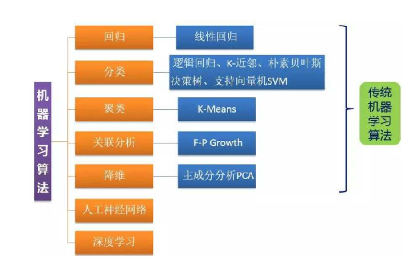
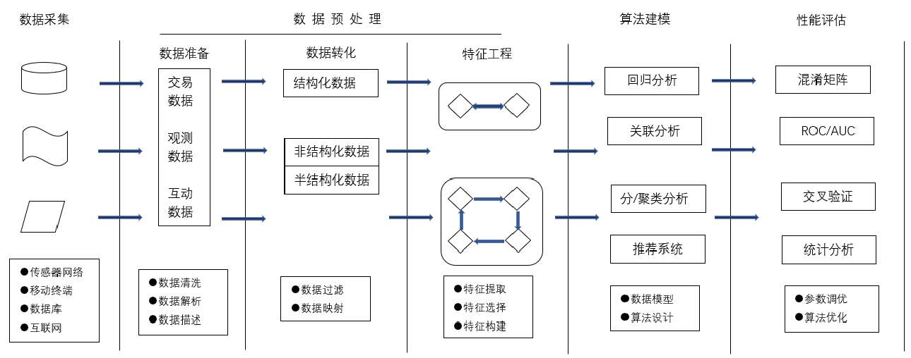
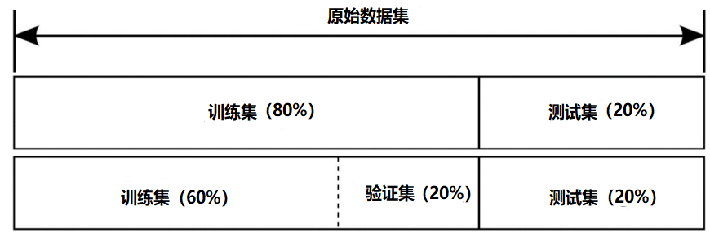
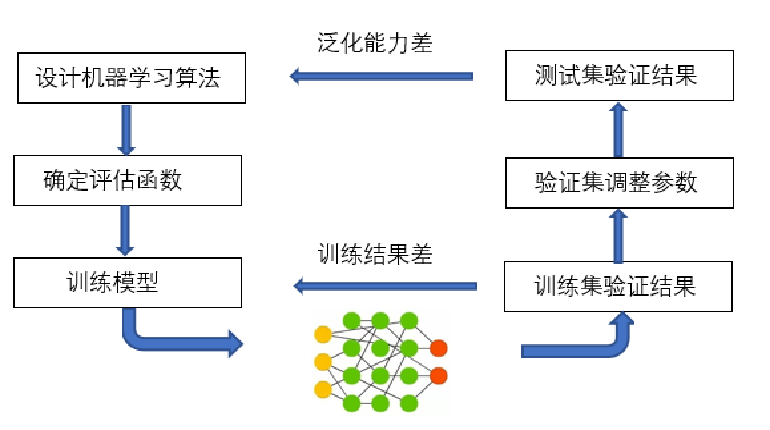
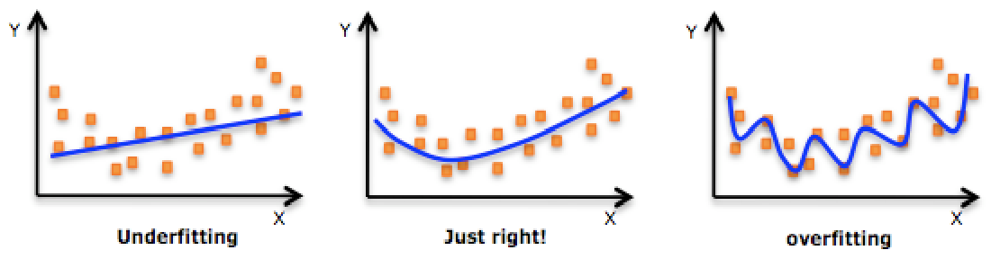
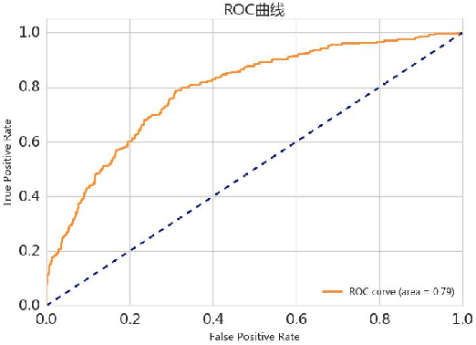
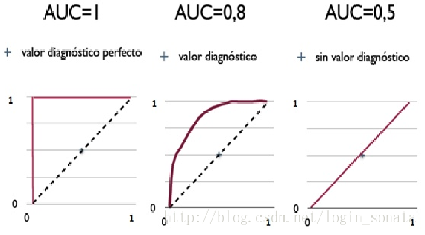

# 机器学习入门

## 机器学习概述

机器学习的含义是基于样本数据(即已有的“训练数据”)建立数学模型，以便做出预测或决策，从而给出人们指导性的建议和意见。

### 常用应用

### 常用算法

用的最广泛：回归和分类

### 流程

机器学习是从数据中自动分析获得模型，并利用模型对未知数据进行预测。机器学习一般流程大致分为**数据采集**、**预处理数据**、**特征提取**以及**训练模型**和**评估模型**，然后优化模型等步骤，如图所示。

## 数据预处理

### （1）数据集、特征和标签 

| Housing Median Age（房龄 特征） | Total Rooms（总数 特征） | Total Bedrooms（卧室 特征） | MedianHouseValue（价格 标签） |
| ------------------------------- | ------------------------ | --------------------------- | ----------------------------- |
| 15                              | 5612                     | 1283                        | 66900                         |
| 19                              | 7650                     | 1901                        | 80100                         |
| 17                              | 720                      | 174                         | 85700                         |
| 14                              | 1501                     | 337                         | 73400                         |
| 20                              | 1454                     | 326                         | 65500                         |

数据集：表中全部信息

特征：自变量

标签：因变量

### （2）训练集、验证集和测试集 

**训练集（Train set）**—— 用于训练模型，拟合的数据样本。

**验证集（Development set）**—— 是模型训练过程中单独留出的样本集，它可以用于调整模型的超参数和优化算法。

**测试集（Test set）**—— 对于已经构建和训练好的机器学习模型进行各方面的性能评估。

### （3）数据预处理

一个数据集中通常会存在以下问题：

- 数据缺失（Incomplete） 是属性值为空的情况。
- 数据噪声（Noisy）是数据值不合常理的情况。
- 数据不一致（Inconsistent）是数据前后存在矛盾的情况。
- 数据冗余（Redundant）是数据量或者属性数目超出数据分析需要的情况。
- 数据集不均衡 （Imbalance）是各个类别的数据量相差悬殊的情况。
- 离群点/异常值 （Outliers）是远离数据集中其余部分的数据。
- 数据重复（Duplicate）是在数据集中出现多次的数据。

对于数据中存在的问题，数据的预处理主要有以下方法与步骤，包括：

- (1)数据清洗 (Data Cleansing)
- (2)数据转换 (Data Transformation)
- (3)数据描述 (Data Description)
- (4)特征选择 (Feature Selection)
- (5)特征抽取 (Feature Extraction)

#### 数据清洗

占用50%—80%时间

（1）缺失值清洗

- 确定缺失值范围。
- 去除不需要的字段。
- 填充缺失内容。

（2）格式内容清洗

- 时间、日期、数值、全半角等显示格式不一致
- 内容中有不该存在的字符
- 内容与该字段应有内容不符

（3）第三步：逻辑错误清洗

- 去除冗余数据
- 去除不合理值
- 修正矛盾内容

#### 数据转换

**原因**：某些算法要求样本具有零均值和单位方差；需要消除样本不同属性具有不同量级时的影响。

①数量级的差异将导致量级较大的属性占据主导地位；

②数量级的差异将导致迭代收敛速度减慢；

③依赖于样本距离的算法对于数据的数量级非常敏感。

**常用方法**

1. min-max标准化（归一化）

2. z-score标准化（规范化）

### 特征选择

选择相关特征，合并离散特征，去除无关特征。

**常用算法**

熵增益(Entropy information ain)，分支定界（Branch and bound，Sequential forward(序列前向选择), Sequential backward(序列反向选择), Simulated annealing(模拟退火), Tabu search(竞技搜索), Genetic algorithms(遗传算法)。

## 模型训练

在对于数据集进行**预处理**和**特征提取**以后，需要利用**训练集**建立**预测模型**，然后将这种训练好的模型应用于**测试集**（即作为新的、未见过的数据）上进行预测。根据模型在测试集上的表现来选择最佳模型，为了获得最佳模型，还需要进行**参数优化**。

**泛化：**使算法模型的应用场景更普遍

## 模型拟合

### 模型的过（欠）拟合

衡量算法模型泛化能力的好坏，最直观的表现就是模型的过拟合（Overfitting）和欠拟合（Underfitting）

过拟合是指训练误差和测试误差之间的差距太大，模型复杂度高于实际问题，模型在训练集上表现很好，但在测试集上却表现很差。

欠拟合一般是由于训练样本被提取的特征比较少，样本数理不足，导致训练出来的模型不能很好地匹配算法模型，数据预测表现得很差，甚至样本本身都无法高效的识别。

在机器学习与深度学习中，对于模型欠拟合，一般是由于训练数据量太少，我们只有再去增加训练数据的数据量来避免模型欠拟合。对于模型过拟合，我们一般使用**交叉验证**(Cross-Validation)和正则化来避免模型过拟合。

### 交叉验证

**LOOCV方法，即（Leave-one-out cross-validation留一交叉验证）**

LOOCV方法包含将数据集分为训练集和测试集，只用一个数据作为测试集，其他的数据都作为训练集，并将此步骤重复N次（N为数据集的数据数量）。计算量大。

**K折交叉验证(K-fold Cross Validation)**

和LOOCV的不同在于，我们每次的测试集将不再只包含一个数据，而是多个，具体数目将根据K的选取决定。

## 模型评估

### 混淆矩阵

混淆矩阵(Confusion matrix)是机器学习中总结分类模型预测结果的情形分析表，以矩阵形式将数据集中的记录按照真实的类别与分类模型预测的类别判断两个标准进行汇总。其中矩阵的行表示预测值，矩阵的列表示真实值，以二分类为例，看下矩阵表现形式，如表：

|  混淆矩阵  |       | 预测值 | 预测值 |
| :--------: | :---: | :----: | :----: |
|            |       | **P**  | **N**  |
| **真实值** | **P** |   TP   |   FN   |
| **真实值** | **N** |   FP   |   TN   |

(1) 准确率(Accuracy)=所有预测正确的样本/总的样本（TP+TN）/总样本数
$$
Accuracy=\frac{TP+TN}{TP+TN+FP+FN}
$$

(2) 精确率(Precision)=将正类预测为正类/所有预测为正类 TP/（TP+FP）
$$
Precision=\frac{TP}{TP+FP}
$$

(3) 召回率(Recall) = 将正类预测为正类/所有正真的正类 TP/（TP+FN）
$$
Recall=\frac{TP}{TP+FN}
$$
(4) F-Measure（又称为F-Score）
$$
F=\frac{(a^2+1)P*R}{a^2(P+R)}
$$
特别的：当参数α=1时，就是最常见的F1值测量,即为：
$$
F=\frac{2*P*R}{P+R}
$$

### ROC曲线

ROC(Receiver Operating Characteristic 受试者操作特征曲线)是一个画在二维平面上的曲线—ROC Curve。
$$
TPR=\frac{TP}{TP+FN}
$$
在所有实际为阳性的样本中，被正确地判断为阳性之比率
$$
FPR=\frac{FP}{FP+TN}
$$
在所有实际为阴性的样本中，被错误地判断为阳性之比率

对于一个预测模型来说，我们希望：

1. 分类正确的数量越多越好，TPR越大越好。
2. 分类错误的数量越少越好，FPR越小越好。
3. 最理想的情况是经过坐标（0，1）。
4. 当TPR=FPR,无论是输入是正例还是负例， 都预测为正例和负例各一半（图中虚线的部分）。

### AUC曲线

AUC（Area Under ROC Curve）是一种用来度量分类模型好坏的另一个标准。虽然用ROC Curve来表示分类器的性能很直观，但是一般希望能有一个数值来标志分类器的好坏，于是Area Under roc Curve(AUC)就出现了。顾名思义，AUC的值就是处于ROC Curve下方的那部分面积的大小。通常，AUC的值介于0.5到1.0之间，较大的AUC代表了分类器较好的性能，如图3-6。AUC被定义为ROC曲线下的面积(ROC的积分)，通常大于0.5小于1。随机挑选一个正样本以及一个负样本，分类器判定正样本的值高于负样本的概率就是 AUC 值。AUC值(面积)越大的分类器，性能越好。

