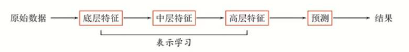

# 人工智能概论复习

- [人工智能概论复习](#人工智能概论复习)
  - [人工智能概论](#人工智能概论)
  - [机器学习](#机器学习)
    - [概念](#概念)
    - [监督学习与无监督学习](#监督学习与无监督学习)
    - [特征工程](#特征工程)
      - [数据标准化](#数据标准化)
      - [特性降维](#特性降维)
    - [线性回归](#线性回归)
    - [逻辑回归](#逻辑回归)
    - [决策树](#决策树)
    - [K近邻(KNN)](#k近邻knn)
    - [DBSCAN聚类](#dbscan聚类)
    - [K均值(K-Means)](#k均值k-means)
      - [聚类中心](#聚类中心)
    - [贝叶斯分类](#贝叶斯分类)
      - [朴树贝叶斯分类](#朴树贝叶斯分类)
    - [支持向量机(SVM)](#支持向量机svm)
      - [核函数](#核函数)
      - [软间隔](#软间隔)
    - [集成学习](#集成学习)
    - [梯度下降](#梯度下降)
    - [模型评估](#模型评估)
      - [MSE](#mse)
      - [R方值](#r方值)
      - [交叉熵](#交叉熵)
      - [混淆矩阵](#混淆矩阵)
      - [ROC曲线](#roc曲线)
    - [欠拟合和过拟合](#欠拟合和过拟合)
      - [过拟合的原因](#过拟合的原因)
      - [过拟合的解决办法](#过拟合的解决办法)
      - [欠拟合的原因](#欠拟合的原因)
      - [欠拟合的解决办法](#欠拟合的解决办法)
    - [模型优化](#模型优化)
      - [常用方法](#常用方法)
      - [优化步骤](#优化步骤)
    - [交叉验证](#交叉验证)
  - [深度学习](#深度学习)
    - [从机器学习到深度学习](#从机器学习到深度学习)
      - [浅层学习(Shallow Learning)](#浅层学习shallow-learning)
      - [表示学习](#表示学习)
      - [深度学习概念](#深度学习概念)
      - [深度学习步骤](#深度学习步骤)
    - [神经网络](#神经网络)
    - [全连接前馈网络](#全连接前馈网络)
    - [BP算法(Backpropagation)](#bp算法backpropagation)
    - [卷积神经网络(CNN)](#卷积神经网络cnn)
    - [循环神经网络(RNN)](#循环神经网络rnn)
  - [计算机视觉](#计算机视觉)
  - [自然语言处理](#自然语言处理)
    - [文本处理流程](#文本处理流程)
  - [工具](#工具)
    - [Scikit-Learn](#scikit-learn)
    - [Numpy](#numpy)
    - [Matplotlib](#matplotlib)


## 人工智能概论

提出时间： **1956年**

标志性事件：**达特茅斯会议**

4个发展阶段：


3个主要学派：

1. **符号主义**(symbolicism)

   认为人工智能源于数理逻辑

2. **连接主义**(connectionism)

   认为人工智能源于仿生学

3. **行为主义**(actionism)

**概念**：人工智能是研究使计算机来模拟人的某些思维过程和智能行为的学科

**研究领域**：

- 机器感知(计算机视觉、语音信息处理、模式识别)
- 学习(机器学习、强化学习)
- 语言(自然语言处理)
- 记忆(知识表示)
- 决策(规划、数据挖掘)

**图灵测试**：艾伦·图灵认为，如果机器在拥有知识的观察者面前能够成功地伪装成人类，那么你就应该认为它具有智能。

麦卡锡等4人(1955年)提出**首次提出“人工智能”这一术语**

研究主题：

1. 将信息理论概念应用到计算机器与大脑模型中。

2. 与机器人相匹配的环境-大脑模型。 

## 机器学习

### 概念

机器学习( Machine Learning，ML)是指从**有限的观测数据(训练数据)**中**学习(或“猜测”)出具有一般性的规律(Function)**，并利用这些规律**对未知数据进行预测**的方法。

### 监督学习与无监督学习

监督学习(supervised learning) (预测)

- 定义：输入数据是由输入特征值和目标值所组成。函数的输出可以是一个连续的值(称
  为回归)，或是输出是有限个离散值(称作分类)。

  - 回归：线性回归、岭回归

  - 分类：k-近邻算法、贝叶斯分类、决策树与随机森林、逻辑回归、神经网络

无监督学习(unsupervised learning)

- 定义：输入数据是由输入特征值所组成。
- 聚类：K均值(k-means)

### 特征工程

#### 数据标准化

将样本数据的属性缩放到某个指定的范围

（1）min-max标准化(归一化) 

（2）z-score标准化(规范化)


标准化的原因：

- 某些算法要求样本具有零均值和单位方差；
- 需要消除样本不同属性具有不同量级时的影响；
- 数量级的差异将导致量级较大的属性占据主导地位；
- 数量级的差异将导致迭代收敛速度减慢；
- 依赖于样本距离的算法对于数据的数量级非常敏感。

#### 特性降维

目标：在某些限定条件下，降低随机变量(特征)个数,得到- -组 “不相关"主变量的过程。

### 线性回归

通过两个或多个变量之间的**线性关系**来预测结果。

目标函数：


### 逻辑回归

用于解决分类问题的一种模型。根据数据特征或属性，计算其归属于某一类别的概率P(x)，根据概率数值判断其所属类别。主要应用场景：二分类问题。

**Sigmoid函数：**


目标函数：


### 决策树

决策树的构建算法主要有**ID3、C4.5、 CART**三种，其中ID3和C4.5是分类树，CART是分类回归树。ID3是决策树最基本的构建算法，C4.5和CART是在ID3的基础上进行的优化算法。

### K近邻(KNN)

利用训练数据集对特征空间进行划分，以其作为分类的“模型”，不具有显性的学习过程。KNN的输入是测试数据和训练样本数据集，输出是测试样本的类别。

KNN的三个要素：

- 距离度量
- K值选择
- 分类决策规则

### DBSCAN聚类

DBSCAN (Density-Based Spatial Clustering of Applications with Noise，具有噪声的基于密度的聚类方法)

- 密度：某个点的领域空间里存在的其他点的数量
- 核心对象：若某个点的密度达到算法设定的阈值，则为核心点。(即r邻域内点的数量不小于minPts)
- 邻域的距离阈值：设定半径r
- 直接密度可达：若p在q的邻域内，且q是核心点，则称p到q直接密度可达
- **密度可达**：若存在一个点的序列$q_0$、$q_1$... $q_n$对任意$q_i$、$q_{i+1}$是直接密度可达的，则称$q_0$、$q_n$ 密度可达，实际上是直接密度可达的传播
- **密度相连**：对于点p和点q，若点p点q都是从点k密度可达的,则称点p和q是密度相连的
- 边界点：属于某一个类的非核心点，不能再发展下线了
- 噪声点：不属于任何一个类簇的点，从任何一个核心点出发都不是密度可达的

### K均值(K-Means)

K-Means是一种基于相似距离的聚类算法，根据给定样本集中样本间距离的大小将样本集划分为k个簇（类），使得每个点都属于距离它最近的那个**聚类中心**（即均值means）对应的类。

- K值：要得到的簇的个数
- 质心：每个簇的均值，一般是向量各维取平均值
- 距离：常用欧几里得距离(先做标准化)
- 目标：选择距离最短的质心

#### 聚类中心

每个簇的均值，一般是向量各维取平均值

### 贝叶斯分类

贝叶斯(Bayes) 分类是一类分类算法的总称，该类算法均以**贝叶斯定理**为基础，所以统称为贝叶斯分类。而朴素贝叶斯分类是贝叶斯分类中最简单，也是常见的一种分类方法,同时朴素贝叶斯模型是一-组非常简单快速的分类算法，通常适用于维度非常高的数据集。

贝叶斯定理：**P (A∩B) = P (A)\*P (B|A)=P (B)\*P (A|B)**

贝叶斯定理是一种逆概率思维。

**条件概率**（客观事实）：根据已知结果去推测固有性质的可能性(likelihood)，是对固有性质的拟合程度。

**先验概率**（主观判断）：指根据常识、 生活经验所观测到的“原因”的概率。

**后验概率**（最终结论）：指在知道“结果”之后，去推测“原因”的概率。

#### 朴树贝叶斯分类

**假设条件**：实例特征之间相互独立


示例：计算实例点x = (2, S)的类别


### 支持向量机(SVM)

支持向量机（Support Vector Machine，简称SVM）是在分类与回归分析中分析数据的监督式学习模型与相关的学习算法。给定一组训练实例，每个训练实例被标记为属于两个类别中的一个或另一个，SVM训练算法创建一个将新的实例分配给两个类别之一的模型，使其成为非概率二元线性分类器。SVM模型是将实例表示为空间中的点，这样映射就使得单独类别的实例被尽可能宽的明显的间隔分开。然后，将新的实例映射到同一空间，并基于它们落在间隔的哪一侧来预测所属类别。

简而言之：最大化离超平面最近点（支持向量）到该平面的距离。

- 要解决的问题：什么样的决策边界才是最好的呢？
- 特征数据本身如果就很难分，怎么办呢？ 
- 计算复杂度怎么样？能实际应用吗?
- 目标：基于上述问题对SVM进行推导

决策边界：选出来离雷区最远的（雷区就是边界上的点，要Large Margin )

如果要找出与两类数据间隔最大的划分超平面，很直观地会从两类样本点最靠近的地方开始寻找，因为两
类处在最边缘位置上的样本点最有可能是最靠近划分超平面的点而其他点对确定超平面的最终位置作用较小，
所以可以认为是这些边缘点支持了超平面的确立。由于样本空间中的点可以视为向量，比如二维点(x,y)可以
看成是一个二维向量，n 维点是一个n维向量, 所以将这些有用的边缘点称为“支持向量”(Support vector)。

**算法模型**

什么样的决策边界才是最好的呢？

- 线性可分SVM

  > 当训练数据线性可分时，通过硬间隔(hard margin，什么是硬、软间隔下面会讲)最大化可以学习得到一个线性分类器，即硬间隔SVM，如上图的的H3。

- 线性SVM

  > 当训练数据不能线性可分但是可以近似线性可分时，通过软间隔(soft margin)最大化也可以学习到一个线性分类器，即软间隔SVM。

- 非线性SVM

  > 当训练数据线性不可分时，通过使用核技巧(kernel trick)和软间隔最大化，可以学习到一个非线性SVM。

支持向量：真正发挥作用的数据点，a值不为0的点

#### 核函数

**解决计算复杂度问题**

由低维度空间向高维度空间作一个映射，使原本在低纬度上线性不可分数据变得在高维度上变得可分，并找到这个分割函数。

#### 软间隔

**解决过拟合问题**

硬间隔强制要求包括噪音点或者离群点的所有样本点都满足约束，可能会导致使决策边界发生变化出现过拟合的问题，所以允许部分样本（离群点或者噪音点）不必满足该约束。

### 集成学习

集成学习(Ensemble Learning)方法通过组合和合并多个相同或者不同种类的机器学习分类器来完成学习任务，避免使用单一学习模型带来的学习模型缺陷， 从而尽可能的使得机器学习的效果达到尽可能的最优。

策略：

- **Bagging**：训练多个分类器取平均值

  **并联，少数服从多数**，典型代表是**随机森林**

- **Boosting**：从弱学习器开始加强，通过加权来进行训练

  **串联，权重**（错分类样本），每次迭代正确率要提高，典型算法`Adaboost`

- **Stacking**：聚合多个分类或回归模型（可以分阶段来做）

  **级联，裁判**，分阶段：第一阶段各自分类，第二阶段用前一阶段的结果训练

### 梯度下降

提高收敛速度的三种策略：

1. 批量梯度下降
   每次迭代，均选择**所有数据**来计算梯度
2. 随机梯度下降
   每次迭代，**随机**选择**一条数据**来计算梯度
3. Mini-Batch GD
   每次迭代，**随机**选择**一部分数据**来计算梯度

### 模型评估

MSE，R2评估回归，交叉熵评估分类

#### MSE

Mean Squared Error 均方误差

https://www.bilibili.com/video/BV1wi4y157Tt


#### R方值

[0,1] 不定系数 R-squared (R方)，越小越好

https://www.bilibili.com/video/BV1Qy4y1i7Le


#### 交叉熵

https://www.bilibili.com/video/BV1mZ4y1R76t

输入为羊，输出为羊的概率0.8，输出为牛的概率0.1，输出为猴概率0.1


#### 混淆矩阵


#### ROC曲线


一种比较总体优劣的方法是采用AUG (Area Under ROC Curve)参数，表示为其ROC曲线之下和坐标横轴之间的面积。

### 欠拟合和过拟合

欠拟合：训练集上表现的不好，测试集上不好

过拟合：训练集上表现的好，测试集上不好

#### 过拟合的原因

- 模型结构过于复杂（维度过高）
- 训练数据中噪音干扰过大，使得学习器认为部分噪音是特征从而扰乱学习规则。
- 建模样本选取有误，例如训练数据太少，抽样方法错误，样本label错误等，导致样本不能代表整体。
- 模型不合理，或假设成立的条件与实际不符。

#### 过拟合的解决办法

- 简化模型结构（使用低阶模型，比如线性模型）
- 数据预处理，保留主成分信息（数据PCA处理）
- 在模型训练时，增加**正则化项**（regularization）

#### 欠拟合的原因

- 模型复杂度过低
- 特征量过少

#### 欠拟合的解决办法

欠拟合可以通过观察训练数据及时发现，优化模型结果解决。

- 增加特征数；
  当特征不足或者现有特征与样本标签的相关性不强时，模型易出现欠拟合。
  可以通过挖掘上下文特征，ID类特征，组合特征等新的特征，可以取得较好的效果。这属于特征工程相关的内容，如因子分解机，梯度提升决策树，deep_crossing都可以丰富特征。
- 增加模型复杂度；
  模型简单时其表达能力较差，容易导致欠拟合，因此可以适当地增加模型复杂度，使模型拥有更强的拟合能力。
  如线性模型中添加高次项，神经网络中增加网络层数或神经元个数。尝试非线性模型，比如核SVM 、决策树、DNN等模型。
- 减小[正则化](https://so.csdn.net/so/search?q=正则化&spm=1001.2101.3001.7020)系数。
  正则化是用于防止过拟合的，但是当出现欠拟合时，就有必要针对性地减小正则化系数。

### 模型优化

#### 常用方法

- PCA思路(最大可分性和最低重构性)
- 正则化(L1、L2)

#### 优化步骤

1. 优化数据(异常数据、数据量级、数据维度)
2. 优化模型(模型选择与调参)
3. 测试评估(交叉验证)

### 交叉验证

常用方法：

- 数据分离

- LOOCV方法(Leave-one-out cross-validation留一交叉验证)

  每次取出一个数据作为测试集的唯一元素，其他n - 1个数据都作为训练集用于训练模型和调参。结果是最终训练了n个模型，每次都能得到一个均方误差(Mean-Square Error MSE)。而计算最终测试集MSE则就是将这n个MSE取平均值。

- K折交叉验证(K-fold Cross Validation)

  和LOOCV的不同在于，每次的测试集将不再只包含一个数据，而是多个，具体数目将根据K的选取决定。
  比如，如果K=3，那么我们利用三折交叉验证的步骤就是：

  - 将所有数据集分成3份
  - 不重复地每次取其中一份做测试集，用其他两份做训练集训练模型，之后计算该模型在测试集上的MSE
  - 将3次的MSE取平均得到最后的MSE

## 深度学习

### 从机器学习到深度学习

**机器学习 = 特征工程 + 预测**

**深度学习 = 表示学习 + 预测**

#### 浅层学习(Shallow Learning) 

不涉及特征学习，其特征主要靠人工经验或特征转换方法抽取。(特征工程)

#### 表示学习

如何自动从数据中学习好的表示
通过构建具有一定“深度”的模型，可以让模型来自动学习好的特征表示(从底层特征,到中层特征，再到高层特征)，从而最终提升预测或识别的准确性



表示形式：如何在计算机中表示语义

局部(符号)表示:

- 离散表示、符号表示
- One-Hot向量

分布式(Distributed) 表示:

- 压缩、低维、稠密向量
- 用O(N)个参数表示O(2^k)区间，k为非0参数, k<N

以颜色表示为例，一种表示颜色的方法是以不同名字来命名不同的颜色，这种表示方式叫做**one-hot局部表示**。

另一种表示颜色的方法是用RGB值来表示颜色，不同颜色对应R、G、B三维空间中一个点，这种表示方式叫做**分布式表示**。

**特征提取 vs 表示学习**

- 特征提取：基于任务或先验去除无用特征
- 表示学习：通过深度模型学习高层语义特征

#### 深度学习概念

**深度学习 = 表示学习 + 决策(预测)学习**


深度学习需要解决的关键问题是**贡献度分配问题**（Credit Assignment Problem，CAP），即**一个系统中不同的组件 (component)或其参数对最终系统输出结果的贡献或影响**。

神经网络模型可以使用误差反向传播算法，从而可以比较好地解决贡献度分配问题。

#### 深度学习步骤


### 神经网络

参考生物神经元以下特征：

- 两种状态：兴奋和抑制
- 输入达到一定值激活兴奋状态
- 记忆储存在连接之中

**单个神经元模型结构**


上面的x是神经元的输入，相当于树突接收的多个外部刺激。w是每个输入对应的权重，代表了每个特征的重要程度，它对应于每个输入特征，影响着每个输入x的刺激强度。假设只有3个特征，那么x就可以用（x1，x2，x3）。b表示阈值，用来影响预测结果。z就是预测结果。

**多个神经元组成神经网络**

**神经网络分类**

1. **前馈网络**，整个网络中的信息朝一个方向传播，没有反向的信息传播。如全连接前馈网络，卷积神经网络。
2. **记忆网络**，神经元不仅可以接受其他神经元的信息，也可以接受自己的历史信息，如循环神经网络。
3. **图网络**，是前两者的泛化，如图卷积网络

### 全连接前馈网络

全连接前馈网络、多层感知器

- 各神经元分别属于不同的层，层内无连接
- 相邻两层之间的神经元全部两两连接
- 整个网络中无反馈,信号从输入层向输出层单向传播，可用一个有向无环图表示

神经元之间两两都连接，链式结构，前后次序给定; 上一层的输出为下一层的输入。


**应用：**

- 数据压缩
- 模式识别
- 计算机视觉
- 声纳目标识别
- 语音识别
- 手写字符识别

### BP算法(Backpropagation)

误差反向传播

用来高效寻找最优参数

1. 权重初始化
2. 前向计算
3. 反向传播


### 卷积神经网络(CNN)

受生物学上感受野(Receptive Field)的机制而提出的，选不同的卷积核提取需要的特征

**特性**：

- 局部连接
- 权重共享
- 空间或时间上的次采样

**应用**：图像特征识别

**为什么用于图像**：

1. 彩色图片维度很大
2. 特征往往小于图片
3. 特征会出现在图片的任何位置
4. 图片压缩大小不会改变特征

下采样→保留特征+减小图片尺寸→网络中节点数变少→参数变少→加快训练

**计算方法及输出长度**


卷积输出长度
`1,1,-1,1...,1`是输入信号，经过卷积`[1,-2,1]`的计算，输出`-2,4,-2,0...`
`-2 = 1*1 + 1* -2 + -1 * 1`


### 循环神经网络(RNN)

- 样本间存在顺序关系，每个样本和它之前的样本存在关联。
- 引入“记忆”的概念，来处理前后数据的相关性。

适合序列数据，如文本，语音，视频，气象观测数据，股票交易数据。

**计算方法**

在计算时，把上一次隐藏层的结果数据，作为下一次的一个输入源，与下一次的x合并后，再传入隐藏层。


**应用：**

- 机器翻译
- 机器人控制
- 时间序列预测
- 语音识别
- 语音合成
- 时间序列异常检测
- 节奏学习
- 音乐创作

## 计算机视觉

用摄像机等设备替代人眼对目标进行识别，跟踪和测量，并使用计算机对获取的图像或视频进行处理，分析和理解。


**应用类型：**

- 图像分类
- 目标检测 定位 识别 R-CNN 区域卷积神经网络
- 目标跟踪 分布式视觉网络 摄像头协作
- 语义分割 一类颜色一样
- 实例分割 一类可能有不同颜色

像素：像素是分辨率的单位。像素是构成位图图像最基本的单元，每个像素都用自己的颜色。

分辨率(解析度) ：

- 图像分辨率是单位英寸内的像素点数，单位为PPI (Pixels
  Per Inch)

- PPI表示的是每英寸对角线上所拥有的像素数量(每英寸密度) :

  

灰度：表示图像像素**明暗程度**的数值，即**黑白图像中点的颜色深度**。范围0-255，白色是255，黑色是0

通道：把图像分解成一个或多个颜色成分：

- 单通道：一个像素点只需一 个数值表示， 只能表示灰度, 0表示黑色(二值图&灰度图)
  
- 三通道：RGB模式，把图像分为红绿蓝三个通道，可以表示彩色，全0表示黑色
  
- 四通道：RGBA模式，在RGB基础上加上Alpha通道， 表示透明度，Alpha=0表示全透明

对比度：不同颜色之间的差别，对比度=最大灰度值/最小灰度值

一副尺寸为800x600的黑白图像，假设采用8bit像素，需要占用多大存储空间?

800 x 600黑白图像，有480000个像素，每个像素包含1个数值，每个数值8-bit，保存这一副图像需要
`800 X 600 X 1 X 8-bit = 3840000-bit = 3750Kb = 468.75KB = 0.4578MB`

一副尺寸为800x 600的彩色图像，需要占用多大存储空间?
800 x 600彩色图像，有480000个像素，每个像素包含3个数值，每个数值8-bit，保存这一副图像需要
`800 X 600 X 3 X 8-bit = 11520000-bit = 11250Kb = 1406.25KB = 1.373MB`

## 自然语言处理

自然语言处理(Natural Language Processing: NLP)是研究用机器处理人类语言的理论和技术以实现在人与人以及人与计算机之间利用自然语言进行交互的一门学科。

- 自然语言理解
- 自然语言生成

### 文本处理流程


标准化：套规则

特征提取：共现矩阵

## 工具

### Scikit-Learn

常用函数

[scikit-learn常用库与函数整理](https://blog.csdn.net/HNU_Csee_wjw/article/details/89218305)

[sklearn常用函数](https://blog.csdn.net/weixin_45485946/article/details/106627416)

导入数据集

```python
from sklearn.datasets import load_wine
wine = load_wine()
```

分割测试集数据和训练集数据

```python
from sklearn import model_selection
X_train, X_test, y_train, y_test = train_test_split(train_data, train_target, test_size, random_state，shuffle)
```


### Numpy

[Numpy 数组操作](https://www.runoob.com/numpy/numpy-array-manipulation.html)

### Matplotlib

[Matplotlib常见图形绘制(折线图、散点图 、柱状图 、直方图 、饼图 、条形图)](https://blog.csdn.net/geek64581/article/details/106241522)
