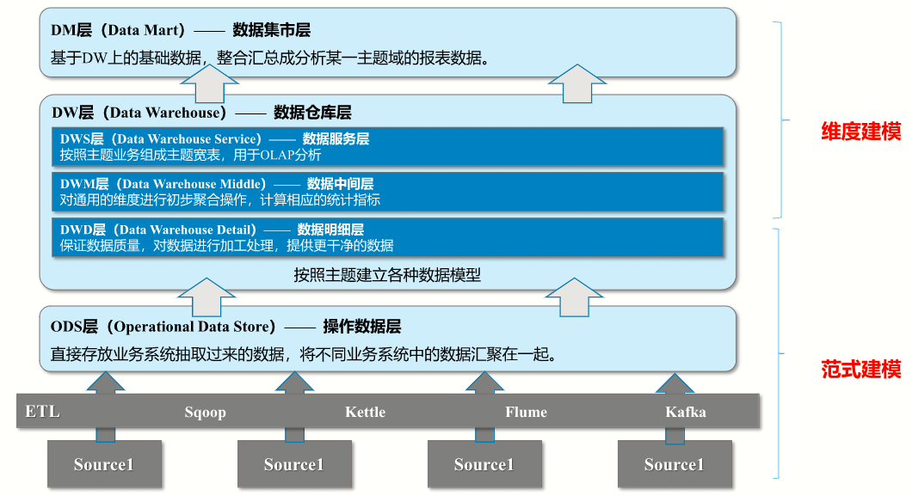

# 大数据基础

## 数据库基础

三范式：

1. 第一范式(1NF)；原子性，字段不可分
2. 第二范式(2NF)唯一性，有主键，非主键字段完全依赖主键
3. 第三范式(3NF) ：非主键字段不能相互依赖

## 企业级数据仓库

### 为什么要构建数据仓库

历史数据积存

企业数据分析需要

1. 数据存储在互不兼容的系统中
2. 关系型数据库一般不存储日志数据
3. 决策者需要从业务角度观察分析数据，关系型数据库不支持。

### 什么是数据仓库

数据仓库(DataWarehouse, DW, DWH)是**面向主题的、集成的、相对稳定**的、反应历史变化的数据集合，数
仓中的数据是有组织、有结构的存储数据集合,用于对管理决策过程的支持。

## 数据仓库架构及建模

### 分层设计

### 系统建模

- OLTP(在线事务处理)

- OLAP(在线联机分析)
  - ROLAP (RelationOLAP， 关系型OLAP) ：使用关系模型构建，存储系统一般为RDBMS
  - MOLAP (Multidimensional OLAP，多维型OLAP)：预先聚合计算，使用多维数组的形式保存数据结果，加快查询分析时间
  - HOLAP (Hybrid OLAP,混合架构的OLAP)：ROLAP和MOLAP两者的集成；如低层是关系型的，高层是多维矩阵型的;查询效率高于ROLAP，低于MOLAP

### 维度模型

维度模型中，表被分为维度表、事实表，维度是对事实的一种组织。

- 星型模型
- 雪花模型
- 星座模型

模型对比

1. 星型模型违反范式建模，雪花模型符合范式建模
2. 星型模型数据分析效率比雪花模型高
3. 企业级数仓构建使用星型模型和星座模型居多

### 维度表设计

代理键

稳定维度

缓慢变化维度

拉链表

### 事实表设计

#### 明细事实表

降维

#### 事实表存储S

- 增量存储
- 全量快照
- 拉链存储

#### 聚合事实表

DWS层
