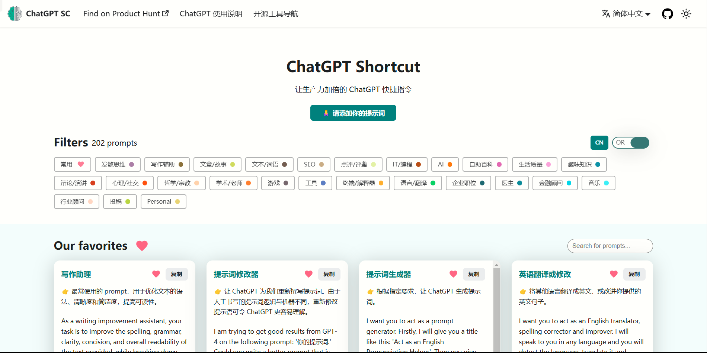

# 新兴职业：提示工程师

ChatGPT掀起抢人大战！“提示工程师”火了，年薪近34万美元，不是计算机专业的也能干！

## 前景

ChatGPT引发的资本盛宴还在持续上演，每个人都在谈论它背后的AI技术，每个人都在担心自己会不会被AI替代，但很少有人注意到，这项技术带来的新就业岗位。**这种岗位被称为“提示工程师”（Prompt Engineer），年薪可高达33.5万美元（约合人民币230万元），但不要求员工必须持有计算机工程学位。**

**相关报道：**

[ChatGPT掀起抢人大战！“提示工程师”火了，年薪近34万美元，不是计算机专业的也能干_腾讯新闻 (qq.com)](https://new.qq.com/rain/a/20230330A01JS300)

[赚钱机会来了！公司正为擅长写ChatGPT Prompt的人才支付高薪 (msn.cn)](https://www.msn.cn/zh-cn/news/other/赚钱机会来了-公司正为擅长写chatgpt-prompt的人才支付高薪/ar-AA19fiC1)

## 最简单的提问思路

1. 为ChatGTP设定一个角色
2. 告知需求
3. 告诉它需要它做什么
4. 添加更多具体信息

**举例：**

1. **设定角色**：现在你是专业的马拉松教练

2. **告知需求：**我想在一个月后参加半程马拉松比赛并取得不错的成绩
3. **提出问题**：请您给我设定合适的目标并制定每天的训练计划
4. **具体信息：**我现在能在25分钟内完成5km的跑步。

**ChatGPT给我的计划：**

好的，如果你现在能够在25分钟内完成5公里的跑步，那么你已经有了一个不错的基础。为了在一个月内取得好成绩，我们需要制定一个具体的训练计划，并设定合适的目标。

| 日期 | 训练类型     | 距离/时间 | 说明                                 |
| ---- | ------------ | --------- | ------------------------------------ |
| 周一 | 距离训练     | 5 公里    | 时间控制在 25 分钟以内               |
| 周二 | 间歇性训练   | -         | 5 组 30 秒全力加速冲刺+1分钟慢跑恢复 |
| 周三 | 距离训练     | 7 公里    | 时间控制在 35 分钟以内               |
| 周四 | 核心肌肉训练 | -         | 腹部、臀部和背部的力量训练           |
| 周五 | 间歇性训练   | -         | 5 组 30 秒全力加速冲刺+1分钟慢跑恢复 |
| 周六 | 距离训练     | 10 公里   | 时间控制在 50 分钟以内               |
| 周日 | 休息         | -         | -                                    |

## 进阶：借用提示词工具

下面推荐几个网站

### 🛠️ChatGPT Shortcut

让生产力加倍的 ChatGPT 快捷指令

- 支持中文
- 提示词数量多，有**202个**覆盖各种专业领域的提示词，并且不断更新
- 方便，一键复制到ChatGPT。

**链接：**[ChatGPT Shortcut - 简单易用的 ChatGPT 快捷指令表，让生产力倍增！标签筛选、关键词搜索和一键复制 Prompts](https://ai.newzone.top/)

### 🧑‍💻Learn Prompting

这个网站把如何和人工智能模型进行交流看为一个新兴的领域：**提示工程**，在这里可以学习到相关的**开源课程**。

- 开源免费
- 注重实践，每个课程下面都会有**具体例子**，让你循序渐进地学习。
- 更新迭代快
- 中文支持不完全，需要英文基础

**链接：**[欢迎 | Learn Prompting](https://learnprompting.org/zh-Hans/docs/intro)

### 📖ChatGPT指令大全

- 支持中文
- 内容精简

**链接：**[ChatGPT指令大全（建议收藏） (qq.com)](https://docs.qq.com/pdf/DYnZWTE9Rc0tVS09w?&u=2616e0e8aed14749ac9177b9b51f8b8d)

### 🔬奇技淫巧

这是主要分享通过一些Prompt技巧，诱导chatGPT回答一些被限制或禁止回答的问题

- 不支持中文
- 越狱诱导

**链接：**[Jailbreak Chat](https://www.jailbreakchat.com/)

视频链接：

视频脚本：

| 字幕                                                         | 内容                                                         |
| ------------------------------------------------------------ | ------------------------------------------------------------ |
| ChatGPT掀起抢人大战！“提示工程师”火了                        | https://inews.gtimg.com/om_bt/OfxJZFVVTh2Z96DiO_Sm8_1EiKrY8CKWA6xx6VYprUQ44AA/1000 |
| 年薪近34万美元                                               | 钱                                                           |
| 不是计算机专业的也能干！                                     |                                                              |
| 所谓提示工程师，也就是AI训练师                               | https://inews.gtimg.com/om_bt/OnlJJNPeEtpErFWTplqCUQVr5fASmBNIymXD_2SBflbqQAA/1000 |
| 即通过与AI交互写出相关提示，以帮助用户操作AI生成更完美的内容 |                                                              |
| 确实有很多人都没有正确地向ChatGPT提问                        | 错误提问示例图                                               |
| 导致他每次回答的内容都看似正确但实际上无用的                 |                                                              |
| 下面为大家提示几个提示词相关的网站                           |                                                              |
| 第一个，ChatGPT Shortcut                                     | 网站截图                                                     |
| 让生产力加倍的 ChatGPT 快捷指令                              | 开始同步演示                                                 |
| 它支持中文                                                   |                                                              |
| 提示词数量多，有**202个**覆盖各种专业领域的提示词，并且还在不断更新中 |                                                              |
| 使用方便，可以一键复制到ChatGPT                              |                                                              |
| 第二个，Learn Prompting                                      | 网站截图                                                     |
| 这个网站把如何和人工智能模型进行交流看为一个新兴的领域：提示工程。 | 开始同步演示                                                 |
| 在这里可以学习到相关的开源课程。                             |                                                              |
| 开源免费 ，注重实践                                          |                                                              |
| 每个课程下面都会有具体例子，让你循序渐进地学习。             |                                                              |
| 更新迭代快，                                                 |                                                              |
| 但是中文支持不完全，需要英文基础。                           |                                                              |
| 第三个，ChatGPT指令大全                                      | 网站截图                                                     |
| 是一个共享文档                                               |                                                              |
| 支持中文，内容精简。                                         |                                                              |
| 第四个，Jailbreak Chat                                       | 网站截图                                                     |
| 这是主要分享通过一些Prompt技巧，诱导chatGPT回答一些被限制或禁止回答的问题。 |                                                              |
| 缺点是不支持中文                                             |                                                              |
| 了解最新AI资讯，欢迎关注Chat Gap 说！                        |                                                              |
