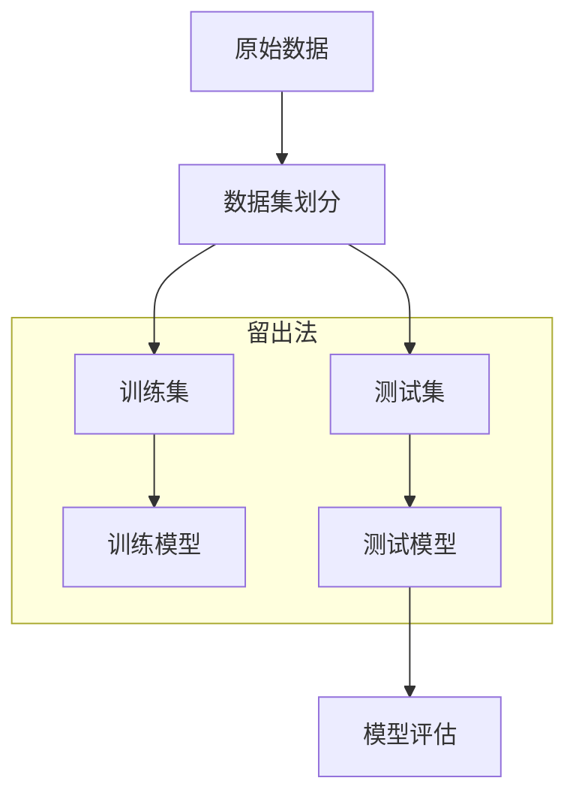
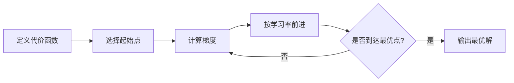

# 机器学习与深度学习复习

## 机器学习的含义

### 狭义

机器学习( Machine Learning，ML)是指从**有限的观测数据(训练数据)中学习(或“猜测”)出具有一般性的规律(Function)**，并利用这些规律**对未知数据进行预测**的方法。

### 广义

机器学习是一种人工智能的方法，它利用计算机算法来自动地从数据中学习并改进自己的行为。机器学习的目标是通过从数据中提取模式和规律，使计算机能够自动地进行决策和预测。

## 机器学习的基本流程

1. 收集数据：收集具有代表性和可信度的数据作为机器学习的训练数据集。

2. 数据预处理：对数据进行清洗、去重、缺失值填补、特征选择和特征变换等预处理工作，以便于后续的建模和分析。

3. 特征提取：从原始数据中提取有意义的特征，通常使用统计学和机器学习技术对原始特征进行组合、转换、筛选等操作。

4. 模型构建：通过选择和设计相应的算法模型来进行数据的学习和预测，包括监督学习、无监督学习、半监督学习和强化学习等。

5. 模型训练：利用训练数据集来训练模型，根据不同的算法模型和优化算法，可以使用梯度下降、随机梯度下降、牛顿法等方法来求解训练问题。

6. 模型评估：采用交叉验证、留一验证、测试集验证等方法来评估模型的精度、泛化能力和稳定性等性能指标。

7. 模型调参：通过调整模型参数、结构、算法和优化方法等因素来提高模型的性能和泛化能力。

8. 模型应用：将优化过的模型应用于实际问题中，如分类、回归、聚类、推荐、异常检测等任务，以解决各种实际应用问题。

## 交叉验证的三种方式

### 留出法

hand-out cross validation

留出法是一种数据集划分方法，它将收集到的所有数据按照一定的比例划分为**训练集**、**验证集**和**测试集**。在训练模型时，使用训练集进行模型训练，然后使用**验证集**进行模型选择，最后使用**测试集**对模型进行测试和评估。在留出法中，训练集、验证集和测试集的比例通常是6:2:2或7:2:1。使用留出法时，需要注意保持数据集的分布和平衡，同时要避免过度拟合，即模型过度适应训练数据，而不具有泛化能力。

### 留一交叉验证

leave-one-out cross validation

简称`LOOCV`，叫做留一交叉验证，对于样本总数为N的数据集，进行N次迭代，每次都只保留一个样本作为测试集，剩余的作为训练集

### K折交叉验证

k fold cross validation

将数据集均匀划分为k个子集，每次迭代，使用一个子集作为测试集，其他的作为训练集。`LOOCV`也可以看做是K折交叉验证的一个特例，K等于样本总数N。对于得到的k个模型，从其中挑选误差最小的作为最终的模型。

## 机器学习中的数据集的划分以及划分的意义

数据集划分是将原始数据集分成**训练集**、**验证集**和**测试集**三部分的过程，

目的是提高模型的泛化能力和避免过拟合现象的发生。

- 训练集用于训练模型

- 验证集用于调整模型参数

- 测试集用于评估模型泛化能力

意义：

- 避免过拟合
- 提高模型效率和准确度

## 数据标准化的意义和两种不同的方法

### Z-score标准化

使用Z-score将数据标准化为类标准正态分布。这种方法会使得所有数据的均值为0，方差为1。

### Min-max标准化

将数据标准化到某一特定的范围内，通常是[0,1]或[-1,1]范围内。这种方法将原始数据减去最小值，然后除以最大值与最小值的差。

### 意义

在不同的特征或变量具有不同的范围和单位时会影响模型训练的质量和结果。通过数据标准化，我们可以消除这种差异并使特征处于统一的范围内，使模型更准确，更可靠，更有意义。

## 梯度下降的三种方式

[【梯度下降】3D可视化讲解通俗易懂_哔哩哔哩_bilibili](https://www.bilibili.com/video/BV18P4y1j7uH)

### 梯度下降的过程

1. 定义代价函数
2. 选择起始点
3. 计算梯度
4. 按学习率前进
5. 重复3，4直到找到最低点

梯度下降是常见的优化算法之一，用于优化损失函数以更新模型的参数。梯度下降的三种方式如下：

### 批量梯度下降

（Batch Gradient Descent，BGD）

是最基础的梯度下降方法，它在每次迭代中使用训练集中的所有数据来计算梯度，并通过梯度更新模型参数。BGD的优点是能够保证最终收敛到全局最优解，但缺点是**算法速度较慢**，需要**大量的计算资源和时间**。

### 随机梯度下降

（Stochastic Gradient Descent，SGD）

其每次迭代中只随机选择一个样本来计算梯度以更新模型参数。这种方法**速度较快**，但**准确度和稳定性可能不如批量方法**。

### 小批量梯度下降

（Mini-batch Gradient Descent，MBGD）

MBGD是BGD和SGD的**折中方案**，它每次使用一小批次的样本计算梯度进行更新。这种方法能够综合考虑BGD和SGD的优点，同时也考虑了计算时间和算法准确度的权衡。

## 模型过（欠）拟合的含义以及如何避免

过拟合是指在训练集上表现良好，但是在测试集上表现较差。

模型欠拟合则是指模型无法在训练数据上获得良好的性能。

避免过拟合的方法有以下几种：
1. **数据集扩增**：使用更多数据会促进模型的泛化能力。
2. **正则化**：通过对模型的损失函数添加一些正则化项，如L1和L2正则化，可以限制模型参数的增长，避免过拟合。
3. **早停**：在训练过程中监控验证数据集上的误差，当误差不再下降时停止训练，避免过度拟合。
4. **参数调整**：通过调整模型的超参数来避免过拟合，例如调整网络层数、层的神经元数和学习速率等。

避免欠拟合的方法有以下几种：
1. 使用更大、更复杂的模型，以提高模型的拟合能力。
2. 调整模型的参数或超参数，以增加模型的拟合能力。
3. 数据集的扩增，以提高模型的学习效果。 
4. 减小正则化，提高模型的拟合能力。

## 什么是正则化

正则化是应用于模型优化中的一种技术，它通过对模型的损失函数添加一些惩罚项（即正则化项）来限制模型的复杂度和对训练数据的拟合程度，从而避免过拟合。正则化是一个有助于解决应用机器学习时的最重要的问题之一——“方差/偏差权衡问题”的关键工具。

通俗地讲，正则化的本质是通过人为地加入一些“惩罚力度”，防止模型对训练数据中的随机噪声和异常值过拟合。L1和L2正则化是最常用的两种正则化方法。

L1正则化又称Lasso正则化，它通过对模型参数的绝对值之和进行约束，使得一些无关的特征的系数变成0。

L2正则化又称岭回归，它通过对模型参数的平方和进行约束，使得模型参数分布更加均匀，同时可以防止过拟合。

当正则化项越大，模型的复杂度就越小，模型在训练集上的表现可能会下降，但在测试集上的表现可能会更好。

### 逻辑回归的基本含义

用于**分类**

逻辑回归是指将一个线性模型和一个逻辑函数（也称sigmoid函数）联系起来的建模技术，用于处理二分类问题中的输出值。逻辑回归的输出值可以表示成0或1， 0表示属于一个类，1表示不属于。

`逻辑回归 = 线性回归+Sogmoid函数`

逻辑函数的图像呈现S型曲线，将输出值映射到0到1之间，并对输出值进行概率计算。逻辑回归通过对训练样本数据进行学习，得到一个能够将输入样本映射成它属于某个类别的模型，并和分类问题相关联。可以说，逻辑回归是用于二分类问题的一种技术。

逻辑回归的基本思想是：将实例的特征线性组合，并带入逻辑函数中计算概率值；然后可以使用最大似然估计来调整模型的参数，最终得到一个能够将输入样本映射到0或1的模型。逻辑回归可以应用于很多场景，如广告点击率预测、信用卡欺诈检测、医学疾病预测等。

## 线性回归算法的基本步骤

1. 选择线性模型：通常采用的是一元线性回归或多元线性回归模型。
2. 选择损失函数：常见的损失函数有均方误差（MSE）和平均绝对误差（MAE）等。
3. 选择优化算法：通常采用梯度下降算法，它能够沿着损失函数的梯度方向，找到最小化损失函数的最优参数

## 决策树算法中生成决策树的三种算法。

决策树的构建算法主要有**ID3、C4.5、 CART**三种，其中ID3和C4.5是分类树，CART是分类回归树。ID3是决策树最基本的构建算法，C4.5和CART是在ID3的基础上进行的优化算法。

ID3、C4.5和CART是三种常见的决策树构建算法，它们的主要区别如下：

1. ID3算法：ID3是“Iterative Dichotomiser 3”的缩写，它是一种基于信息增益的决策树构建算法。ID3算法会选择最大信息增益的特征作为节点进行划分，但它不能处理连续型特征和缺失值。

2. C4.5算法：C4.5是ID3算法的改进版，它可以处理连续型特征和缺失值。C4.5算法使用信息增益比来选择最佳特征进行划分，这个比值可以解决ID3算法中信息增益偏向于取值比较多的特征的问题。

3. CART算法：CART是“Classification and Regression Trees”的缩写，它既可以用于分类问题，也可以用于回归问题。CART算法使用基尼系数来选择最佳特征进行划分，基尼系数可以度量数据集的不纯度。CART算法可以处理连续型特征，但不能处理缺失值。

总的来说，ID3、C4.5和CART算法都是基于决策树的构建算法，它们在特征选择、处理连续型特征和缺失值等方面有所不同，选择合适的算法取决于数据集的特征和问题的类型。

**信息增益是什么？**

**信息增益**是指在决策树算法中，一个特征对于分类结果的贡献程度。它是通过计算某个特征对于数据集分类的不确定性减少程度来衡量的。具体来说，信息增益越大，说明该特征对于分类结果的影响越大，应该优先选择该特征作为节点划分的依据。

举个例子，假设有一个数据集包含以下几个样本：

| 序号 | 年龄 | 性别 | 是否有工作 | 是否有房子 | 是否有车 | 是否有存款 | 是否信贷成功 |
| ---- | ---- | ---- | ---------- | ---------- | -------- | ---------- | ------------ |
| 1    | 青年 | 男   | 否         | 否         | 否       | 否         | 否           |
| 2    | 青年 | 男   | 否         | 否         | 否       | 是         | 否           |
| 3    | 青年 | 女   | 否         | 否         | 否       | 是         | 是           |
| 4    | 青年 | 女   | 是         | 否         | 否       | 是         | 是           |
| 5    | 青年 | 女   | 是         | 是         | 否       | 否         | 是           |
| 6    | 中年 | 女   | 是         | 是         | 否       | 否         | 是           |
| 7    | 中年 | 女   | 是         | 是         | 是       | 否         | 是           |
| 8    | 中年 | 男   | 否         | 是         | 是       | 否         | 否           |
| 9    | 中年 | 女   | 是         | 否         | 是       | 是         | 是           |
| 10   | 老年 | 女   | 是         | 否         | 是       | 是         | 是           |

其中，最后一列是分类结果，表示是否信贷成功，其他列是特征。

假设我们想要用年龄这个特征来划分节点，计算信息增益的步骤如下：

1. 计算数据集的熵，即所有样本的分类结果不确定性，公式为 $H(D) = -\sum_{i=1}^{n}p_i\log_2p_i$，其中 $n$ 表示分类结果的种类数，$p_i$ 表示第 $i$ 种分类结果的概率。在这个例子中，分类结果只有两种，即信贷成功和不成功，因此 $n=2$，$p_1$ 表示信贷成功的概率，$p_2$ 表示不成功的概率。根据上表，$p_1=7/10$，$p_2=3/10$，因此 $H(D)=-0.7\log_2{0.7}-0.3\log_2{0.3}=0.881$。

2. 计算以年龄为特征划分节点后的条件熵，即根据年龄的不同取值将数据集划分成若干个子集，计算每个子集的熵的加权平均值，公式为 $H(D|A) = \sum_{i=1}^{n}\frac{|D_i|}{|D|}H(D_i)$，其中 $n$ 表示年龄的取值个数，$D_i$ 表示年龄为第 $i$ 种取值的样本子集，$|D_i|$ 表示子集大小，$|D|$ 表示数据集大小。在这个例子中，年龄的取值有三种，即青年、中年、老年，因此 $n=3$。根据上表，年龄为青年的样本子集有5个，其中有2个信贷成功，3个不成功，因此 $H(D_1)=-\frac{2}{5}\log_2{\frac{2}{5}}-\frac{3}{5}\log_2{\frac{3}{5}}=0.971$。同理，年龄为中年的样本子集有4个，其中有3个信贷成功，1个不成功，因此 $H(D_2)=-\frac{3}{4}\log_2{\frac{3}{4}}-\frac{1}{4}\log_2{\frac{1}{4}}=0.811$。年龄为老年的样本子集有1个，信贷成功，因此 $H(D_3)=0$。因此，$H(D|A)=\frac{5}{10} \times 0.971 + \frac{4}{10} \times 0.811 + \frac{1}{10} \times 0 = 0.834$。

3. 计算信息增益，即数据集的熵减去以年龄为特征划分节点后的条件熵，公式为 $Gain(D,A) = H(D) - H(D|A)$。在这个例子中，$Gain(D,A) = 0.881 - 0.834 = 0.047$。因此，年龄这个特征对于分类结果的贡献较小，不是一个好的节点划分依据。

## 分类算法性能评价几种常见的评价指标

## 随机森林算法的基础算法

## 支持向量机算法中的几种常见核函数

（15）KNN算法的名称。
（16）集成学习算法的含义及基本思想。
（17）猫狗分类器中，准确率（Accuracy）、精准率（Precision）、召回率（Recall）、F1值（F1-Score）如何计算。

## （18）根据给定的TP/FP/FN/TN，计算准确率、精准率、召回率、F1值。

混淆矩阵是评估分类模型性能的一种常用方法，它将模型预测结果与真实结果进行比较，得到分类结果的准确性、召回率、精确率等指标。

以下是一个二分类问题的混淆矩阵示例：

| 真实结果/预测结果 | 正例         | 反例         |
| ----------------- | ------------ | ------------ |
| 正例              | TP（真正例） | FN（假反例） |
| 反例              | FP（假正例） | TN（真反例） |

其中，TP表示模型将正例正确地预测为正例的数量，FN表示模型将正例错误地预测为反例的数量，FP表示模型将反例错误地预测为正例的数量，TN表示模型将反例正确地预测为反例的数量。

例如，在一个肿瘤诊断的二分类问题中，正例表示患有肿瘤，反例表示没有肿瘤。如果模型将一个患有肿瘤的病人预测为没有肿瘤，那么这个样本就被归类为假反例（FN）。如果模型将一个没有肿瘤的病人预测为患有肿瘤，那么这个样本就被归类为假正例（FP）。

通过混淆矩阵可以计算出模型的准确率、召回率、精确率等指标，进而评估模型的性能和优化模型的参数。

## （19）信息熵如何计算。

在信息论中，熵（Entropy）是一个衡量随机变量不确定性的度量。在机器学习中，熵被广泛应用于决策树算法中的信息增益计算。

信息增益是指在决策树算法中，某个特征对分类结果的影响程度。信息增益越大，说明该特征对分类结果的影响越大，因此在决策树的分裂过程中应该优先选择这个特征。

熵的计算公式如下：

$H(X)=-\sum_{i=1}^{n}p_i\log_2p_i$

其中，$X$是一个随机变量，$p_i$表示该随机变量取值为$i$的概率。

熵的值越大，表示该随机变量的不确定性越高，因为它有更多的取值可能性。当随机变量的取值只有一个时，熵为0，表示该随机变量的取值是确定的。当随机变量的取值具有相同的概率分布时，熵达到最大值，此时所有可能的取值都是等可能的。

在决策树算法中，我们可以使用熵来计算每个特征对应的信息增益，从而选择最优的特征进行分裂。

（20）欧式距离和曼哈顿距离如何计算。
（21）使用Max-Min标准化方法将数据集标准化。
（22）贝叶斯算法的核心思想。
（23）层次聚类的2种类别。
（24）有监督和无监督算法的含义是什么。
（25）理解线性回归、逻辑回归算法、决策树和贝叶斯程序（代码），重点理解哪些语句是进行算法模型训练（拟合），哪些语句是进行数据预测的。
（26）全连接神经网络的含义。