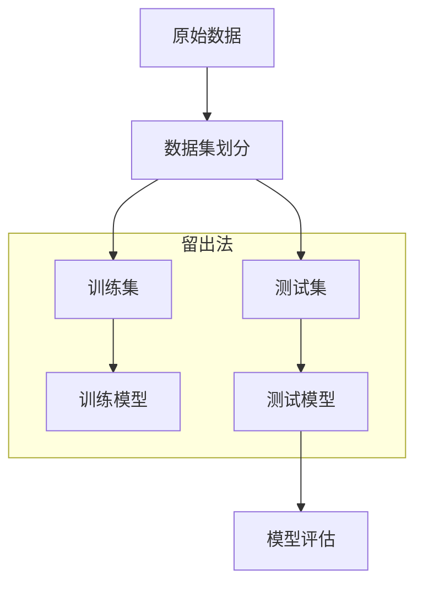
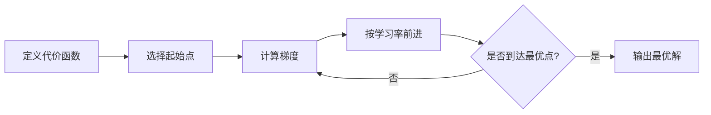

# 机器学习与深度学习复习

## 机器学习的含义

### 狭义

机器学习( Machine Learning，ML)是指从**有限的观测数据(训练数据)中学习(或“猜测”)出具有一般性的规律(Function)**，并利用这些规律**对未知数据进行预测**的方法。

### 广义

机器学习是一种人工智能的方法，它利用计算机算法来自动地从数据中学习并改进自己的行为。机器学习的目标是通过从数据中提取模式和规律，使计算机能够自动地进行决策和预测。

## 机器学习的基本流程

1. 收集数据：收集具有代表性和可信度的数据作为机器学习的训练数据集。

2. 数据预处理：对数据进行清洗、去重、缺失值填补、特征选择和特征变换等预处理工作，以便于后续的建模和分析。

3. 特征提取：从原始数据中提取有意义的特征，通常使用统计学和机器学习技术对原始特征进行组合、转换、筛选等操作。

4. 模型构建：通过选择和设计相应的算法模型来进行数据的学习和预测，包括监督学习、无监督学习、半监督学习和强化学习等。

5. 模型训练：利用训练数据集来训练模型，根据不同的算法模型和优化算法，可以使用梯度下降、随机梯度下降、牛顿法等方法来求解训练问题。

6. 模型评估：采用交叉验证、留一验证、测试集验证等方法来评估模型的精度、泛化能力和稳定性等性能指标。

7. 模型调参：通过调整模型参数、结构、算法和优化方法等因素来提高模型的性能和泛化能力。

8. 模型应用：将优化过的模型应用于实际问题中，如分类、回归、聚类、推荐、异常检测等任务，以解决各种实际应用问题。

## 有监督和无监督算法的含义是什么

有监督学习是指**已知输入和输出**的情况下，通过对已有数据进行训练，构建模型来预测未知数据的输出。在有监督学习中，输入和输出之间存在明显的关系，通常用分类和回归等技术进行处理。

无监督学习则是在**不知道输出**的情况下，只有输入数据，通过对数据的聚类、降维等技术，从中提取出潜在的结构和规律。无监督学习更加自由，可以发现隐藏在数据背后的模式和规律，常见的方法有聚类、异常检测、降维等。

总之，有监督学习是通过已知的标记训练数据来训练模型，并通过模型来预测未知数据的标记，而无监督学习是通过对未标记数据进行聚类、分类等分析来揭示数据的内在规律。

## 交叉验证的三种方式

### 留出法

hand-out cross validation

留出法是一种数据集划分方法，它将收集到的所有数据按照一定的比例划分为**训练集**、**验证集**和**测试集**。在训练模型时，使用训练集进行模型训练，然后使用**验证集**进行模型选择，最后使用**测试集**对模型进行测试和评估。在留出法中，训练集、验证集和测试集的比例通常是6:2:2或7:2:1。使用留出法时，需要注意保持数据集的分布和平衡，同时要避免过度拟合，即模型过度适应训练数据，而不具有泛化能力。



### 留一交叉验证

leave-one-out cross validation

简称`LOOCV`，叫做留一交叉验证，对于样本总数为N的数据集，进行N次迭代，每次都只保留一个样本作为测试集，剩余的作为训练集

### K折交叉验证

k fold cross validation

将数据集均匀划分为k个子集，每次迭代，使用一个子集作为测试集，其他的作为训练集。`LOOCV`也可以看做是K折交叉验证的一个特例，K等于样本总数N。对于得到的k个模型，从其中挑选误差最小的作为最终的模型。

## 机器学习中的数据集的划分以及划分的意义

数据集划分是将原始数据集分成**训练集**、**验证集**和**测试集**三部分的过程，

目的是提高模型的泛化能力和避免过拟合现象的发生。

- 训练集用于训练模型

- 验证集用于调整模型参数

- 测试集用于评估模型泛化能力

意义：

- 避免过拟合
- 提高模型效率和准确度

## 数据标准化的意义和两种不同的方法

### Z-score标准化

使用Z-score将数据标准化为类标准正态分布。这种方法会使得所有数据的均值为0，方差为1。

### Min-max标准化

将数据标准化到某一特定的范围内，通常是[0,1]或[-1,1]范围内。这种方法将原始数据减去最小值，然后除以最大值与最小值的差。

### 意义

在不同的特征或变量具有不同的范围和单位时会影响模型训练的质量和结果。通过数据标准化，我们可以消除这种差异并使特征处于统一的范围内，使模型更准确，更可靠，更有意义。

## 梯度下降的三种方式

[【梯度下降】3D可视化讲解通俗易懂_哔哩哔哩_bilibili](https://www.bilibili.com/video/BV18P4y1j7uH)

### 梯度下降的过程

1. 定义代价函数
2. 选择起始点
3. 计算梯度
4. 按学习率前进
5. 重复3，4直到找到最低点



梯度下降是常见的优化算法之一，用于优化损失函数以更新模型的参数。梯度下降的三种方式如下：

### 批量梯度下降

（Batch Gradient Descent，BGD）

是最基础的梯度下降方法，它在每次迭代中使用训练集中的所有数据来计算梯度，并通过梯度更新模型参数。BGD的优点是能够保证最终收敛到全局最优解，但缺点是**算法速度较慢**，需要**大量的计算资源和时间**。

### 随机梯度下降

（Stochastic Gradient Descent，SGD）

其每次迭代中只随机选择一个样本来计算梯度以更新模型参数。这种方法**速度较快**，但**准确度和稳定性可能不如批量方法**。

### 小批量梯度下降

（Mini-batch Gradient Descent，MBGD）

MBGD是BGD和SGD的**折中方案**，它每次使用一小批次的样本计算梯度进行更新。这种方法能够综合考虑BGD和SGD的优点，同时也考虑了计算时间和算法准确度的权衡。

## 模型过（欠）拟合的含义以及如何避免

过拟合是指在训练集上表现良好，但是在测试集上表现较差。

模型欠拟合则是指模型无法在训练数据上获得良好的性能。

避免过拟合的方法有以下几种：

1. **数据集扩增**：使用更多数据会·促进模型的泛化能力。
2. **正则化**：通过对模型的损失函数添加一些正则化项，如L1和L2正则化，可以限制模型参数的增长，避免过拟合。
3. **早停**：在训练过程中监控验证数据集上的误差，当误差不再下降时停止训练，避免过度拟合。
4. **参数调整**：通过调整模型的超参数来避免过拟合，例如调整网络层数、层的神经元数和学习速率等。

避免欠拟合的方法有以下几种：

1. 使用更大、更复杂的模型，以提高模型的拟合能力。
2. 调整模型的参数或超参数，以增加模型的拟合能力。
3. 数据集的扩增，以提高模型的学习效果。
4. 减小正则化，提高模型的拟合能力。

## 什么是正则化

正则化是应用于模型优化中的一种技术，它通过对模型的损失函数添加一些惩罚项（即正则化项）来限制模型的复杂度和对训练数据的拟合程度，从而避免过拟合。正则化是一个有助于解决应用机器学习时的最重要的问题之一——“方差/偏差权衡问题”的关键工具。

通俗地讲，正则化的本质是通过人为地加入一些“惩罚力度”，防止模型对训练数据中的随机噪声和异常值过拟合。L1和L2正则化是最常用的两种正则化方法。

L1正则化又称Lasso正则化，它通过对模型参数的绝对值之和进行约束，使得一些无关的特征的系数变成0。

L2正则化又称岭回归，它通过对模型参数的平方和进行约束，使得模型参数分布更加均匀，同时可以防止过拟合。

当正则化项越大，模型的复杂度就越小，模型在训练集上的表现可能会下降，但在测试集上的表现可能会更好。

### 逻辑回归的基本含义

用于**分类**

逻辑回归是指将一个线性模型和一个逻辑函数（也称sigmoid函数）联系起来的建模技术，用于处理二分类问题中的输出值。逻辑回归的输出值可以表示成0或1， 0表示属于一个类，1表示不属于。

`逻辑回归 = 线性回归+Sogmoid函数`

逻辑函数的图像呈现S型曲线，将输出值映射到0到1之间，并对输出值进行概率计算。逻辑回归通过对训练样本数据进行学习，得到一个能够将输入样本映射成它属于某个类别的模型，并和分类问题相关联。可以说，逻辑回归是用于二分类问题的一种技术。

逻辑回归的基本思想是：将实例的特征线性组合，并带入逻辑函数中计算概率值；然后可以使用最大似然估计来调整模型的参数，最终得到一个能够将输入样本映射到0或1的模型。逻辑回归可以应用于很多场景，如广告点击率预测、信用卡欺诈检测、医学疾病预测等。

## 线性回归算法的基本步骤

1. 选择线性模型：通常采用的是一元线性回归或多元线性回归模型。
2. 选择损失函数：常见的损失函数有均方误差（MSE）和平均绝对误差（MAE）等。
3. 选择优化算法：通常采用梯度下降算法，它能够沿着损失函数的梯度方向，找到最小化损失函数的最优参数

## 决策树算法中生成决策树的三种算法

决策树的构建算法主要有**ID3、C4.5、 CART**三种，其中ID3和C4.5是分类树，CART是分类回归树。ID3是决策树最基本的构建算法，C4.5和CART是在ID3的基础上进行的优化算法。

ID3、C4.5和CART是三种常见的决策树构建算法，它们的主要区别如下：

1. ID3算法：ID3是“Iterative Dichotomiser 3”的缩写，它是一种基于**信息增益**的决策树构建算法。ID3算法会选择最大信息增益的特征作为节点进行划分，但它不能处理连续型特征和缺失值。

2. C4.5算法：C4.5是ID3算法的改进版，它可以处理连续型特征和缺失值。C4.5算法使用信息增益比来选择最佳特征进行划分，这个比值可以解决ID3算法中信息增益偏向于取值比较多的特征的问题。

3. CART算法：CART是“Classification and Regression Trees”的缩写，它既可以用于分类问题，也可以用于回归问题。CART算法使用基尼系数来选择最佳特征进行划分，基尼系数可以度量数据集的不纯度。CART算法可以处理连续型特征，但不能处理缺失值。

总的来说，ID3、C4.5和CART算法都是基于决策树的构建算法，它们在特征选择、处理连续型特征和缺失值等方面有所不同，选择合适的算法取决于数据集的特征和问题的类型。

**信息增益是什么？**

**信息增益**是指在决策树算法中，一个特征对于分类结果的贡献程度。它是通过计算某个特征对于数据集分类的不确定性减少程度来衡量的。具体来说，信息增益越大，说明该特征对于分类结果的影响越大，应该优先选择该特征作为节点划分的依据。

举个例子，假设有一个数据集包含以下几个样本：

| 序号 | 年龄 | 性别 | 是否有工作 | 是否有房子 | 是否有车 | 是否有存款 | 是否信贷成功 |
| ---- | ---- | ---- | ---------- | ---------- | -------- | ---------- | ------------ |
| 1    | 青年 | 男   | 否         | 否         | 否       | 否         | 否           |
| 2    | 青年 | 男   | 否         | 否         | 否       | 是         | 否           |
| 3    | 青年 | 女   | 否         | 否         | 否       | 是         | 是           |
| 4    | 青年 | 女   | 是         | 否         | 否       | 是         | 是           |
| 5    | 青年 | 女   | 是         | 是         | 否       | 否         | 是           |
| 6    | 中年 | 女   | 是         | 是         | 否       | 否         | 是           |
| 7    | 中年 | 女   | 是         | 是         | 是       | 否         | 是           |
| 8    | 中年 | 男   | 否         | 是         | 是       | 否         | 否           |
| 9    | 中年 | 女   | 是         | 否         | 是       | 是         | 是           |
| 10   | 老年 | 女   | 是         | 否         | 是       | 是         | 是           |

其中，最后一列是分类结果，表示是否信贷成功，其他列是特征。

假设我们想要用年龄这个特征来划分节点，计算信息增益的步骤如下：

1. 计算数据集的熵，即所有样本的分类结果不确定性，公式为 $H(D) = -\sum_{i=1}^{n}p_i\log_2p_i$，其中 $n$ 表示分类结果的种类数，$p_i$ 表示第 $i$ 种分类结果的概率。在这个例子中，分类结果只有两种，即信贷成功和不成功，因此 $n=2$，$p_1$ 表示信贷成功的概率，$p_2$ 表示不成功的概率。根据上表，$p_1=7/10$，$p_2=3/10$，因此 $H(D)=-0.7\log_2{0.7}-0.3\log_2{0.3}=0.881$。

2. 计算以年龄为特征划分节点后的条件熵，即根据年龄的不同取值将数据集划分成若干个子集，计算每个子集的熵的加权平均值，公式为 $H(D|A) = \sum_{i=1}^{n}\frac{|D_i|}{|D|}H(D_i)$，其中 $n$ 表示年龄的取值个数，$D_i$ 表示年龄为第 $i$ 种取值的样本子集，$|D_i|$ 表示子集大小，$|D|$ 表示数据集大小。在这个例子中，年龄的取值有三种，即青年、中年、老年，因此 $n=3$。根据上表，年龄为青年的样本子集有5个，其中有2个信贷成功，3个不成功，因此 $H(D_1)=-\frac{2}{5}\log_2{\frac{2}{5}}-\frac{3}{5}\log_2{\frac{3}{5}}=0.971$。同理，年龄为中年的样本子集有4个，其中有3个信贷成功，1个不成功，因此 $H(D_2)=-\frac{3}{4}\log_2{\frac{3}{4}}-\frac{1}{4}\log_2{\frac{1}{4}}=0.811$。年龄为老年的样本子集有1个，信贷成功，因此 $H(D_3)=0$。因此，$H(D|A)=\frac{5}{10} \times 0.971 + \frac{4}{10} \times 0.811 + \frac{1}{10} \times 0 = 0.834$。

3. 计算信息增益，即数据集的熵减去以年龄为特征划分节点后的条件熵，公式为 $Gain(D,A) = H(D) - H(D|A)$。在这个例子中，$Gain(D,A) = 0.881 - 0.834 = 0.047$。因此，年龄这个特征对于分类结果的贡献较小，不是一个好的节点划分依据。

## 分类算法性能评价几种常见的评价指标

对于分类算法的性能评价，常见的几种评价指标包括：

1. 准确率（Accuracy）：分类正确的样本数量与总样本数量的比例。简单易懂，但当正负样本分布不均衡时，准确率会失去意义。
2. 精准率（Precision）：真实为正样本的样本中，被算法预测为正样本的比例。它关注的是算法预测为正样本的准确性。
3. 召回率（Recall）：算法成功预测为正样本的样本中，真实的正样本比例。它关注的是算法找出所有的正样本的能力。
4. F1-score：是综合考虑精准率和召回率的评价指标。它是精准率和召回率的调和平均数。
5. ROC曲线和AUC：ROC曲线是以False Positive Rate为横轴，True Positive Rate为纵轴画出来的曲线。AUC表示ROC曲线下方的面积。AUC的值越大，分类器的性能越好。

## 随机森林算法的基础算法

随机森林算法是一种**集成学习**方法，它基于决策树算法构建多个决策树，然后通过投票或取平均值的方式对它们进行组合以得出最终结果。算法的具体步骤如下：

1. 随机选择样本数据：从原始的数据集中随机选择一部分数据，做成不同的样本集。

2. 随机选择特征：从所有的特征中随机选择一些特征用来建造树。

3. 建造**决策树**：基于选定的样本集和特征集建立多个决策树，每棵树的决策过程都是通过选定的特征进行分割。

4. 结合多个决策树的结果：对于分类问题，随机森林通过投票的方式来结合多个决策树的分类结果；对于回归问题，通过取平均值的方式来结合多个决策树的预测结果。

5. 评估模型：使用**交叉验证**等方法对模型进行评估，确保其在新数据上有良好的预测能力。

随机森林算法具有较高的准确性和泛化能力，能够有效地应对数据噪声和缺失值等问题。

## 支持向量机算法中的几种常见核函数

支持向量机是一种强大的机器学习算法，它可以用于解决分类和回归问题。在SVM中，核函数是非常重要的概念。它可以将非线性可分的数据映射到高维空间，从而使数据在新的空间中变得线性可分。

下面是SVM中常用的几种核函数：

1. **线性核函数**：线性核函数是最简单的核函数，它常常用于线性可分的数据集。它的公式为 K(x, y) = x * y。

2. **多项式核函数**：多项式核函数可以将数据映射到更高维空间，增加分类的准确性。它的公式为 K(x, y) = (x * y + 1) ^ p，其中p是多项式的次数。

3. **径向基核函数**：径向基核函数也是一种常用的核函数。它可以将数据映射到无限维的空间中，从而可以处理非线性可分的数据。它的公式为 K(x, y) = exp (-γ ||x - y|| ^ 2)，其中γ是一个超参数，用于控制函数的平滑度。

4. **Sigmoid核函数**：Sigmoid核函数可以将数据映射到[-1,1]之间，它常用于处理二元分类问题。它的公式为 K(x, y) = tanh(α x y + β)。

在选择核函数时，需要根据数据的性质和目标问题进行选择，并通过**交叉验证**等方法来进行调参，从而获得更好的模型效果。

## KNN算法

KNN算法（**K-Nearest Neighbors**）（K近邻）是一种基于实例的机器学习算法，它可以用于**分类**和**回归**问题。在分类问题中，该算法将每个样本点分配给其“最近”的K个邻居，其中K是一个**超参数**，然后根据这些邻居的类别标签进行投票或者加权投票来确定该样本点的分类。在回归问题中，该算法将每个样本点的输出值设置为其“最近”的K个邻居的输出值的平均值或者加权平均值。KNN算法的关键在于定义**“距离”**或**“相似度”**度量，该度量用于计算每个样本点到其他样本点的距离或相似度。常用的距离度量包括**欧氏距离**和**曼哈顿距离**。KNN算法是一种简单且易于实现的算法，但是它的计算复杂度随着样本数的增加而快速增加，因此在处理大型数据集时需要谨慎使用。

## 集成学习算法的含义及基本思想

### 含义

集成学习是一种通过结合多个学习器来提高预测性能的机器学习算法。

### 基本思想

是将多个弱学习器进行结合，通过像投票、加权平均等方式获得一个更强的学习器。相对于单一学习器，集成学习可以更有效地利用训练数据集，在处理复杂问题时可以达到更高的准确率。

### 分类

1. **Bagging**：并行地训练多个模型，每个模型对应一个数据子集。通过取平均数或投票法等方法，提高最终分类的准确率。

2. **Boosting**：串行地提升模型的预测能力，每一轮都对上一轮分类错误的样本进行加权处理。这样，后一轮的模型会更关注于之前被分错的样本，从而不断提高整个模型的性能。

3. **Stacking**：先训练多个不同种类的模型，再将它们的预测结果作为输入，再训练一个元模型。因为元模型是在多个基模型的基础上进行训练，所以可以达到更好的性能。

4. **组合**：将模型的结果进行加权或者取平均数等方式，以提高整个模型的分类准确率。组合还可以针对不同的样本或分类进行不同权重的处理，以获得更好的结果。

5. **随机森林**：也是一种基于决策树的集成学习算法。针对决策树的一些不足，如容易出现过拟合等，随机森林通过随机筛选部分特征数据以及样本数据，并由多棵决策树共同进行预测，以提高整个模型的分类效果。

## 混淆矩阵指标的计算

这些指标是衡量**分类**算法性能的常用指标。

- 准确率（Accuracy）：准确率是分类器正确分类的样本数与总样本数之比。它可以用以下公式计算：

  准确率 = (TP + TN) / (TP + FP + TN + FN)

  其中，TP表示真正例（True Positive），即被正确分类为正例的样本数；TN表示真负例（True Negative），即被正确分类为负例的样本数；FP表示假正例（False Positive），即被错误地分类为正例的样本数；FN表示假负例（False Negative），即被错误地分类为负例的样本数。

- 精准率（Precision）：精准率表示分类器在预测为正例中，真正为正例的概率。它可以用以下公式计算：

  精准率 = TP / (TP + FP)

- 召回率（Recall）：召回率表示分类器正确预测为正例的样本数与实际正例的样本数之比。它可以用以下公式计算：

  召回率 = TP / (TP + FN)

- F1-Score：F1-Score是精准率（Precision）和召回率（Recall）的加权调和平均数。它可以用以下公式计算：

  `F1-Score = 2 * 精准率 * 召回率 / (精准率 + 召回率)`

  下表是一个分类问题的混淆矩阵，用于计算准确率、精准率、召回率和F1值的示例：

|                | 实际标签为正例 | 实际标签为负例 |
| -------------- | -------------- | -------------- |
| 预测标签为正例 | 5 (TP)         | 2 (FP)         |
| 预测标签为负例 | 1 (FN)         | 7 (TN)         |

根据上表可以求得：

- `准确率 = (5 + 7) / (5 + 2 + 1 + 7) = 0.8`
- `精准率 = 5 / (5 + 2) = 0.71`
- `召回率 = 5 / (5 + 1) = 0.83`
- `F1-Score = 2 * 0.71 * 0.83 / (0.71 + 0.83) = 0.76`

## 根据给定的TP/FP/FN/TN，计算准确率、精准率、召回率、F1值

混淆矩阵是评估分类模型性能的一种常用方法，它将模型预测结果与真实结果进行比较，得到分类结果的准确性、召回率、精确率等指标。

以下是一个二分类问题的混淆矩阵示例：

| 真实结果/预测结果 | 正例         | 反例         |
| ----------------- | ------------ | ------------ |
| 正例              | TP（真正例） | FN（假反例） |
| 反例              | FP（假正例） | TN（真反例） |

其中，TP表示模型将正例正确地预测为正例的数量，FN表示模型将正例错误地预测为反例的数量，FP表示模型将反例错误地预测为正例的数量，TN表示模型将反例正确地预测为反例的数量。

例如，在一个肿瘤诊断的二分类问题中，正例表示患有肿瘤，反例表示没有肿瘤。如果模型将一个患有肿瘤的病人预测为没有肿瘤，那么这个样本就被归类为假反例（FN）。如果模型将一个没有肿瘤的病人预测为患有肿瘤，那么这个样本就被归类为假正例（FP）。

通过混淆矩阵可以计算出模型的准确率、召回率、精确率等指标，进而评估模型的性能和优化模型的参数。

## 信息熵如何计算

在信息论中，熵（Entropy）是一个衡量随机变量不确定性的度量。在机器学习中，熵被广泛应用于决策树算法中的信息增益计算。

信息增益是指在决策树算法中，某个特征对分类结果的影响程度。信息增益越大，说明该特征对分类结果的影响越大，因此在决策树的分裂过程中应该优先选择这个特征。

熵的计算公式如下：

$H(X)=-\sum_{i=1}^{n}p_i\log_2p_i$

其中，$X$是一个随机变量，$p_i$表示该随机变量取值为$i$的概率。

熵的值越大，表示该随机变量的不确定性越高，因为它有更多的取值可能性。当随机变量的取值只有一个时，熵为0，表示该随机变量的取值是确定的。当随机变量的取值具有相同的概率分布时，熵达到最大值，此时所有可能的取值都是等可能的。

在决策树算法中，我们可以使用熵来计算每个特征对应的信息增益，从而选择最优的特征进行分裂。

## 欧式距离和曼哈顿距离如何计算

欧式距离是指在n维空间中两个点之间的距离，计算公式如下：

$$ d_{euclidean}(x,y)=\sqrt{\sum_{i=1}^{n}(x_i-y_i)^2} $$

其中，x和y是两个n维向量，$x_i$和$y_i$是它们在第i个维度上的取值。

曼哈顿距离也称为城市街区距离或L1距离，计算公式如下：

$$ d_{manhattan}(x,y)=\sum_{i=1}^{n}\left |x_i-y_i\right| $$

其中，x和y是两个n维向量，$x_i$和$y_i$是它们在第i个维度上的取值。

## 使用Max-Min标准化方法将数据集标准化

Max-Min标准化方法是一种数据预处理的方法，用于将特征值缩放到一个固定的区间内。具体步骤如下：

1. 找到特征值中的最大值和最小值。

2. 将每个特征值通过以下公式进行标准化：
   $$
   x' = \frac{x - x_{min}}{x_{max} - x_{min}}
   $$

其中，$x$是原始特征值，$x'$是标准化后的特征值，$x_{min}$是特征值中的最小值，$x_{max}$是特征值中的最大值。
3. 标准化后的特征值将被缩放到区间[0,1]内。
4. 重复上述步骤，将数据集中每个特征值进行标准化。

通过标准化方法将数据集的特征值进行标准化，可以避免不同特征之间的尺度敏感问题，并且有助于提高模型的性能和精度。

## 贝叶斯算法的核心思想

贝叶斯算法的核心思想是基于**条件概率**和**贝叶斯定理**，通过已知的样本信息推断出未知数据的概率分布。具体来说，通过对训练样本数据的学习，贝叶斯算法会得出一个先验条件概率分布模型，然后通过该模型计算未知数据的后验条件概率。在分类问题中，贝叶斯算法会将待分类数据分别计算属于各个类别的概率，然后选取具有最高概率的类别作为预测结果。贝叶斯算法在分类、文本分类、垃圾邮件过滤等领域都有着广泛的应用。

## 层次聚类的2种类别

层次聚类一般可以分为以下两种类别：

1. 自底向上的凝聚型（agglomerative）聚类：它从每个数据点作为最小的簇开始，逐步合并成越来越大的簇，直到所有的点都被合并成一个大簇。在任何时候，被合并的两个簇是距离最近的两个簇。

2. 自顶向下的分离型（divisive）聚类：它从所有数据点作为一个大簇开始，逐步分裂成越来越小的簇，直到每个簇只剩下一个数据点。在任何时候，被分裂的簇是距离最远的簇。

这两种聚类方法各有优缺点，需要根据具体的数据集和任务需求来选择合适的方法。

## 代码实现部分

重点理解哪些语句是进行算法模型训练（拟合），哪些语句是进行数据预测的。

### 线性回归代码实现

1. 原生实现

   以下是一个简单的Python代码实现线性回归。假设我们有n个数据点 $(x_1, y_1), (x_2, y_2), \cdots, (x_n, y_n)$，并且我们想要拟合一条线性模型 $y = mx + b$ 来预测其他$x$所对应的$y$值。

   ```python
   import numpy as np
   
   def linear_regression(X, y):
       """
       线性回归模型的实现
       参数：
       ----
       X : np.array, shape (n_samples, n_features)
           训练数据的特征向量
       y : np.array, shape (n_samples,)
           训练数据的输出标签
   
       返回：
       ----
       m : float
           模型权重的斜率
       b : float
           模型的偏差
       """
       # 添加一个偏置项
       X = np.hstack((X, np.ones((X.shape[0], 1))))
       # 计算权重向量 w = (X^T X)^-1 X^T y
       w = np.linalg.inv(X.T @ X) @ X.T @ y
       # 提取斜率和偏移项
       m = w[:-1]
       b = w[-1]
       return m, b
   
   ```

   使用方法如下:

   ```python
   X = np.array([[1], [2], [3], [4], [5]])
   y = np.array([2.5, 4.8, 7.3, 8.9, 11.1])
   m, b = linear_regression(X, y)
   print("斜率：", m)
   print("偏移：", b)
   ```

   输出结果应为:

   ```txt
   斜率： [2.13]
   偏移： 0.5300000000000038
   ```

1. 使用`sk-learn`实现

   ```python
   # 导入生成回归数据集的函数 make_regression
   from sklearn.datasets import make_regression
   
   # 导入 train_test_split 函数，将数据集划分为训练集和测试集
   from sklearn.model_selection import train_test_split
   
   # 导入线性回归模型
   from sklearn.linear_model import LinearRegression
   
   # 生成100个样本，每个样本含有3个特征，加噪音
   X, y = make_regression(n_samples=100, n_features=3, noise=10)
   
   # 将数据集划分为训练集和测试集，其中测试集占30%，随机种子为42
   X_train, X_test, y_train, y_test = train_test_split(X, y, test_size=0.3, random_state=42)
   
   # 创建线性回归模型对象
   lr = LinearRegression()
   
   # 使用训练集进行模型训练
   lr.fit(X_train, y_train)
   
   # 输出在测试集上的 R^2 决定系数
   print("R^2 Score on Test Set: {:.2f}".format(lr.score(X_test, y_test)))
   ```

   输出：

   ```txt
   R^2 Score on Test Set: 0.99
   ```

### 逻辑回归代码实现

以下是Python中使用sklearn库实现逻辑回归的代码：

首先，导入必要的库和数据集：

```python
from sklearn.linear_model import LogisticRegression
from sklearn.model_selection import train_test_split
from sklearn.datasets import load_iris

# 加载iris数据集
iris = load_iris()
# 取前两列特征作为自变量
X = iris.data[:, :2]  
# 取分类标签作为因变量
y = iris.target

# 分割数据
X_train, X_test, y_train, y_test = train_test_split(X, y, test_size=0.3, random_state=0)
```

接下来，创建逻辑回归模型对象，并训练模型：

```python
# 创建逻辑回归模型对象
lr = LogisticRegression(C=1e5)  
# 使用训练集数据训练模型
lr.fit(X_train, y_train) 
```

最后，使用测试集数据进行预测并计算预测准确率：

```python
# 对测试集进行预测
y_pred = lr.predict(X_test) 
# 计算模型在测试集上的准确率
accuracy = lr.score(X_test, y_test)
print('模型在测试集上的准确率为：{:.2f}'.format(accuracy))
```

### 决策树代码实现

决策树是一种基于树形结构对样本进行判定的机器学习模型。下面是以 Python 语言为例，基于 scikit-learn 库进行决策树的代码实现：

1. 导入模块和数据

```python
from sklearn.tree import DecisionTreeClassifier
from sklearn.datasets import load_iris
from sklearn.model_selection import train_test_split
 
iris = load_iris()
X = iris.data
y = iris.target
X_train, X_test, y_train, y_test = train_test_split(X, y)
```

2. 训练模型

```python
tree_clf = DecisionTreeClassifier(max_depth=2, random_state=42)
tree_clf.fit(X_train, y_train)
```

在训练模型中，`max_depth` 是限制树的深度，防止过拟合，`random_state` 是随机种子，保证模型训练的可重复性。

3. 预测结果

```python
y_pred = tree_clf.predict(X_test)
```

4. 评估模型性能

```python
from sklearn.metrics import accuracy_score
 
accuracy_score(y_test, y_pred)
```

在评估模型性能中，通常使用准确率（accuracy）作为衡量指标，该指标计算公式为：正确分类的样本数 / 总样本数。

以上就是决策树的代码实现过程，可以通过调整模型参数等方式来优化模型效果。

### 贝叶斯代码实现

1. 原生实现

   要实现贝叶斯算法，需要遵循以下步骤：

   1. 确定先验概率分布
   2. 计算似然函数
   3. 通过先验概率和似然函数计算后验概率
   4. 根据最大后验概率确定分类结果

   以下是一个简单的贝叶斯分类器的 Python 实现：

   ```python
   import numpy as np
   
   class NaiveBayesClassifier:
   
       def __init__(self):
           self.classes = None
           self.priors = None
           self.likelihoods = None
           self.features = None
   
       def fit(self, X, y):
           self.classes = np.unique(y)
           self.priors = np.zeros(len(self.classes))
           self.likelihoods = np.zeros((len(self.classes), X.shape[1], 2))
           self.features = X.shape[1]
   
           for i, c in enumerate(self.classes):
               X_c = X[c == y]
               self.priors[i] = X_c.shape[0] / X.shape[0]
               for j in range(self.features):
                   self.likelihoods[i,j,0] = np.sum(X_c[:,j] == 0) / X_c.shape[0]
                   self.likelihoods[i,j,1] = np.sum(X_c[:,j] == 1) / X_c.shape[0]
   
       def predict(self, X):
           y_pred = []
           for x in X:
               posteriors = []
               for i, c in enumerate(self.classes):
                   prior = np.log(self.priors[i])
                   likelihood = np.sum(np.log(self.likelihoods[i,range(self.features),x == range(self.features)]))
                   posterior = prior + likelihood
                   posteriors.append(posterior)
               y_pred.append(self.classes[np.argmax(posteriors)])
           return y_pred
   ```

   在此实现中，`fit` 方法计算先验分布和似然函数，即计算每个特征在每个类别下的条件概率。然后，在`predict`方法中，应用贝叶斯公式来计算每个类别的后验概率，并返回具有最高概率的类作为预测结果。

   注意，这只是一个简单的实现示例，可能不适用于所有情况。真正的实现可能需要处理缺失值、连续变量和其他复杂的数据类型。

2. sk-learn实现

   scikit-learn库中提供了贝叶斯分类器的实现，包括高斯朴素贝叶斯（Gaussian Naive Bayes）、多项式朴素贝叶斯（Multinomial Naive Bayes）和伯努利朴素贝叶斯（Bernoulli Naive Bayes）等。

   以高斯朴素贝叶斯分类器为例，实现步骤如下：

   1. 导入高斯朴素贝叶斯分类器模块：

   ```python
   from sklearn.naive_bayes import GaussianNB
   ```

   2. 准备数据，将数据分为训练集和测试集：

   ```python
   from sklearn.datasets import load_iris
   from sklearn.model_selection import train_test_split
   
   iris = load_iris()
   X_train, X_test, y_train, y_test = train_test_split(iris.data, iris.target, test_size=0.3, random_state=0)
   ```

   3. 创建高斯朴素贝叶斯分类器对象：

   ```python
   gnb = GaussianNB()
   ```

   4. 拟合模型（训练模型）：

   ```python
   gnb.fit(X_train, y_train)
   ```

   5. 预测测试集数据：

   ```python
   y_pred = gnb.predict(X_test)
   ```

   6. 评估模型性能：

   ```python
   from sklearn.metrics import accuracy_score
   
   accuracy = accuracy_score(y_test, y_pred)
   print('Accuracy: {:.2f}'.format(accuracy))
   ```

   这样，你就可以使用scikit-learn实现高斯朴素贝叶斯分类器了。

## 全连接神经网络的含义

全连接神经网络是一种深度学习模型，也是一种最基本的神经网络类型。它由多层神经元组成，其中每一层神经元都与上一层的所有神经元相连，每个连接都有一个权重，用来调整信号的强度。这样的连接方式使得神经网络能够学习复杂的输入输出关系，从而实现分类、回归等任务。在全连接神经网络中，每个神经元都使用一个非线性激活函数来处理输入信号，通常使用ReLU、Sigmoid、Tanh等函数。全连接神经网络是深度学习中应用最广泛的模型之一。
