# 软件测试复习

## 黑盒测试

方法：

- 等价类
- 边界值
- 因果图
- 决策表
- 正交试验法

### 等价类

等价类是输入域的某个**子集合**，而所有的等价类的**并集是整个输入域**。在子集合中，各个输入数据对于揭露程序中的错误是**等效**的。

特点：

- 完备性
- 无冗余
- 等价性

等价类划分

- 有效等价类（检验正常功能）
- 无效等价类（检验异常功能）

从对等价类的覆盖程度，可以将等价类测试分为

- 弱组合形式
- 强组合形式

针对是否对无效数据进行测试，可以将等价类测试分为

- 一般等价类测试
- 健壮等价类测试

弱：单缺陷假设
强：多缺陷假设 

一般：**只考虑有效值**
健壮：**考虑无效值**

**等价类设计测试用例的一般步骤**

1. 划分等价类，形成**等价类表**，为每一个等价类规定一个唯一的编号。 
2. 设计一个新的测试用例，使它能够尽量覆盖尚未覆盖的**有效等价类**。重复这个步骤，直到所有的**有效等价类**均被测试用例所覆盖。 
3. 设计一个新的测试用例，使它仅覆盖一个尚未覆盖的**无效等价类**。重复这一步骤，直到所有的**无效等价类**均被测试用例所覆盖

**测试用例的概念及构成**

为某个业务目标，而编制的一组由**测试输入**，**执行条件**以及**预期结果**组成的案例。

用例编号、测试模块、用例标题、用例级别、前置条件、测试输入、执行操作、预期结果、实际结果

### 边界值

针对各种边界情况设计测试用例

对于一个n变量的程序，边界值**健壮性**测试会产生`6n+1`个测试用例。

### 决策表

决策表(Decision Table)，又叫判定表，是分析和表达多逻辑条件下执行不同操作的工具。

**决策表法主要为了发现以下两种类型的缺陷**

1. 某种条件组合的情况下，系统采取错误操作，即执行了不应该执行的操作
2. 某种条件组合的情况下，系统没有执行正确的操作，即没有执行应该执行的操作

决策表的构成

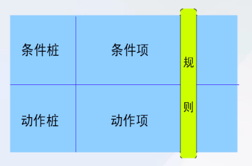

>条件桩：列出了问题的所有条件。
条件项：针对条件桩给出的条件列出所有可能的取值。
动作桩：给出了问题规定的可能采取的操作。
动作项：和条件项紧密相关，指出在条件项的各组取值情况下应采取的动作。

**决策表的化简**

有两条或多条规则具有相同的动作，并且其条件项之间存在着极为相似的关系，就可以将规则合并。

**维修机器问题的决策表测试**

维修机器问题描述：“……对于功率大于50马力并且维修记录不全的机器，或已运行10年以上的机器，应给予优先的维修处理……

1. 列出所有的条件桩和动作桩
   - 条件桩
     - C1：功率大于50马力吗？
     - C2：维修记录不全吗？
     - C3：运行超过10年吗？
   - 动作桩
     - A1：进行优先处理
     - A2：作其他处理
2. 确定规则个数
   - 输入条件个数：3；
   - 每个条件的取值：“是”或“否”；
   - 规则个数：2*2\*2 =8；
3. 填入条件项，动作项，得到初始决策表

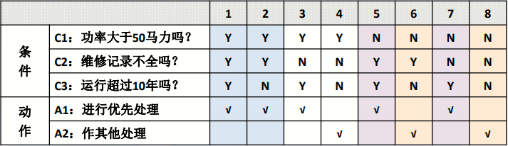

4. 化简（合并规则）

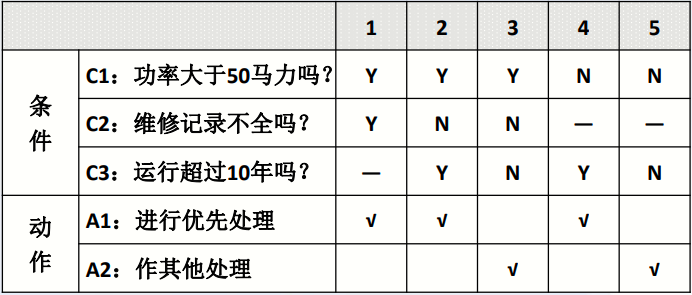

### 因果图

因果图（Cuase-effect Graph）是一种描述输入条件的组合以及每种组合对应的输出的图形化工具。在因果图的基础上可以设计测试用例。

原因与结果之间的关系
**恒等、非、或、与** 

原因与原因之间的约束关系
**异、或、唯一、要求** 

结果与结果之间的关系
**M约束**

**四种符号**

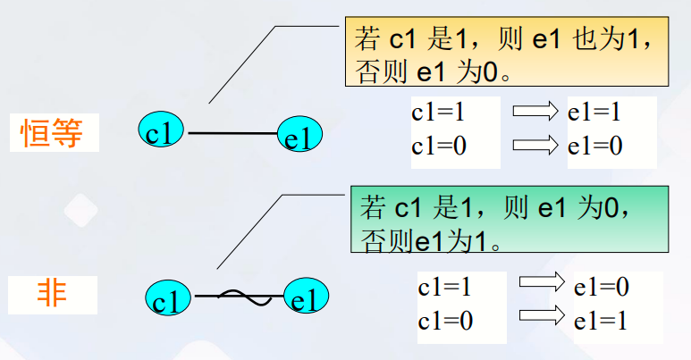

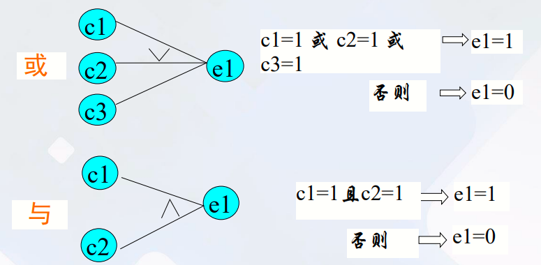

**四种约束**

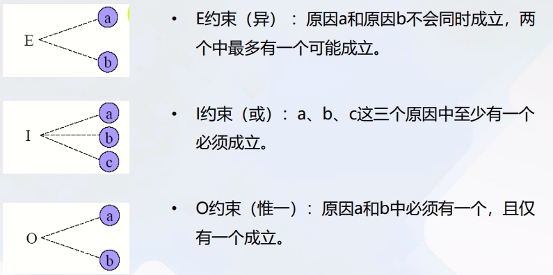

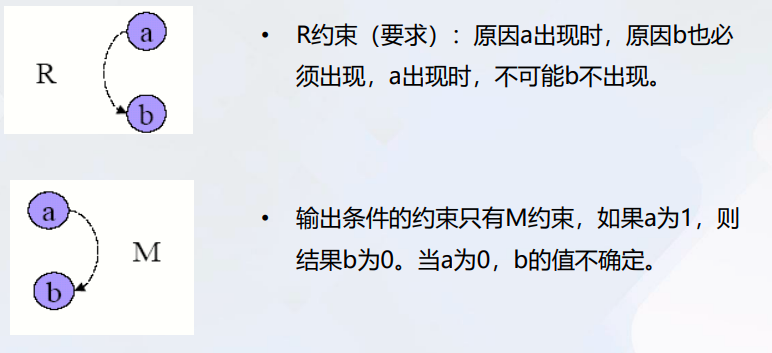

**符号＋约束**

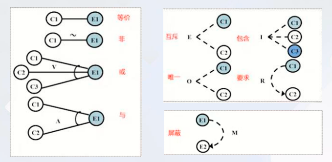

### 正交表

正交表是一个二维数字表格。其形式： $L_{行数}(水平数^{因子数})$

L表示正交表

>行数(Runs)：正交表中的行的个数，即试验的次数。 
因子数(Factors)：正交表中列的个数。 
水平数(Levels)：任何单个因素能够取得的值的最大个数。正交表中的包 含的值为从0到数“水平数-1”或从1到“水平数”

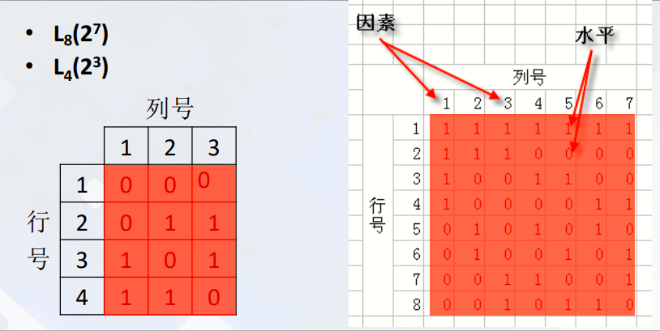

**特点**：**均匀分散，整齐可比**

## 白盒测试

### 逻辑覆盖

1. 语句覆盖（Statement Coverage, SC）：可执行语句 
2. 判定覆盖（Decision Coverage, DC）：每个**判定节点**的取真和取假分支至少执行一次
3. 条件覆盖（Condition Coverage, CC）：每一判定语句中每个**逻辑条件**的可能取值至少满足一次
4. 条件判定覆盖（Condition/Decision Coverage, C/DC）：判定中的每个**条件**的所有可能（真/假）至少出现一次，并且每个判定本身的判定**结果**也至少出现一次
5. 修正条件判定覆盖（Modified Condition / Decision Coverage, MD/CC）
6. 条件组合覆盖（Condition Combination Coverage，CCC）每个判定中条件无脑排列组合。
7. 路径覆盖：设计足够的测试用例，使得每条可能的**路径**都至少执行一次。

几种逻辑覆盖标准发现错误的能力呈**由弱至强**的变化

==达到100%判定条件覆盖标准一定能够达到100%条件覆盖、 100%判定覆盖 和100%语句覆盖==


### 基本路径测试

给定一个控制流图G，设其环形复杂度为V(G)

- V(G)＝E－N＋2，其中E是控制流图G中边的数量，N是控制流图中结点的数目。
- V(G)＝P＋1，其中P是控制流图G中判断结点的数目
- V(G)＝A，其中A是控制流图G中区域的数目。

由边和结点围成的区域叫做区域， 当在控制流图中计算区域的数目时，控制 流图外的区域也应记为一个区域

**独立路径定义**： 从控制流图来看，一条独立路径是至少包含有一条在其他独立路径中**从未有过**的边的路径。路径可以用控制流图中的结点序列来表示。

**程序的环形复杂度 = 程序中独立路径的数量**

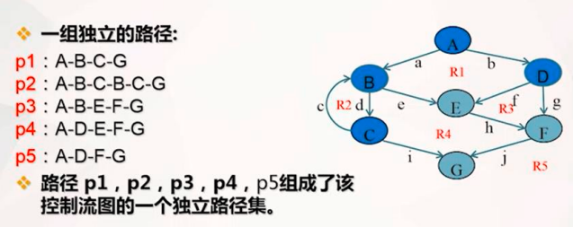

 **做好测试用例设计工作的关键是什么？**

黑盒法用例设计的关键同样也是以**较少的用例覆盖模块输出和输入接口**。不可能做到完全测试，**以最少的用例在合理的时间内发现最多的问题**。

白盒测试用例设计的关键是**以较少的用例覆盖尽可能多的内部程序逻辑结果**。

## 测试管理

测试过程四个阶段划分

1. 单元测试
2. 集成测试
3. 系统测试
4. 验收测试

### 单元测试

最小粒度的测试，以测试某个功能或代码块。

**JUnit 生命周期**

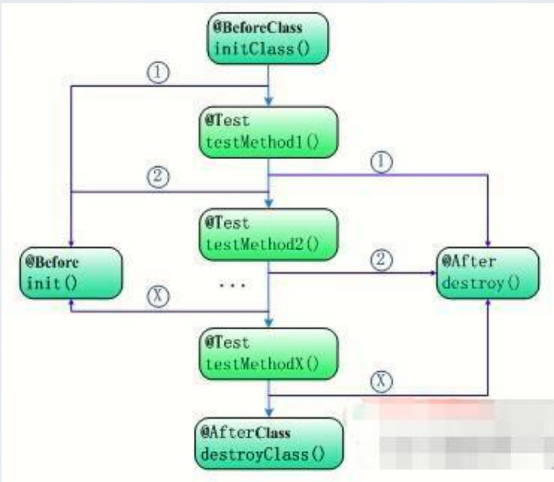

桩模块和驱动模块

- **驱动程序（Driver），也称驱动模块**
  用于模拟被测模块的上级模块，能够**调用被测模块**，驱模块接受测试数据，调用被测模块并把相关数据传送给被测模块。
- **桩程序（Stub），也称桩模块**
  用于模拟**被测模块工作过程中所调用**的下层模块，一般很少进行数据处理，一般只检测被测模块传输数据的正确性。

```python
def test(a,b)	# 被测模块
	c = a+b
	stub(c)

def stub(c)	# 桩程序
	print(c)

if __name == "__main__":
	test(1,2)	# 驱动程序
```


### 集成测试

集成测试是在单元测试的基础上，将所有已通过单元测试的模块按照概要设计的要求组装为子系统或系统，进行集成测 试，目的是确保各 单元模块组合在一 起后能够按既定意图协作运行，并确保增量的行为正确。

### 系统测试

系统测试的定义 ： 系统测试是将整个软件，作为整个基于计算机系统的一个元素，与计算机硬件、外设、某些支持软件、数据和人员等其它系统元素结合在一起，在实际运行环境下，验证软件的功能和性能及其它特性是否与用户的要求一致

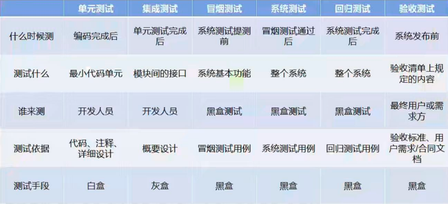

### 缺陷属性

严重程度

- 微小的(Minor)
- 一般的(Major)
- 严重的(Critical)
- 致命的(Fatal)

优先级

- 低 Not Urgent
- 中 Normal Queue
- 高 Resolve Immediately

## 自动化测试

Selenium WebDriver 中的元素定位方法：

```java
// 方法通过 id 属性定位来元素
findElement(By.id("kw")).sendKeys("XXX")
// 通过 name 属性来定位元素
findElement(By.name("kw")).click()
// 通过 class 属性来定位元素
findElement(By.className())
// 通过元素的 tag name 来定位元素
findElement(By.tagName())
// 通过文本信息来定位元素
findElement(By.linkText())
// 通过部分文本信息定位元素
findElement(By.partialLinkText())
// 使用 XPath 语言来定位元素
findElement(By.xpath())
// 用于 CSS 选择器定位元素
findElement(By.cssSelector()) 
```

## 性能测试

- 响应时间
- 并发数
- 点击量/点击率
- 吞吐量/吞吐率
- TPS/QPS
  - TPS:单位时间（每秒）系统处理的事务量
  - QPS:单位时间内查询或访问服务器的次数
- PV/UV
  - 页面的浏览量或点击量
  - 系统或者网站的独立访客

## 例题

1. NextDate 函数是一个有 3 个输入变量 month（月份），day（日期）和 year（年）的函数， 其中 month、day 和 year 均为整数值，并且满足条件 1≤month≤12、1≤day≤31、1900≤ year≤2050，month、day、year 分别作为输入日期的月份、日、年份，通过程序可以输出该 输入日期在日历上下一天的日期。例如，输入为 2005 年 11 月 29 日，则该程序的输出为 2005 年 11 月 30 日。请用**健壮性测试法**设计测试用例。

   

   | 输入条件 | 有效等价类 | 编号 | 无效等价类  | 编号 |
   | -------- | ---------- | ---- | ----------- | ---- |
   | month    | 6          | 1    | 非整数字符  | 4    |
   | month    |            | -    | 0           | 5    |
   | month    |            | -    | 13          | 6    |
   | day      | 15         | 2    | 非整数字符- | 7    |
   | day      |            | -    | 0           | 8    |
   | day      |            | -    | 32          | 9    |
   | year     | 2023       | 3    | 非整数字符  | 10   |
   | year     |            | -    | 1880        | 11   |
   | year     |            | -    | 2070        | 12   |

   

   | 测试用例 | month | day  | year   | 预期输出      |
   | -------- | ----- | ---- | ------ | ------------- |
   | 1        | 6     | 15   | 2023   | 2023年6月16日 |
   | 2        | 1.2   | 16   | 2024   | 错误          |
   | 3        | 0     | 17   | 2025   | 错误          |
   | 4        | 13    | 18   | 2026   | 错误          |
   | 5        | 7     | 测试 | 2027   | 错误          |
   | 6        | 8     | 0    | 2028   | 错误          |
   | 7        | 9     | 32   | 2029   | 错误          |
   | 8        | 10    | 19   | ？？？ | 错误          |
   | 9        | 11    | 20   | 1880   | 错误          |
   | 10       | 12    | 21   | 2070   | 错误          |
   | 11       | 2     | 29   | 2023   | 错误          |
   | 12       | 4     | 31   | 2023   | 错误          |
   | 13       | 2     | 30   | 2024   | 错误          |

2. 假设有一个待测试的小程序，其 Java 源代码如下。使用白盒测试方法，画出流程图，并设计测试用例，分别实现：语句覆盖，判定覆盖，条件覆盖，判定/条件覆盖。 代码：

   ```java
   public void foo (int a, int b, int x) {
       if(a>1 && b==0) {
           x = x/a;
       }
       if (a==2 || x>1) {
           x = x+1;
       }
   }
   ```

   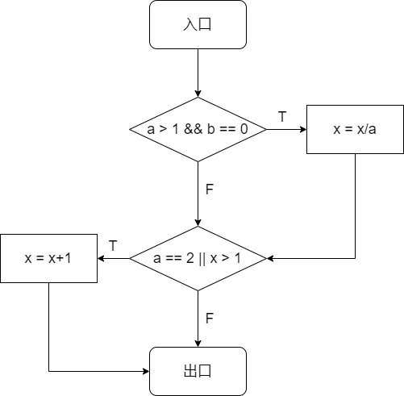

   语句覆盖：

   | a    | b    | x    |
   | ---- | ---- | ---- |
   | 2    | 0    | 2    |

   判定覆盖：

   | a    | b    | x    |
   | ---- | ---- | ---- |
   | 2    | 0    | 2    |
   | 1    | 1    | 1    |

   条件覆盖：

   | a    | b    | x    |
   | ---- | ---- | ---- |
   | 2    | 0    | 2    |
   | 0    | 1    | 2    |

   判定/条件覆盖：

   | a    | b    | x    |
   | ---- | ---- | ---- |
   | 2    | 0    | 2    |
   | 0    | 1    | 2    |
   | 1    | 0    | 1    |

3. 按照要求完成以下问题。

   ```c
   void getit(int m)
   {
       int i, k;
       k = sqrt(m);
       for(i = 2; i <= k; i++)
           if (m % i == 0) break;
       if(i >= k + 1)
           printf("%d is a selected number\n", m);
       else
           printf("%d is not a selected number\n", m);
   }
   ```

   问题 1、画出程序流程图

   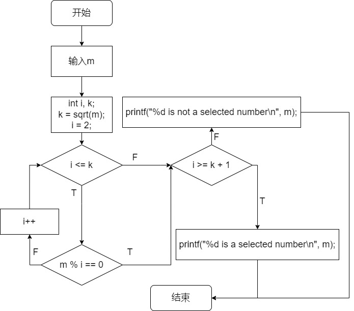

   

   问题 2、计算环形复杂度 

   V(G) = P+1 = 3+1 = 4

   问题 3、导出独立路径（用语句编号）

   

   问题 4、确定只包含独立路径的基本路径集

   （1）4 6 7 10

   （2）4 6 8 9 10

   （3）4 5 6 7 10

   （4）4 5 4 6 7
