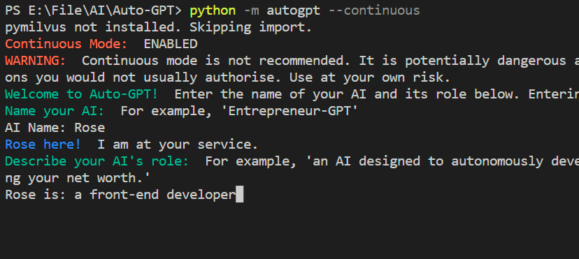
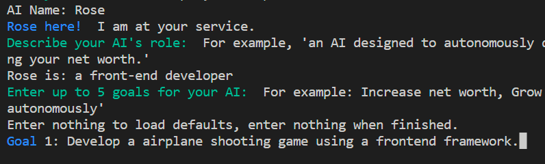
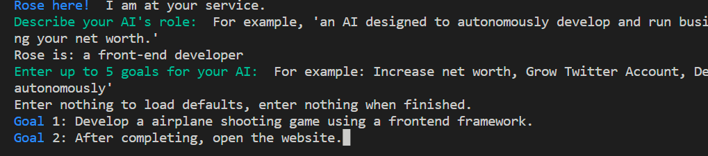
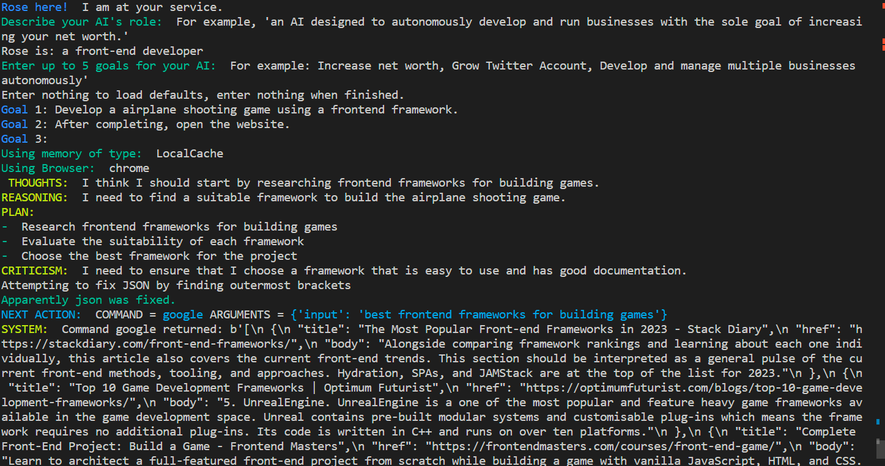
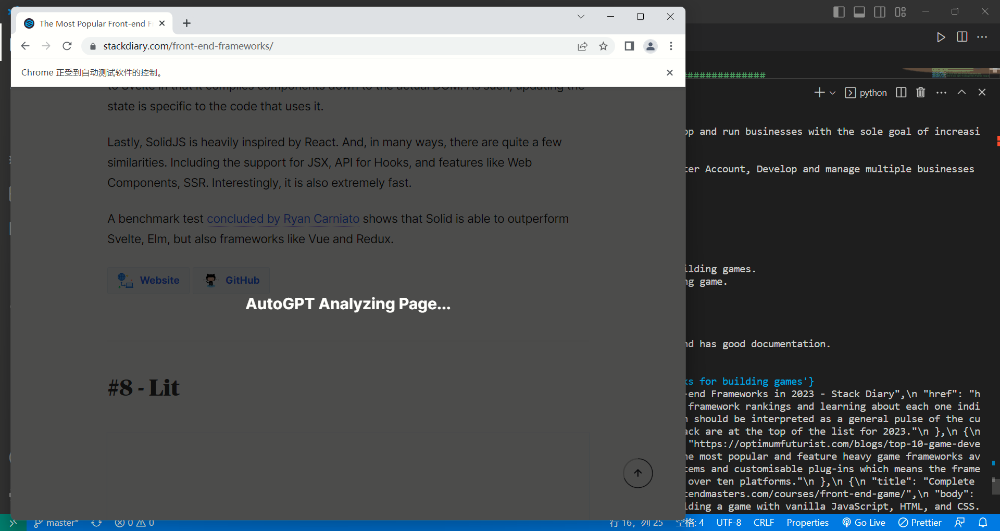

#  通向 AGI 之路

很多人都想知道下一代GPT可能会发展到怎样的程度。极有可能的情况是，ChatGPT 可能会走向通用型 AIGC，这将是实现人工通用智能(AGI)的重要一步。

## 可能实现 AGI 的技术路径

1. **ChatGPT 这类大模型直接实现 AGI 能力。**

   也就是很多人想象的 GPT-5， 看完了这个世界上所有的文本、图像和视频，听完了这个世界上所有的语音，可以直接操作文本、图像、语音等多种模态。优点是实现的 AGI 能力上限比较高，缺点是实现难度大。

2.  **ChatGPT 作为控制中枢（大脑）控制各种 AI 工具（肢体）**

   以并行的方式将各种AIGC工具集成到一个共享 agent 中，让 ChatGPT 来设计和调度任务。优点是简单可行，思路直观，缺点是不同任务之间独立性太强，缺乏交互。

   目前已经有类似做法，微软的 HuggingGPT 思路就是使用 ChatGPT 去调度操作 HuggingFace 上的各种模型来完成各种复杂任务，他们将这个系统命名为 JARVIS。

## AutoGPT

https://github.com/Significant-Gravitas/Auto-GPT

prompt 工程的下一个前沿，通向 AGI 之路！

具体来说，AutoGPT 相当于给基于 GPT 的模型一个内存和一个身体。有了它，你可以把一项任务交给 AI 智能体，让它自主地提出一个计划，然后执行计划。此外其还具有互联网访问、长期和短期内存管理、用于文本生成的 GPT-4 实例以及使用 GPT-3.5 进行文件存储和生成摘要等功能。AutoGPT 用处很多，可用来分析市场并提出交易策略、提供客户服务、进行营销等其他需要持续更新的任务。

特斯拉前 AI 总监、刚刚回归 OpenAI 的 Andrej Karpathy 也大力宣传，并在推特赞扬：「AutoGPT 是 prompt 工程的下一个前沿。」

AutoGPT 正在互联网上掀起一场风暴，它无处不在。很快，已经有网友上手实验了，该用户让 AutoGPT 建立一个网站，不到 3 分钟 AutoGPT 就成功了。期间 AutoGPT 使用了 React 和 Tailwind CSS，全凭自己，人类没有插手。看来程序员之后真就不再需要编码了。

##  BabyAGI

[yoheinakajima/babyagi (github.com)](https://github.com/yoheinakajima/babyagi)

babyagi 是一个智能任务管理和解决工具，它结合了OpenAI GPT-4和Pinecone向量搜索引擎的力量，以自动完成和管理一系列任务，从一个初始任务开始，babyagi使用GPT4生成解决方案和新任务，并将解决方案存储在Pinecone中以便进一步检索。

##  AgentGPT

通过AgentGPT配置和部署“Autonomous AI agent”。命名你自己的自定义AI，让它开始任何你能想到的目标。它会通过思考要做的任务，执行它们，并从结果中学习来试图达到目标.

## 视频脚本

一觉醒来，AI行业又变天了！

很多人都想知道下一代GPT可能会发展到怎样的程度，极有可能的情况是，ChatGPT 可能会走向通用型 AIGC。

目前来讲，有两种可能的方式：

一是ChatGPT 这类大模型直接实现 AGI 能力。也就是很多人想象的 GPT-5， 看完了这个世界上所有的文本、图像和视频，听完了这个世界上所有的语音，可以直接操作文本、图像、语音等多种模态。优点是实现的 AGI 能力上限比较高，缺点是实现难度大。

二是ChatGPT 作为“大脑”控制各种 AI 工具来完成任务，优点是简单可行，思路直观，缺点是不同任务之间独立性太强，缺乏交互。

目前已经有类似做法，微软的 HuggingGPT 思路就是使用 ChatGPT 去调度操作 HuggingFace 上的各种模型来完成各种复杂任务，他们将这个系统命名为 JARVIS。

还有一些使用提示工程技巧和目前的ChatGPT的来实现类似AGI的功能如：

**AutoGPT、BabyAGI、AgentGPT**

**AutoGPT**

AutoGPT 相当于给基于 GPT 的模型一个内存和一个身体。

有了它，你可以把一项任务交给 AI 智能体，让它自主地提出一个计划，然后执行计划。

更牛的是，它还可以自主访问互联网爬取需要的信息，并且保存下来使用。

AutoGPT 用处很多，不仅可以用来编写代码，也可用来分析市场并提出交易策略、提供客户服务、进行营销等其他需要持续更新的任务。

**BabyAGI**

babyagi 是一个智能任务管理和解决工具，它结合了OpenAI GPT-4和Pinecone向量搜索引擎的力量，以自动完成和管理一系列任务，从一个初始任务开始，babyagi使用GPT4生成解决方案和新任务，并将解决方案存储在Pinecone中以便进一步检索。

**AgentGPT**

AgentGPT通过配置和部署“Autonomous AI agent”。命名你自己的自定义AI，让它开始任何你能想到的目标。它会通过思考要做的任务，执行它们，并从结果中学习来试图达到目标.

可以说他们是生成性AI的一小步，却是通用人工智能的一大步！

本期内容就到这里，了解最新AI资讯，欢迎关注Chat Gap 说！

我自己也实验了一下：

首先给他指定角色：一名前端程序员（a front-end developer）

设定目标1：用前端框架写一个飞机大战小游戏。

Develop a airplane shooting game using a frontend framework.

设定目标2：完成后打开网站。

After completing, open the website.

AI正在对此任务自动进行规划，期间他还会主动访问互联网爬取所需数据。

官方Demo视频：

[Significant-Gravitas/Auto-GPT: An experimental open-source attempt to make GPT-4 fully autonomous. (github.com)](https://github.com/Significant-Gravitas/Auto-GPT#-usage)

程序员的门槛又降低了！

